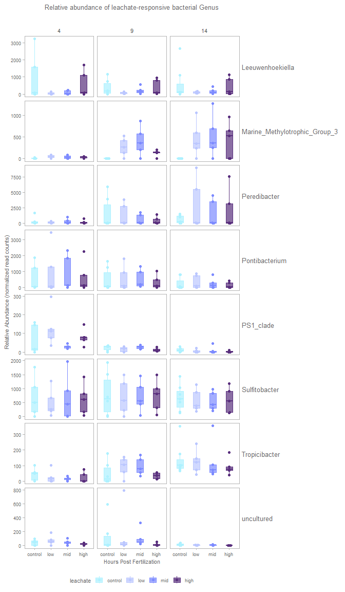
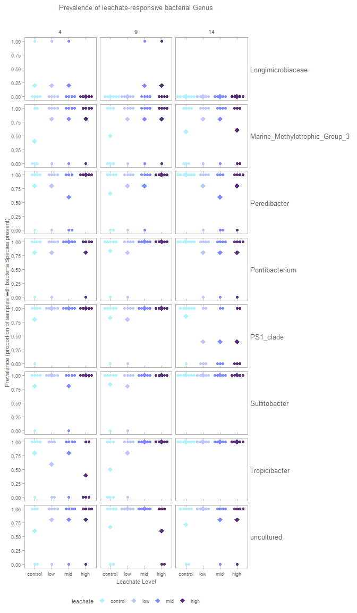

# Differential abundance and prevalence of bacterial taxa at various taxonomic levels
Sarah Tanja
2026-03-16

- [<span class="toc-section-number">1</span> Background](#background)
- [<span class="toc-section-number">2</span> Load
  Libraries](#load-libraries)
- [<span class="toc-section-number">3</span> Setup](#setup)
  - [<span class="toc-section-number">3.1</span> Set custom ggplot
    theme](#set-custom-ggplot-theme)
  - [<span class="toc-section-number">3.2</span> Set
    colorschemes](#set-colorschemes)
  - [<span class="toc-section-number">3.3</span> Define file
    paths](#define-file-paths)
  - [<span class="toc-section-number">3.4</span> Load
    metadata](#load-metadata)
- [<span class="toc-section-number">4</span> Load Data](#load-data)
  - [<span class="toc-section-number">4.1</span> m1 :
    leachate\*hpf](#m1--leachatehpf)
- [<span class="toc-section-number">5</span> Load in level 6 qiime2
  feature table for
  plotting](#load-in-level-6-qiime2-feature-table-for-plotting)
- [<span class="toc-section-number">6</span> Pivot data longer for
  plotting](#pivot-data-longer-for-plotting)
- [<span class="toc-section-number">7</span> Abundance](#abundance)
- [<span class="toc-section-number">8</span> Prevalence](#prevalence)

# Background

H<sub>o</sub> : “PVC Leachate does not alter specific bacterial taxa
trajectory over developmental time”

H<sub>a</sub> : “PVC Leachate alters specific bacterial taxa trajectory
over developmental time”

Microbiome Multivariable Associations with Linear Models (MaAsLin)

[MaAslin3](https://huttenhower.sph.harvard.edu/MaAsLin3) improves on
MaAslin2 by accounting for compositionality and accommodates
cross-sectional studies (that’s ours!)

First read and get familiar with the: [MaAslin3 package
README](https://github.com/biobakery/maaslin3) & the [MaAslin3
tutorial](https://github.com/biobakery/biobakery/wiki/maaslin3) from the
Stanford University Huttenhower Lab.

> William A. Nickols, Thomas Kuntz, Jiaxian Shen, Sagun Maharjan, Himel
> Mallick, Eric A. Franzosa, Kelsey N. Thompson, Jacob T. Nearing,
> Curtis Huttenhower. MaAsLin 3: Refining and extending generalized
> multivariable linear models for meta-omic association discovery.
> bioRxiv 2024.12.13.628459; doi:
> https://doi.org/10.1101/2024.12.13.628459

Here we aim to test changes in relative abundance (how many) and
prevalence (presence/absence) of specific taxa due to leachate, and the
interaction of leachate exposure over time, while controlling for spawn
night and read depth.

Our PERMANOVA detected that spawn night was a significant batch effect
and introduced nuisance variation into our data. To account for this
`(1 | spawn_night)` adds a random intercept for each unique spawn night
— that is, each spawn night gets its own baseline shift in abundance,
but the effects of `hpf` and `leachate` is assumed to be the same across
nights.

[MaAsLin3 Wiki](https://github.com/biobakery/biobakery/wiki/maaslin3)
Any significant abundance associations with a categorical variable
should usually have at least 10 observations in each category.
Significant prevalence associations with categorical variables should
also have at least 10 samples in which the feature was present and at
least 10 samples in which it was absent for each significant category.

> [!IMPORTANT]
>
> There are also a few rules of thumb to keep in mind: - Models should
> ideally have about **10 times as many samples** (all samples for
> logistic fits, non-zero samples for linear fits) **as covariate
> terms** (**all continuous variables plus all categorical variable
> levels**).
>
> - We have 63 samples… so the maximum number of terms we should use is
>   6
>
> - Significant associations for MaAsLin 3 are results with no model
>   fitting errors, and joint q-value less than 0.1
>
> - Significant abundance associations with continuous metadata should
>   be checked visually for influential outliers.

# Load Libraries

``` r
library(tidyverse)
library(qiime2R)
```

> MaAsLin3 requires two input files, one for taxonomic or functional
> feature abundances, and one for sample metadata.

1.  Data (or features) file

- This file is tab-delimited.
- Formatted with features as columns and samples as rows.
- The transpose of this format is also okay.
- Possible features in this file include **microbes**, genes, pathways,
  etc.

2.  Metadata file

- Formatted with metadata as columns and samples as rownames
- Is a data.frame object
- Includes per sample read counts

# Setup

## Set custom ggplot theme

``` r
library(ggsidekick) # theme by sean anderson
theme_sleek_axe <- function() {
  theme_sleek() +
    theme(
      panel.border = element_rect(
        color = "grey70",
        fill = NA,
        linewidth = 0.5
      ),
      axis.line.x  = element_line(color = "grey70"),
      axis.line.y  = element_line(color = "grey70"),
      
      plot.title = element_text(
        size  = 10,
        color = "grey40",
        hjust = 0.5,
        margin = margin(b = 20)
      ),
      
      strip.text = element_text(size = 8, color = "grey40"),
  
      
      plot.subtitle = element_text(
        size   = 8,
        color  = "grey40",
        hjust  = 0.5,
        margin = margin(b = 40)
      ),
      
      axis.title = element_text(size = 8, color = "grey40"),
      axis.text = element_text(size = 7, color = "grey40"),
      legend.title = element_text(size = 8, color = "grey40"),
      legend.text = element_text(size = 7, color = "grey40")
    )
}
```

## Set colorschemes

``` r
leachate.colors <- c(control = "#AEF1FF", 
                     low     = "#BBC7FF",
                     mid     = "#7D8BFF", 
                     high    = "#592F7D")

stage.5.colors <- c(egg           = "#FFE362",
                    cleavage      = "#EBA600", 
                    morula        = "#E6AA83",
                    prawnchip     = "#D9685B", 
                    earlygastrula = "#A2223C")

stage.3.colors <- c(cleavage      = "#EBA600", 
                    prawnchip     = "#D9685B", 
                    earlygastrula = "#A2223C")

status.colors <- c(typical   = "#75C165", 
                   uncertain = "#E3FAA5", 
                   malformed = "#8B0069")

night.colors <- c(July_6th = "#E3FAA5", 
                  July_7th = "#578B21", 
                  July_8th = "#1E2440")

night.colors.alt <- c(July_6th = "#21918C", 
                      July_7th = "#201158", 
                      July_8th = "#1E2440")
```

## Define file paths

``` r
feature_table_path <- "../../salipante/241121_StonyCoral/270x200/"
metadata_path <- "../../metadata/meta.csv"
input_path <- "../../output/maaslin_taxa/"
fig_path <- "../../figs"
```

## Load metadata

``` r
# Load metadata
metadata <- read_csv(metadata_path)

# set factors
metadata <- metadata %>% 
  mutate(
    collection_date = as.Date(collection_date, format = "%d-%b-%Y"),
    stage    = factor(stage,    levels = c("cleavage", "prawnchip", "earlygastrula"), ordered = TRUE),
    leachate = factor(leachate, levels = c("control", "low", "mid", "high"),        ordered = TRUE),
    spawn_night = factor(
      collection_date,
      levels  = as.Date(c("06-Jul-2024", "07-Jul-2024", "08-Jul-2024"), format = "%d-%b-%Y"),
      labels  = c("July 6th", "July 7th", "July 8th"),
      ordered = TRUE
    )
  )
```

``` r
meta <- metadata %>% 
  column_to_rownames(var = "sample_id") %>% 
  as.data.frame()

# View metadata structure
str(meta)
```

    'data.frame':   63 obs. of  8 variables:
     $ collection_date: Date, format: "2024-07-08" "2024-07-08" ...
     $ parents        : num  101112 101112 101112 101112 101112 ...
     $ group          : chr  "C14" "C4" "C9" "H14" ...
     $ hpf            : num  14 4 9 14 4 9 14 4 9 14 ...
     $ stage          : Ord.factor w/ 3 levels "cleavage"<"prawnchip"<..: 3 1 2 3 1 2 3 1 2 3 ...
     $ leachate       : Ord.factor w/ 4 levels "control"<"low"<..: 1 1 1 4 4 4 2 2 2 3 ...
     $ leachate_mgL   : num  0 0 0 1 1 1 0.01 0.01 0.01 0.1 ...
     $ spawn_night    : Ord.factor w/ 3 levels "July 6th"<"July 7th"<..: 3 3 3 3 3 3 3 3 3 3 ...

# Load Data

## m1 : leachate\*hpf

``` r
m1_lin_fits <- readRDS(file.path(input_path, "m1_l6/fits/models_linear.rds"))

m1_log_fits <- readRDS(file.path(input_path, "m1_l6/fits/models_logistic.rds"))
```

**Model formula:**
`Abundance|Prevelance ~ leachate * hpf + reads + (1|spawn_night)`

**This model tests:**

- Main effect of `leachate` (ordered categorical predictor; control,
  low, mid, high): Differences in the response between the levels of the
  `leachate` treatment, averaged over all `hpf`values. We choose to
  represent leachate *categorically* instead of a continuous variable
  here because we do not assume that response to increasing leachate
  levels is linear, and we want to capture any non-linear patterns of
  response across the different leachate treatments.

- Main effect of `hpf` (continuous): Overall change in the response
  across developmental time, averaged over all leachate levels. This
  tests if there is a general trend of response change with time
  regardless of leachate treatment.

- Interaction between `leachate` and `hpf`: Whether the slope of the
  response across hpf differs depending on the leachate category. This
  tests if `leachate` modifies how the response changes continuously
  over time; e.g., some leachate levels may accelerate or slow the
  effect of `hpf`.

- Effect of `reads` (continuous covariate): Controls for the influence
  of read depth on the response, adjusting other effects accordingly.

- Random intercept for `spawn_night`: Accounts for variability and
  non-independence among samples collected on the same spawn night by
  allowing different baseline response levels for each spawn night.

Probability of Detection

Predicted Abundance

- **Fitted values** = “what happened in my experiment”

- **Predicted grid** = “what the model says the pattern is”

The following are the results that indicate the significance levels (how
likely is this to be due random chance?) and the coefficients (what is
the magnitude and direction of the difference?).

``` r
m1_l6_sig <- read_tsv(file.path(input_path, "m1_l6/significant_results.tsv"))
```

Calculate the confidence intervals for the significant features, and
filter for those with no model fitting errors and that are associated
with leachate. Then extract the unique features to a character vector.

``` r
m1_l6_sigleach <- m1_l6_sig %>% 
  mutate(
    CI_lwr = coef - 1.98 * stderr,
    CI_upr = coef + 1.98 * stderr
  ) %>% 
  filter(is.na(error)) %>% 
  filter(metadata == "leachate")

m1_l6_sigfeat <- unique(m1_l6_sigleach$feature)
```

How many significant features do we have in each model?

``` r
m1_l6_sigleach %>% 
  group_by(model) %>%
  summarise(n = n_distinct(feature))
```

    # A tibble: 2 × 2
      model          n
      <chr>      <int>
    1 abundance      8
    2 prevalence     8

Are these the same 8 features that are significant in both models?

``` r
# Extract only unique features to a character vector for prevalence  
m1.l6_feat_prev <- m1_l6_sigleach %>% 
  filter(model == "prevalence") %>% 
  distinct(feature) %>% 
  pull(feature)
m1.l6_feat_prev
```

    [1] "d__Bacteria;p__Gemmatimonadota;c__Longimicrobia;o__Longimicrobiales;f__Longimicrobiaceae;g__Longimicrobiaceae"               
    [2] "d__Bacteria;p__Proteobacteria;c__Alphaproteobacteria;o__Rhodobacterales;f__Rhodobacteraceae;g__Tropicibacter"                
    [3] "d__Bacteria;p__Bdellovibrionota;c__Bdellovibrionia;o__Bacteriovoracales;f__Bacteriovoracaceae;g__Peredibacter"               
    [4] "d__Bacteria;p__Proteobacteria;c__Alphaproteobacteria;o__Parvibaculales;f__PS1_clade;g__PS1_clade"                            
    [5] "d__Bacteria;p__Proteobacteria;c__Alphaproteobacteria;o__Rhodobacterales;f__Rhodobacteraceae;g__Sulfitobacter"                
    [6] "d__Bacteria;p__Proteobacteria;c__Gammaproteobacteria;o__Oceanospirillales;f__Nitrincolaceae;g__Pontibacterium"               
    [7] "d__Bacteria;p__Proteobacteria;c__Gammaproteobacteria;o__Burkholderiales;f__Neisseriaceae;g__uncultured"                      
    [8] "d__Bacteria;p__Proteobacteria;c__Gammaproteobacteria;o__Nitrosococcales;f__Methylophagaceae;g__Marine_Methylotrophic_Group_3"

``` r
# Extract only unique features to a character vector for abundance
m1.l6_feat_abun <- m1_l6_sigleach %>% 
  filter(model == "abundance") %>% 
  distinct(feature) %>% 
  pull(feature)
m1.l6_feat_abun
```

    [1] "d__Bacteria;p__Proteobacteria;c__Gammaproteobacteria;o__Nitrosococcales;f__Methylophagaceae;g__Marine_Methylotrophic_Group_3"
    [2] "d__Bacteria;p__Bacteroidota;c__Bacteroidia;o__Flavobacteriales;f__Flavobacteriaceae;g__Leeuwenhoekiella"                     
    [3] "d__Bacteria;p__Proteobacteria;c__Gammaproteobacteria;o__Burkholderiales;f__Neisseriaceae;g__uncultured"                      
    [4] "d__Bacteria;p__Proteobacteria;c__Alphaproteobacteria;o__Parvibaculales;f__PS1_clade;g__PS1_clade"                            
    [5] "d__Bacteria;p__Bdellovibrionota;c__Bdellovibrionia;o__Bacteriovoracales;f__Bacteriovoracaceae;g__Peredibacter"               
    [6] "d__Bacteria;p__Proteobacteria;c__Alphaproteobacteria;o__Rhodobacterales;f__Rhodobacteraceae;g__Sulfitobacter"                
    [7] "d__Bacteria;p__Proteobacteria;c__Alphaproteobacteria;o__Rhodobacterales;f__Rhodobacteraceae;g__Tropicibacter"                
    [8] "d__Bacteria;p__Proteobacteria;c__Gammaproteobacteria;o__Oceanospirillales;f__Nitrincolaceae;g__Pontibacterium"               

``` r
# Which overlap?
m1.l6_feat_overlap <- intersect(m1.l6_feat_prev, m1.l6_feat_abun)
m1.l6_feat_overlap
```

    [1] "d__Bacteria;p__Proteobacteria;c__Alphaproteobacteria;o__Rhodobacterales;f__Rhodobacteraceae;g__Tropicibacter"                
    [2] "d__Bacteria;p__Bdellovibrionota;c__Bdellovibrionia;o__Bacteriovoracales;f__Bacteriovoracaceae;g__Peredibacter"               
    [3] "d__Bacteria;p__Proteobacteria;c__Alphaproteobacteria;o__Parvibaculales;f__PS1_clade;g__PS1_clade"                            
    [4] "d__Bacteria;p__Proteobacteria;c__Alphaproteobacteria;o__Rhodobacterales;f__Rhodobacteraceae;g__Sulfitobacter"                
    [5] "d__Bacteria;p__Proteobacteria;c__Gammaproteobacteria;o__Oceanospirillales;f__Nitrincolaceae;g__Pontibacterium"               
    [6] "d__Bacteria;p__Proteobacteria;c__Gammaproteobacteria;o__Burkholderiales;f__Neisseriaceae;g__uncultured"                      
    [7] "d__Bacteria;p__Proteobacteria;c__Gammaproteobacteria;o__Nitrosococcales;f__Methylophagaceae;g__Marine_Methylotrophic_Group_3"

``` r
# In both models
paste0("There are ", length(m1.l6_feat_overlap), " significant features in both prevalence and abundance models")
```

    [1] "There are 7 significant features in both prevalence and abundance models"

Which are unique to each model?

``` r
# Only in prevalence model
setdiff(m1.l6_feat_prev, m1.l6_feat_abun)
```

    [1] "d__Bacteria;p__Gemmatimonadota;c__Longimicrobia;o__Longimicrobiales;f__Longimicrobiaceae;g__Longimicrobiaceae"

``` r
paste0("There are ", length(setdiff(m1.l6_feat_prev, m1.l6_feat_abun)), " unique significant features in prevalence model")
```

    [1] "There are 1 unique significant features in prevalence model"

``` r
# Only in abundance model
setdiff(m1.l6_feat_abun, m1.l6_feat_prev)
```

    [1] "d__Bacteria;p__Bacteroidota;c__Bacteroidia;o__Flavobacteriales;f__Flavobacteriaceae;g__Leeuwenhoekiella"

``` r
paste0("There are ", length(setdiff(m1.l6_feat_abun, m1.l6_feat_prev)), " unique significant features in abundance model" )
```

    [1] "There are 1 unique significant features in abundance model"

Are these the same features that were significant in the m2 model? Let’s
check:

``` r
m2_l6_sig <- read_tsv("../../output/maaslin_taxa/m2_l6/significant_results.tsv")
```

``` r
m2_l6_sigleach <-   m2_l6_sig %>% 
  mutate(
    CI_lwr = coef - 1.98 * stderr,
    CI_upr = coef + 1.98 * stderr
  ) %>% 
  filter(is.na(error)) %>% 
  filter(metadata == "leachate") 

m2_l6_sigleach %>% 
  group_by(model) %>%
  summarise(n = n_distinct(feature))
```

    # A tibble: 0 × 2
    # ℹ 2 variables: model <chr>, n <int>

Wow ok so we have ZERO significant features due to *leachate* in the m2
model, which is for linear relationships between leachate and
prevalence. This suggests that the relationship between leachate and
prevalence is not linear… this could be some evidence for leachate
effects being non-monotonic (hormetic?)

SO we’ve shown we can find a FEW taxa with non linear responses to
leachate. - In the grand scheme of things, 8 significant features is not
a lot… but it is more than we would expect by random chance? - Our
feature selection criteria is pretty stringent (qval_joint \< 0.1, no
model fitting errors) so we are likely looking at the most robust
signals in our data. - We did look through a total of 885 features at L6
(genus) level, so 8 significant features is about 0.9% of the total
features tested, which is more than we would expect by random chance
(0.1 false positives at qval_joint \< 0.1 would be about 0.1% of
features, or less than 1 feature). So this suggests that these
significant features are likely to be true positives and not just random
noise. - Are these biologically meaningful?

We have 8 significant features to visualize for abundance and
prevalence!

- Should we visualize the predicted probabilities from the model, or the
  observed data?
- What is the best approach to visualize the relative abundance of these
  features across categorical leachate and time?
- What is the best approach to visualize the probability of detection
  across categorical leachate and time for these features?

> [!NOTE]
>
> > The key now is avoiding two extremes: overstating weak signals
> > dismissing biologically real subtle effects because the hit count is
> > small In microbiome ecotoxicology, especially with embryo systems, 8
> > robust nonlinear responders out of 885 taxa is actually fairly
> > plausible and potentially meaningful. A contaminant does not need to
> > restructure the entire microbiome to matter biologically. Often: a
> > few sensitive taxa respond strongly community-wide metrics barely
> > move but those taxa may carry disproportionate ecological or
> > functional importance That pattern actually matches your broader
> > thesis results very well: subtle but detectable molecular responses
> > limited bulk community restructuring nonlinear low/mid-dose effects
> > hidden shifts beneath stable top-level metrics So conceptually, your
> > microbiome results are converging with the RNA-seq story rather than
> > contradicting it.

# Load in level 6 qiime2 feature table for plotting

``` r
# L6 Genus
## Load feature table from QIIME2 artifact
ft_l6 <- read_qza(file.path(feature_table_path, "collapsed-l6.qza"))$data

## Convert to data.frame
ft_l6_sig <- ft_l6 %>% 
  as.data.frame() %>% 
  rownames_to_column(var = "feature") %>%
  filter(feature %in% m1_l6_sigfeat)
```

Make function to extract taxa levels

``` r
extract_tax_level <- function(x, rank) {
  # rank like "d", "p", "c", "o", "f", "g", "s"
  str_extract(x, paste0("(?<=", rank, "__)[^;]+"))
}
```

# Pivot data longer for plotting

``` r
ft_l6_sig_long <- ft_l6_sig %>% 
  as_tibble() %>% 
  pivot_longer(
    cols = 2:last_col(),
    names_to = "sample_id",
    values_to = "qiime_rel_abundance"
  ) %>% 
  left_join(metadata, by = "sample_id") %>% 
  mutate(
    order = extract_tax_level(feature, "o"),
    family = extract_tax_level(feature, "f"), 
    genus = extract_tax_level(feature, "g")
  ) %>% 
  mutate(presence = ifelse(qiime_rel_abundance > 0, 1, 0),
         prevalence = if_else(feature %in% m1.l6_feat_prev, "yes", "no"),
         abundance  = if_else(feature %in% m1.l6_feat_abun, "yes", "no")
         )
```

# Abundance

``` r
library(ggbeeswarm)
abundance_plot <- 
  ggplot(ft_l6_sig_long %>% filter(abundance == "yes"), aes(x = leachate, y = qiime_rel_abundance,
                        color = leachate, fill = leachate)) +
  
  facet_grid(genus~hpf, scales = "free_y") +
  
  geom_boxplot(width = 0.4, alpha = 0.7, outlier.shape = NA) +
  geom_beeswarm(alpha = 1) + 
  
  scale_fill_manual(values = leachate.colors) +
  scale_color_manual(values = leachate.colors) +
  
 labs(
        title = paste("Relative abundance of leachate-responsive bacterial Genus"),
        x = "Hours Post Fertilization",
        y = "Relative Abundance (normalized read counts)"
      ) +
  
      theme_sleek_axe()+
      theme(
        strip.text.y = element_text(size = 10, color = "grey40", angle = 0, hjust = 0), 
        legend.position = "bottom"
      )

abundance_plot
```



``` r
    ggsave(
      filename = file.path(fig_path, "genus_abundance.png"),
      plot = abundance_plot,
      width = 6,
      height = 4,
      dpi = 900
    )
```

# Prevalence

``` r
genus_prevalence <- 
  ggplot(ft_l6_sig_long %>% filter(prevalence == "yes"),
       aes(x = leachate,
           y = as.numeric(presence),
           color = leachate,
           fill = leachate)) +
    
  geom_rug(
    aes(x = leachate),
    sides = "bt",
    color = "grey70",
    alpha = 0.5
  ) +
  geom_dotplot(
    binaxis = "y",
    stackdir = "centerwhole",
    alpha = 1,
    shape = 1,
    dotsize = 1.5
  ) +
    # mean points
  stat_summary(
    fun = mean,
    geom = "point",
    shape = 18,
    size = 3
  ) +

  facet_grid(genus~hpf) +
  #coord_fixed(ratio = 2.8) +
  
  scale_fill_manual(values = leachate.colors) +
  scale_color_manual(values = leachate.colors) +
  
  labs(
    title = "Prevalence of leachate-responsive bacterial Genus",
    x = "Leachate Level",
    y = "Prevalence (proportion of samples with bacteria Species present)"
  ) +
  
  theme_sleek_axe()+ 
  theme(
  strip.text.y = element_text(size = 10, color = "grey40", angle = 0, hjust = 0), 
  legend.position = "bottom"
)

genus_prevalence
```



``` r
ggsave(
  filename = file.path(fig_path, "genus_prevalence.png"),
  plot = genus_prevalence,
  width = 7,
  height = 7,
  dpi = 900)
```

``` r
sessionInfo()
```

    R version 4.5.1 (2025-06-13 ucrt)
    Platform: x86_64-w64-mingw32/x64
    Running under: Windows 11 x64 (build 26200)

    Matrix products: default
      LAPACK version 3.12.1

    locale:
    [1] LC_COLLATE=English_United States.utf8 
    [2] LC_CTYPE=English_United States.utf8   
    [3] LC_MONETARY=English_United States.utf8
    [4] LC_NUMERIC=C                          
    [5] LC_TIME=English_United States.utf8    

    time zone: America/Los_Angeles
    tzcode source: internal

    attached base packages:
    [1] stats     graphics  grDevices utils     datasets  methods   base     

    other attached packages:
     [1] ggbeeswarm_0.7.3 ggsidekick_0.0.3 qiime2R_0.99.6   lubridate_1.9.4 
     [5] forcats_1.0.1    stringr_1.6.0    dplyr_1.1.4      purrr_1.2.1     
     [9] readr_2.1.6      tidyr_1.3.2      tibble_3.3.1     ggplot2_4.0.1   
    [13] tidyverse_2.0.0 

    loaded via a namespace (and not attached):
      [1] RColorBrewer_1.1-3              rstudioapi_0.18.0              
      [3] jsonlite_2.0.0                  magrittr_2.0.4                 
      [5] farver_2.1.2                    nloptr_2.2.1                   
      [7] rmarkdown_2.30                  ragg_1.5.0                     
      [9] fs_1.6.6                        vctrs_0.6.5                    
     [11] multtest_2.64.0                 minqa_1.2.8                    
     [13] base64enc_0.1-3                 htmltools_0.5.9                
     [15] S4Arrays_1.8.1                  truncnorm_1.0-9                
     [17] Rhdf5lib_1.30.0                 SparseArray_1.8.1              
     [19] Formula_1.2-5                   rhdf5_2.52.1                   
     [21] htmlwidgets_1.6.4               plyr_1.8.9                     
     [23] igraph_2.2.1                    lifecycle_1.0.5                
     [25] iterators_1.0.14                pkgconfig_2.0.3                
     [27] Matrix_1.7-4                    R6_2.6.1                       
     [29] fastmap_1.2.0                   GenomeInfoDbData_1.2.14        
     [31] rbibutils_2.4                   MatrixGenerics_1.20.0          
     [33] digest_0.6.39                   colorspace_2.1-2               
     [35] S4Vectors_0.46.0                textshaping_1.0.4              
     [37] Hmisc_5.2-5                     GenomicRanges_1.60.0           
     [39] vegan_2.7-2                     labeling_0.4.3                 
     [41] timechange_0.3.0                httr_1.4.7                     
     [43] TreeSummarizedExperiment_2.16.1 abind_1.4-8                    
     [45] mgcv_1.9-4                      compiler_4.5.1                 
     [47] bit64_4.6.0-1                   withr_3.0.2                    
     [49] htmlTable_2.4.3                 S7_0.2.1                       
     [51] backports_1.5.0                 BiocParallel_1.42.1            
     [53] MASS_7.3-65                     rappdirs_0.3.3                 
     [55] DelayedArray_0.34.1             biomformat_1.36.0              
     [57] permute_0.9-8                   optparse_1.7.5                 
     [59] tools_4.5.1                     vipor_0.4.7                    
     [61] foreign_0.8-90                  otel_0.2.0                     
     [63] beeswarm_0.4.0                  ape_5.8-1                      
     [65] nnet_7.3-20                     glue_1.8.0                     
     [67] nlme_3.1-168                    rhdf5filters_1.20.0            
     [69] grid_4.5.1                      checkmate_2.3.3                
     [71] cluster_2.1.8.1                 reshape2_1.4.5                 
     [73] ade4_1.7-23                     generics_0.1.4                 
     [75] gtable_0.3.6                    tzdb_0.5.0                     
     [77] data.table_1.18.0               hms_1.1.4                      
     [79] utf8_1.2.6                      XVector_0.48.0                 
     [81] BiocGenerics_0.54.1             foreach_1.5.2                  
     [83] pillar_1.11.1                   yulab.utils_0.2.3              
     [85] vroom_1.6.7                     splines_4.5.1                  
     [87] getopt_1.20.4                   maaslin3_1.0.2                 
     [89] treeio_1.32.0                   lattice_0.22-7                 
     [91] survival_3.8-3                  bit_4.6.0                      
     [93] tidyselect_1.2.1                SingleCellExperiment_1.30.1    
     [95] Biostrings_2.76.0               knitr_1.51                     
     [97] reformulas_0.4.3.1              gridExtra_2.3                  
     [99] phyloseq_1.52.0                 IRanges_2.42.0                 
    [101] SummarizedExperiment_1.38.1     zCompositions_1.5.0-5          
    [103] stats4_4.5.1                    xfun_0.57                      
    [105] Biobase_2.68.0                  matrixStats_1.5.0              
    [107] DT_0.34.0                       stringi_1.8.7                  
    [109] UCSC.utils_1.4.0                lazyeval_0.2.2                 
    [111] yaml_2.3.12                     boot_1.3-32                    
    [113] evaluate_1.0.5                  codetools_0.2-20               
    [115] cli_3.6.5                       rpart_4.1.24                   
    [117] systemfonts_1.3.1               Rdpack_2.6.4                   
    [119] dichromat_2.0-0.1               Rcpp_1.1.1                     
    [121] GenomeInfoDb_1.44.3             parallel_4.5.1                 
    [123] lme4_1.1-38                     tidytree_0.4.7                 
    [125] scales_1.4.0                    crayon_1.5.3                   
    [127] rlang_1.1.6                    
