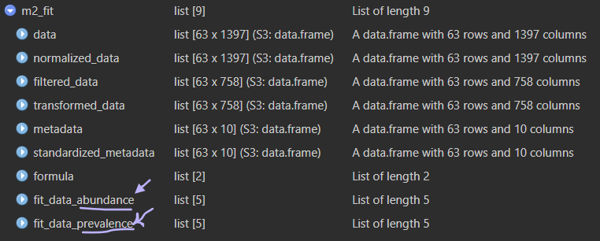

```{r setup, include=FALSE}
knitr::opts_chunk$set(
  echo = TRUE, # Display code chunks
  eval = TRUE, # Evaluate code chunks
  warning = FALSE, # Hide warnings
  message = FALSE, # Hide messages
  comment = "" # Prevents appending '##' to beginning of lines in code output
)        
```

# Background

H~o~ : "PVC Leachate does not alter specific bacterial taxa trajectory
over developmental time"

H~a~ : "PVC Leachate alters specific bacterial taxa trajectory over
developmental time"

Microbiome Multivariable Associations with Linear Models (MaAsLin)

[MaAslin3](https://huttenhower.sph.harvard.edu/MaAsLin3) improves on
MaAslin2 by accounting for compositionality and accommodates
cross-sectional studies (that's ours!)

First read and get familiar with the: [MaAslin3 package
README](https://github.com/biobakery/maaslin3) & the [MaAslin3
tutorial](https://github.com/biobakery/biobakery/wiki/maaslin3) from the
Stanford University Huttenhower Lab.

> William A. Nickols, Thomas Kuntz, Jiaxian Shen, Sagun Maharjan, Himel
> Mallick, Eric A. Franzosa, Kelsey N. Thompson, Jacob T. Nearing,
> Curtis Huttenhower. MaAsLin 3: Refining and extending generalized
> multivariable linear models for meta-omic association discovery.
> bioRxiv 2024.12.13.628459; doi:
> https://doi.org/10.1101/2024.12.13.628459

Here we aim to test changes in relative abundance (how many) and
prevalence (presence/absence) of specific taxa due to leachate, and the
interaction of leachate exposure over time, while controlling for spawn
night and read depth.

Our PERMANOVA detected that spawn night was a significant batch effect
and introduced nuisance variation into our data. To account for this
`(1 | spawn_night)` adds a random intercept for each unique spawn night
--- that is, each spawn night gets its own baseline shift in abundance,
but the effects of `hpf` and `leachate` is assumed to be the same across
nights.

[MaAsLin3 Wiki](https://github.com/biobakery/biobakery/wiki/maaslin3)
Any significant abundance associations with a categorical variable
should usually have at least 10 observations in each category.
Significant prevalence associations with categorical variables should
also have at least 10 samples in which the feature was present and at
least 10 samples in which it was absent for each significant category.

::: callout-important
There are also a few rules of thumb to keep in mind: - Models should
ideally have about **10 times as many samples** (all samples for
logistic fits, non-zero samples for linear fits) **as covariate terms**
(**all continuous variables plus all categorical variable levels**).

-   We have 63 samples... so the maximum number of terms we should use
    is 6

-   Significant associations for MaAsLin 3 are results with no model
    fitting errors, and joint q-value less than 0.1

-   Significant abundance associations with continuous metadata should
    be checked visually for influential outliers.
:::

# Install MaAsLin3

```{r, eval=FALSE}
#library("devtools")
#install_github("biobakery/maaslin3")
```

# Load Libraries

```{r}
library(maaslin3)
library(qiime2R)
library(tidyverse)
```

> MaAsLin3 requires two input files, one for taxonomic or functional
> feature abundances, and one for sample metadata.

1.  Data (or features) file

-   This file is tab-delimited.
-   Formatted with features as columns and samples as rows.
-   The transpose of this format is also okay.
-   Possible features in this file include **microbes**, genes,
    pathways, etc.

2.  Metadata file

-   Formatted with metadata as columns and samples as rownames
-   Is a data.frame object
-   Includes per sample read counts

# Setup

## Set custom ggplot theme

```{r custom-theme}
library(ggsidekick) # theme by sean anderson
theme_sleek_axe <- function() {
  theme_sleek() +
    theme(
      panel.border = element_rect(
        color = "grey70",
        fill = NA,
        linewidth = 0.5
      ),
      axis.line.x  = element_line(color = "grey70"),
      axis.line.y  = element_line(color = "grey70"),
      
      plot.title = element_text(
        size  = 10,
        color = "grey40",
        hjust = 0.5,
        margin = margin(b = 20)
      ),
      
      strip.text = element_text(size = 8, color = "grey40"),
  
      
      plot.subtitle = element_text(
        size   = 8,
        color  = "grey40",
        hjust  = 0.5,
        margin = margin(b = 40)
      ),
      
      axis.title = element_text(size = 8, color = "grey40"),
      axis.text = element_text(size = 7, color = "grey40"),
      legend.title = element_text(size = 8, color = "grey40"),
      legend.text = element_text(size = 7, color = "grey40")
    )
}

```

## Set colorschemes

```{r colorscheme}
leachate.colors <- c(control = "#AEF1FF", 
                     low     = "#BBC7FF",
                     mid     = "#7D8BFF", 
                     high    = "#592F7D")

stage.5.colors <- c(egg           = "#FFE362",
                    cleavage      = "#EBA600", 
                    morula        = "#E6AA83",
                    prawnchip     = "#D9685B", 
                    earlygastrula = "#A2223C")

stage.3.colors <- c(cleavage      = "#EBA600", 
                    prawnchip     = "#D9685B", 
                    earlygastrula = "#A2223C")

status.colors <- c(typical   = "#75C165", 
                   uncertain = "#E3FAA5", 
                   malformed = "#8B0069")

night.colors <- c(July_6th = "#E3FAA5", 
                  July_7th = "#578B21", 
                  July_8th = "#1E2440")

night.colors.alt <- c(July_6th = "#21918C", 
                      July_7th = "#201158", 
                      July_8th = "#1E2440")
```

## Define file paths

```{r file-paths}
feature_table_path <- "../../salipante/241121_StonyCoral/270x200/"
metadata_path <- "../../metadata/meta.csv"
output_path <- "../../output/maaslin_taxa/"
fig_path <- "../../figs"
```

## Load metadata

```{r metadata}
# Load metadata
metadata <- read_csv(metadata_path)

# set factors
metadata <- metadata %>% 
  mutate(
    collection_date = as.Date(collection_date, format = "%d-%b-%Y"),
    stage    = factor(stage,    levels = c("cleavage", "prawnchip", "earlygastrula"), ordered = TRUE),
    leachate = factor(leachate, levels = c("control", "low", "mid", "high"),        ordered = TRUE),
    spawn_night = factor(
      collection_date,
      levels  = as.Date(c("06-Jul-2024", "07-Jul-2024", "08-Jul-2024"), format = "%d-%b-%Y"),
      labels  = c("July 6th", "July 7th", "July 8th"),
      ordered = TRUE
    )
  )
```

## Put read depth per sample into the metadata

> Because MaAsLin 3 identifies prevalence (presence/absence)
> associations, sample read depth (number of reads) should be included
> as a covariate if available. Deeper sequencing will likely increase
> feature detection in a way that could spuriously correlate with
> metadata of interest when read depth is not included in the model.

```{r read-depths}
readepth <- read_csv("../../salipante/Sarah_StonyCoral/241121_StonyCoral_readcounts.csv")
```

```{r join-meta-reads}
metadata <- metadata %>% 
  left_join(readepth, by = c("sample_id" = "sample"))
```

```{r make-samples-rownames}
meta <- metadata %>% 
  column_to_rownames(var = "sample_id") %>% 
  as.data.frame()

# View metadata structure
str(meta)
```

# Load Data

## Feature table L6 Genus

```{r l6-feat-tbl}
# L6 Genus
## Load feature table from QIIME2 artifact
ft_l6 <- read_qza(file.path(feature_table_path, "collapsed-l6.qza"))$data

## Convert to data.frame
ft_l6 <- ft_l6 %>% 
  as.data.frame()
```

# Run MaAslin3

-   many taxa vary with time alone
-   some taxa vary with leachate
-   some taxa vary with leachate differently across time

**Model formula:**
`Abundance|Prevelance ~ leachate * hpf + reads + (1|spawn_night)`

**This model tests:**

-   Main effect of `leachate` (ordered categorical predictor; control,
    low, mid, high): Differences in the response between the levels of
    the `leachate` treatment, averaged over all `hpf`values. We choose
    to represent leachate categorically instead of a continuous variable
    here because we do not assume that response to increasing leachate
    levels is linear, and we want to capture any non-linear patterns of
    response across the different leachate treatments.

-   Main effect of `hpf` (continuous): Overall change in the response
    across developmental time, averaged over all leachate levels. This
    tests if there is a general trend of response change with time
    regardless of leachate treatment.

-   Interaction between `leachate` and `hpf`: Whether the slope of the
    response across hpf differs depending on the leachate category. This
    tests if `leachate` modifies how the response changes continuously
    over time; e.g., some leachate levels may accelerate or slow the
    effect of `hpf`.

-   Effect of `reads` (continuous covariate): Controls for the influence
    of read depth on the response, adjusting other effects accordingly.

-   Random intercept for `spawn_night`: Accounts for variability and
    non-independence among samples collected on the same spawn night by
    allowing different baseline response levels for each spawn night.

Interpretation-wise, if the interaction term is significant, it
indicates that the "trajectory" or slope of response change with `hpf`
differs by `leachate` group. If the interaction is not significant but
`leachate` is, then `leachate` affects overall response level but not
the shape of the response over time.

Graphically, imagine separate regression lines (response vs. `hpf`) for
each `leachate` group. The interaction tests whether these lines have
different slopes. The main effects test differences in intercepts and
general trend.

This model lets you hone in on how `leachate` influences response
patterns over continuous developmental time (`hpf`), adjusting for
sequencing depth (`reads`) and including random intercepts for
`spawn_night`.

-   ordered_effects: A factored categorical variable to be included.
    Consecutive levels will be tested for significance against each
    other with contrast tests, and the resulting associations will
    correspond to effect sizes, standard errors, and significances of
    each level versus the previous. Contrast tests are performed with
    multcomp::glht (fixed effects and logistic mixed effects) and
    lmerTest::contest (linear mixed effects).

## m1 : leachate\*hpf

```{r run-maaslin-categorical}
set.seed(05032026)
m1_fit <- maaslin3(
  input_data = ft_l6,
  input_metadata = meta,
  output = file.path(output_path, "m1_l6"),
  formula = ~ leachate*hpf + reads + (1|spawn_night),
  verbosity = 'ERROR',
  cores = 3, 
  plot_associations = FALSE, 
  save_models = TRUE
)
```

```{r}
m1_lin <- readRDS(file.path(output_path, "m1_l6/fits/models_linear.rds"))

m1_log <- readRDS(file.path(output_path, "m1_l6/fits/models_logistic.rds"))
```

## m2 : leachate_mgL\*hpf

```{r run-maaslin-continuous}
set.seed(05032026)
m2_fit <- maaslin3(
  input_data = ft_l6,
  input_metadata = meta,
  output = file.path(output_path, "m2_l6"),
  formula = ~ leachate_mgL*hpf + reads + (1|spawn_night),
  verbosity = 'ERROR',
  cores = 3, 
  plot_associations = FALSE, 
  save_models = TRUE
)
```

```{r}
m2_lin <- readRDS(file.path(output_path, "m2_l6/fits/models_linear.rds"))

m2_log <- readRDS(file.path(output_path, "m2_l6/fits/models_logistic.rds"))

```



The resulting object `m1/2_fit` is a list of length 9 that contains the
feature table data in `data`, the subsequently TSS `normalized_data`,
then it's `filtered_data` (note columns represent ASVs and they drop
from 1397 to 758) and then `transformed_data` ... The model outputs are
in `fit_data_abundance` and `fit_data_prevalence`

Probability of Detection Predicted Abundance

-   **Fitted values** = “what happened in my experiment”

-   **Predicted grid** = “what the model says the pattern is”

```{r, message=FALSE, warning=FALSE}
L6_sig <- read_tsv(file.path(output_path, "m1_l6/significant_results.tsv"))
```

```{r}
L6_sig <- L6_sig %>% 
  mutate(
    CI_lwr = coef - 1.98 * stderr,
    CI_upr = coef + 1.98 * stderr
  ) %>% 
  filter(is.na(error)) %>% 
  filter(metadata == "leachate")

L6_sigfeat <- unique(L6_sig$feature)
```

There are 8 unique leachate responsive features

```{r}
L6_sig %>% 
  group_by(model) %>%
  summarise(n = n_distinct(feature))
```

```{r}
# Extract only unique features to a character vector for prevalence and abundance models 
feat_prev <- L6_sig %>% 
  filter(model == "prevalence") %>% 
  distinct(feature) %>% 
  pull(feature)

feat_abun <- L6_sig %>% 
  filter(model == "abundance") %>% 
  distinct(feature) %>% 
  pull(feature)

# Which overlap?
feat_overlap <- intersect(feat_prev, feat_abun)

# How many unique features are in each model?
# Only in prevalence model
paste0("There are ", length(feat_prev), " total and ", length(setdiff(feat_prev, feat_abun)), " unique significant features in prevalence model")
# Only in abundance model
paste0("There are ", length(feat_abun), " total and ", length(setdiff(feat_abun, feat_prev)), " unique significant features in abundance model" )
# In both models
paste0("There are ", length(feat_overlap), " significant features in both")
```

> In abundance models, a one-unit change in the metadatum variable
> corresponds to a 2coef fold change in the relative abundance of the
> feature.

> In prevalence models, a one-unit change in the metadatum variable
> corresponds to a coef change in the log-odds of a feature being
> present.

Longimicrobiaceae *Tropicibacter* Peredibacter PS1 clade Sulfitobacter
Pontibacterium Neisseriaceae *Marine Methylotrophic Group 3*

Are these the same features that were significant in the m2 model? Let's
check:

```{r}
m2_L6_sig_feats <- read_tsv("../../output/maaslin_taxa/m2_l6/significant_results.tsv")
```

```{r}
m2_L6_sig_prev_feats <- m2_L6_sig_feats %>%
  filter(model == "prevalence", 
         metadata == "leachate", 
         is.na(error), 
         qval_joint < 0.1
        )
```

```{r}
length(unique(m2_L6_sig_prev_feats$feature))
unique(m2_L6_sig_prev_feats$feature)
```

Wow ok so we have ZERO significant features in the m2 model, which is
the model that uses a continuous numeric leachate_mgL factor and looks
for linear relationships between leachate and prevalence. This suggests
that the relationship between leachate and prevalence is not linear,
which is why the GAMs are useful for visualizing these relationships.

BUT using the categorical method, and looking for non-linear responses,
We have 8 significant features to visualize! What is the best approach
to visualize the predicted probability of detection across categorical
leachate and time for these features?

# Pivot data longer for plotting

##### Make function to extract taxa levels

```{r}
extract_tax_level <- function(x, rank) {
  # rank like "d", "p", "c", "o", "f", "g", "s"
  str_extract(x, paste0("(?<=", rank, "__)[^;]+"))
}
```

example to use funtion like: df2 \<- df %\>% mutate( domain =
extract_tax_level(feature, "d"), phylum = extract_tax_level(feature,
"p"), class = extract_tax_level(feature, "c"), order =
extract_tax_level(feature, "o"), family = extract_tax_level(feature,
"f"), genus = extract_tax_level(feature, "g"), species =
extract_tax_level(feature, "s") )

```{r}
L6_sig_long <- L6_normalized %>% 
  as_tibble() %>% 
  rename(sample_id = feature) %>% 
  pivot_longer(
    cols = 2:last_col(),
    names_to = "feature",
    values_to = "norm_abundance"
  ) %>% 
  filter(feature %in% L6_sigfeat) %>%
  replace_na(list(norm_abundance = 0)) %>%
  left_join(metadata, by = "sample_id") %>% 
  mutate(
    order = extract_tax_level(feature, "o"),
    family = extract_tax_level(feature, "f"), 
    genus = extract_tax_level(feature, "g"),
    species = extract_tax_level(feature, "s"), 
    genus_species = paste0(genus, " ", species)
  ) %>% 
  mutate(presence = ifelse(norm_abundance > 0, 1, 0),
    prevalence = if_else(feature %in% feat_prev, "yes", "no"),
    abundance  = if_else(feature %in% feat_abun, "yes", "no")
  )

L6_feat_all <- unique(L6_sig_long$genus_species)
```

# Abundance

## Species level (L7)

```{r, fig.width = 35, fig.height = 30}
## Relative abundance (normalized read counts)
L7_sig_long %>% 
ggplot(., aes(x = factor(hpf), y = norm_abundance, color = leachate, fill = leachate)) +
  geom_boxplot(width = 0.6, alpha = 0.6, outlier.shape = NA, position = position_dodge(width = 0.8)) +
  geom_jitter(alpha = 0.8, position = position_dodge(width = 0.8)) +
  facet_wrap(~genus_species, scales = "free_y") +
  scale_fill_manual(values = leachate.colors) +
  scale_color_manual(values = leachate.colors) +
  labs(
      title = "Relative Abundance of leachate responsive bacterial Species in 14 hours of embryonic development",
      x = "Hours Post Fertilization",
      y = "Relative Abundance (normalized read counts)"
    ) +
  theme_sleek_axe()
```

```{r}
L7_sig_long %>%
  group_split(genus_species) %>%
  walk(function(df) {

    p <- ggplot(df, aes(x = factor(hpf), y = norm_abundance,
                        color = leachate, fill = leachate)) +
      geom_boxplot(width = 0.6, alpha = 0.6, outlier.shape = NA,
                   position = position_dodge(width = 0.8)) +
      geom_jitter(alpha = 0.8,
                  position = position_dodge(width = 0.8)) +
      scale_fill_manual(values = leachate.colors) +
      scale_color_manual(values = leachate.colors) +
      labs(
        title = paste("Relative abundance of", unique(df$genus_species)),
        x = "Hours Post Fertilization",
        y = "Relative Abundance (normalized read counts)"
      ) +
      theme_sleek_axe()

    ggsave(
      filename = file.path(fig_path, paste0("species_abundance_boxplots/L7_", unique(df$genus_species), ".png")),
      plot = p,
      width = 6,
      height = 4,
      dpi = 900
    )
    
    print(p)

  })
```

## Genus (L6)

## Family (L5)

```{r}
L7_sig_long %>%
  group_split(family) %>%
  walk(function(df) {

    p <- ggplot(df, aes(x = factor(hpf), y = norm_abundance,
                        color = leachate, fill = leachate)) +
      geom_boxplot(width = 0.6, alpha = 0.6, outlier.shape = NA,
                   position = position_dodge(width = 0.8)) +
      geom_jitter(alpha = 0.8,
                  position = position_dodge(width = 0.8)) +
      scale_fill_manual(values = leachate.colors) +
      scale_color_manual(values = leachate.colors) +
      labs(
        title = paste("Relative abundance of", unique(df$family)),
        x = "Hours Post Fertilization",
        y = "Relative Abundance (normalized read counts)"
      ) +
      theme_sleek_axe()

    ggsave(
      filename = file.path(fig_path, paste0("family_abundance_boxplots/L7_", unique(df$family), ".png")),
      plot = p,
      width = 6,
      height = 4,
      dpi = 900
    )
    
    print(p)

  })
```

```{r, fig.width = 12, fig.height = 12}
## Relative abundance (normalized read counts)
L7_sig_long %>% 
ggplot(., aes(x = factor(hpf), y = norm_abundance, color = leachate, fill = leachate)) +
  geom_boxplot(width = 0.6, alpha = 0.6, outlier.shape = NA, position = position_dodge(width = 0.8)) +
  geom_jitter(alpha = 0.8, position = position_dodge(width = 0.8)) +
  facet_wrap(~family, scales = "free_y") +
  scale_fill_manual(values = leachate.colors) +
  scale_color_manual(values = leachate.colors) +
  labs(
      title = "Relative Abundance of leachate responsive bacterial Famiy in 14 hours of embryonic development",
      x = "Hours Post Fertilization",
      y = "Relative Abundance (normalized read counts)"
    ) +
  theme_sleek_axe()
```

```{r}
ggsave(
  filename = file.path(fig_path, "family_abundance.png"),
  width = 12,
  height = 12,
  dpi = 900
)
```

## Order (L4)

```{r}
L7_sig_long %>%
  group_split(order) %>%
  walk(function(df) {

    p <- ggplot(df, aes(x = factor(hpf), y = norm_abundance,
                        color = leachate, fill = leachate)) +
      geom_boxplot(width = 0.6, alpha = 0.6, outlier.shape = NA,
                   position = position_dodge(width = 0.8)) +
      geom_jitter(alpha = 0.8,
                  position = position_dodge(width = 0.8)) +
      scale_fill_manual(values = leachate.colors) +
      scale_color_manual(values = leachate.colors) +
      labs(
        title = paste("Relative abundance of", unique(df$order)),
        y = "Relative Abundance (normalized read counts)",
      ) +
      theme_sleek_axe()

    ggsave(
      filename = file.path(fig_path, paste0("order_abundance_boxplots/L7_", unique(df$order), ".png")),
      plot = p,
      width = 6,
      height = 4,
      dpi = 900
    )
    
    print(p)

  })
```

```{r, fig.width = 12, fig.height = 12}
## Relative abundance (normalized read counts)
L7_sig_long %>% 
ggplot(., aes(x = factor(hpf), y = norm_abundance, color = leachate, fill = leachate)) +
  geom_boxplot(width = 0.6, alpha = 0.6, outlier.shape = NA, position = position_dodge(width = 0.8)) +
  geom_jitter(alpha = 0.8, position = position_dodge(width = 0.8)) +
  facet_wrap(~order, scales = "free_y") +
  scale_fill_manual(values = leachate.colors) +
  scale_color_manual(values = leachate.colors) +
  labs(
      title = "Relative Abundance of leachate responsive bacterial Order in 14 hours of embryonic development",
      x = "Hours Post Fertilization",
      y = "Relative Abundance (normalized read counts)"
    ) +
  theme_sleek_axe()
```

```{r}
ggsave(
  filename = file.path(fig_path, "order_abundance.png"),
  width = 12,
  height = 12,
  dpi = 900
)
```

# Prevalence

## Species (L7)

```{r, fig.width = 14, fig.height = 30}
L7_sig_long %>% filter(feature %in% feat_prev) %>%
ggplot(.,
       aes(x = leachate,
           y = as.numeric(presence),
           color = leachate,
           fill = leachate)) +
    
  geom_smooth(
    aes(group = 1),
    method = "glm",
    method.args = list(family = "binomial"),
    se = FALSE,
    color = "grey40",
    fill = "grey70",
    linewidth = 0.8
  ) +
  geom_rug(
    aes(x = leachate_mgL),
    sides = "bt",
    color = "grey70",
    alpha = 0.5
  ) +
  geom_dotplot(
    binaxis = "y",
    stackdir = "centerwhole",
    alpha = 0.5,
    shape = 1,
    dotsize = 1.5
  ) +
    # mean points
  stat_summary(
    fun = mean,
    geom = "point",
    shape = 18,
    size = 4
  ) +

  facet_grid(genus_species~hpf) +
  coord_fixed(ratio = 2.8) +
  scale_fill_manual(values = leachate.colors) +
  scale_color_manual(values = leachate.colors) +
  labs(
    title = "Prevalence of leachate responsive bacteria Species across leachate levels and developmental stages",
    x = "Leachate Level",
    y = "Prevalence (proportion of samples with bacteria Species present)"
  ) +
  theme_sleek_axe()+ 
  theme(
  strip.text.y = element_text(size = 8, color = "grey40", angle = 0, hjust = 0)
)
```

```{r}
ggsave(
  filename = file.path(fig_path, "species_prevalence.png"),
  width = 12,
  height = 12,
  dpi = 900
)
```

## Family (L5)

```{r, fig.width = 14, fig.height = 30}
L7_sig_long %>% filter(feature %in% feat_prev) %>%
ggplot(.,
       aes(x = leachate,
           y = as.numeric(presence),
           color = leachate,
           fill = leachate)) +
    
  geom_smooth(
    aes(group = 1),
    method = "glm",
    method.args = list(family = "binomial"),
    se = FALSE,
    color = "grey40",
    fill = "grey70",
    linewidth = 0.8
  ) +
  geom_rug(
    aes(x = leachate_mgL),
    sides = "bt",
    color = "grey70",
    alpha = 0.5
  ) +
  geom_dotplot(
    binaxis = "y",
    stackdir = "centerwhole",
    alpha = 0.5,
    shape = 1,
    dotsize = 1.5
  ) +
    # mean points
  stat_summary(
    fun = mean,
    geom = "point",
    shape = 18,
    size = 4
  ) +

  facet_grid(family~hpf) +
  coord_fixed(ratio = 2.8) +
  scale_fill_manual(values = leachate.colors) +
  scale_color_manual(values = leachate.colors) +
  labs(
    title = "Prevalence of leachate responsive bacteria Family across leachate levels and developmental stages",
    x = "Leachate Level",
    y = "Prevalence (proportion of samples with bacteria Species present)"
  ) +
  theme_sleek_axe()+ 
  theme(
  strip.text.y = element_text(size = 8, color = "grey40", angle = 0, hjust = 0)
)
```

```{r}
ggsave(
  filename = file.path(fig_path, "family_prevalence.png"),
  width = 14,
  height = 30,
  dpi = 900)

```

## Order (L4)

```{r, fig.width = 12, fig.height = 18}
L7_sig_long %>% filter(feature %in% feat_prev) %>%
ggplot(.,
       aes(x = leachate,
           y = as.numeric(presence),
           color = leachate,
           fill = leachate)) +
    
  geom_smooth(
    aes(group = 1),
    method = "glm",
    method.args = list(family = "binomial"),
    se = FALSE,
    color = "grey40",
    fill = "grey70",
    linewidth = 0.8
  ) +
  geom_rug(
    aes(x = leachate_mgL),
    sides = "bt",
    color = "grey70",
    alpha = 0.5
  ) +
  geom_dotplot(
    binaxis = "y",
    stackdir = "centerwhole",
    alpha = 0.5,
    shape = 1,
    dotsize = 1.5
  ) +
    # mean points
  stat_summary(
    fun = mean,
    geom = "point",
    shape = 18,
    size = 4
  ) +

  facet_grid(order~hpf) +
  coord_fixed(ratio = 2.8) +
  scale_fill_manual(values = leachate.colors) +
  scale_color_manual(values = leachate.colors) +
  labs(
    title = "Prevalence of leachate responsive bacteria Order across leachate levels and developmental stages",
    x = "Leachate Level",
    y = "Prevalence (proportion of samples with bacteria Species present)"
  ) +
  theme_sleek_axe()+ 
  theme(
  strip.text.y = element_text(size = 8, color = "grey40", angle = 0, hjust = 0)
)
```

```{r}
ggsave(
  filename = file.path(fig_path, "order_prevalence.png"),
  width = 12,
  height = 18,
  dpi = 900
)
```

# Plot model predictions

-   pull one fitted model for one taxon
-   make a prediction grid from your metadata
-   predict fitted probabilities
-   plot probability of detection (y) vs observed presence (x)
    (geom_rug) + smooth fitted predictions + CI
-   loop over taxa and save plots

```{r}
names(maaslin_fit$fit_data_prevalence$fits)[1:10]
```

There is 1 model fit for each ASV. I only want to plot the statistically
significant features... (those which are differentially prevalent). This
list is a character vector named `feat_prev`

Subset list of model fits to `feat_prev`

```{r}
prev_fit_list <- maaslin_fit$fit_data_prevalence$fits

prev_fit_list_sig <- prev_fit_list[feat_prev]
```

Of our list of 24 significant features, let's start with 1

```{r}
# pull out one model from the list
mod1 <- prev_fit_list_sig[[1]]

# inspect the variables in the model formula
formula(mod1)
names(model.frame(mod1))
```

## Make prediction grid

Fixed effects predictions

```{r}
dat1 <- model.frame(mod1) %>% 
  mutate(
    hpf = as.numeric(hpf), 
    reads = as.numeric(reads)
  )

str(dat1)
```

Your fitted model expects: - leachate as ordered factor - hpf as
nmatrix.1 - reads as nmatrix.1 - spawn_night as ordered factor

```{r}
dat_pred <- expand_grid(
  leachate = levels(dat1$leachate),
  hpf = seq(min(dat1$hpf), max(dat1$hpf), length.out = 100),
  reads = mean(dat1$reads),
  spawn_night = levels(dat1$spawn_night)[1]
) %>%
  mutate(
    hpf   = I(matrix(hpf, ncol = 1)),
    reads = I(matrix(reads, ncol = 1)),
    spawn_night = factor(
      spawn_night,
      levels = levels(dat1$spawn_night),
      ordered = is.ordered(dat1$spawn_night)
    ),
    leachate = factor(
      leachate,
      levels = levels(dat1$leachate),
      ordered = is.ordered(dat1$leachate)
    )
  )
```

```{r}
mod1_preds <- predict(mod1, newdata = dat_pred, type = "response", re.form = NA, se.fit = TRUE)
```

zval \<- 1.96 95% = 1.96 90% = 1.645 75% = 1.15

```{r}
zval <- 1.96

mod1_sePreds_link <-  data.frame(dat_pred,
                          mu = binomial()$linkinv((mod1_preds$fit)),
                          low95  = binomial()$linkinv((mod1_preds$fit - zval * mod1_preds$se.fit)),
                          high95 = binomial()$linkinv(mod1_preds$fit + zval * mod1_preds$se.fit),
                          low75  = binomial()$linkinv((mod1_preds$fit - 1.15 * mod1_preds$se.fit)),
                          high75 = binomial()$linkinv(mod1_preds$fit + 1.15 * mod1_preds$se.fit),
                          low50  = binomial()$linkinv((mod1_preds$fit - 0.674 * mod1_preds$se.fit)),
                          high50 = binomial()$linkinv(mod1_preds$fit + 0.674 * mod1_preds$se.fit)
                          ) %>% 
  mutate(
    leachate_mgL = recode(leachate,
      "control" = 0,
      "low"     = 0.01,
      "mid"     = 0.1,
      "high"    = 1 
    )
  )
```

CI stuff... `zval <- 1.96` \# 95% = 1.96 \# 90% = 1.645 \# 75% = 1.15

# Plot fitted prevalence model

```{r}
library(PNWColors)
```

```{r}
mod1POD <- ggplot(mod1_sePreds_link, aes(x = leachate_mgL, y = mu)) +
  geom_ribbon(aes(ymin = low95, ymax = high95), stat = "identity", alpha = 0.3, color = NA) +
  geom_ribbon(aes(ymin = low75, ymax = high75), stat = "identity", alpha = 0.3, color = NA) +
  geom_ribbon(aes(ymin = low50, ymax = high50), stat = "identity", alpha = 0.3, color = NA) +
  geom_line(aes(y = mu)) +
  scale_fill_manual(values = c(pnw_palette("Cascades",5, type = "continuous")[4:5],
                               pnw_palette("Sunset",1, type = "continuous"))) +
  scale_color_manual(values = c(pnw_palette("Cascades",5, type = "continuous")[4:5],
                                pnw_palette("Sunset",1, type = "continuous"))) +
  scale_y_continuous(name = "Probability of Detection")+
  scale_x_log10()+
  theme_minimal() +
  theme(legend.position = "bottom", 
        legend.title = element_blank(),
        axis.text.y.right = element_blank()) +
  xlab("Leachate")

mod1POD
```

# Summary

```{r}
write_csv(L7_sig_long, file.path(output_path, "L7_significant_features_long.csv"))
```

```{r}
sessionInfo()
```
