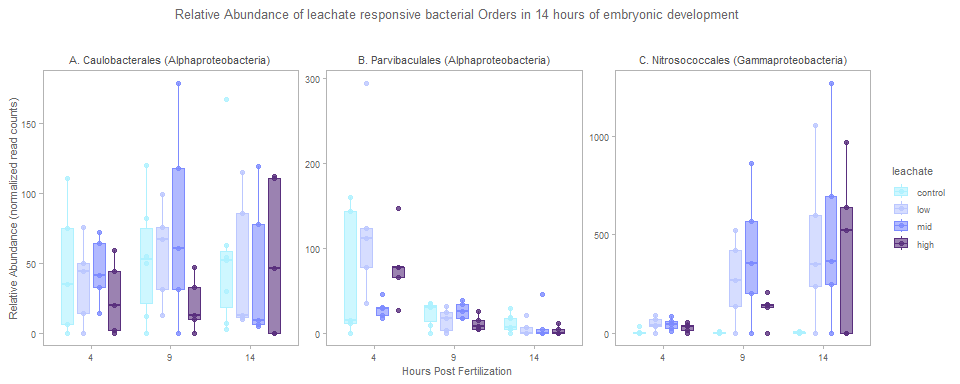
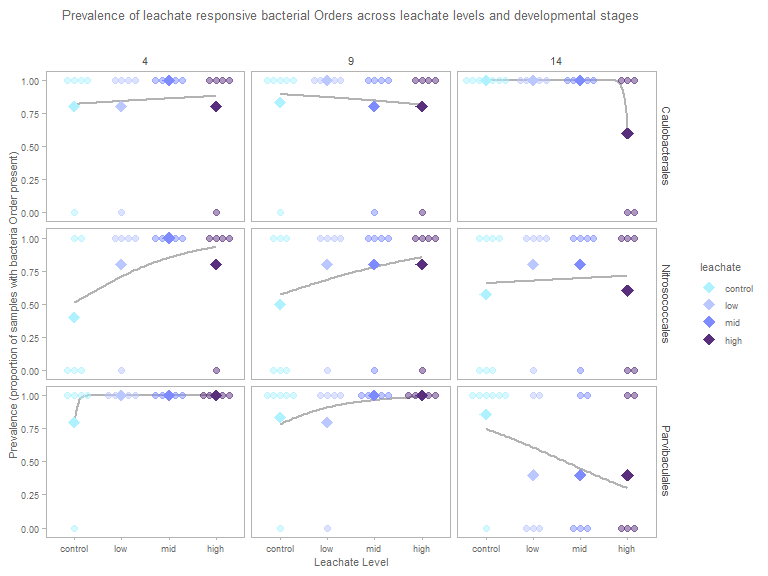
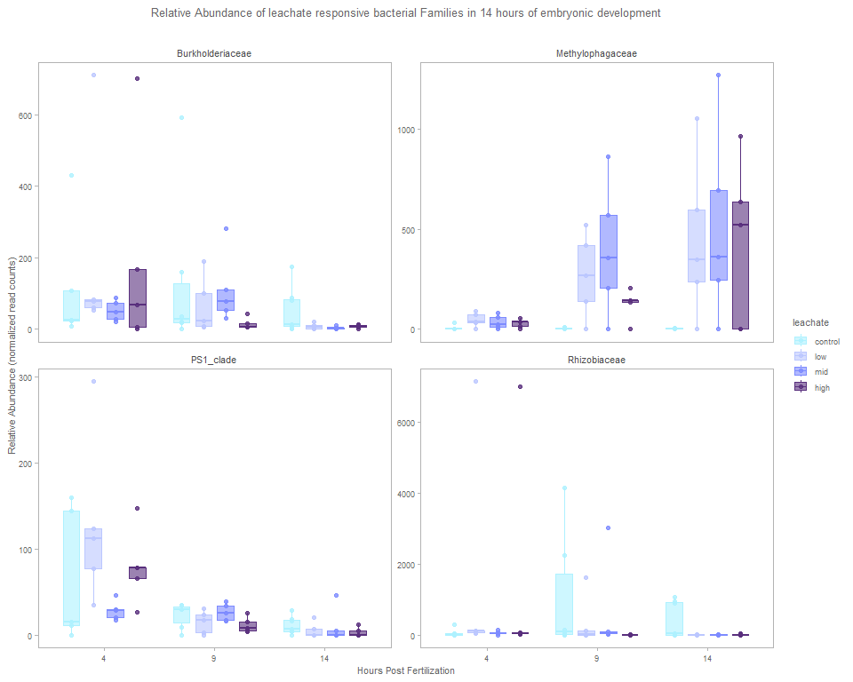
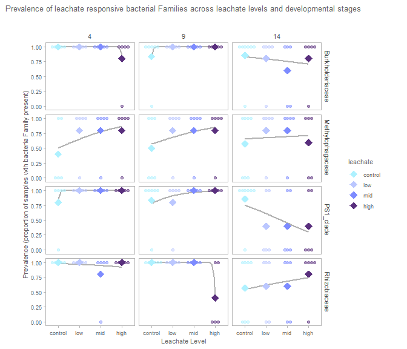
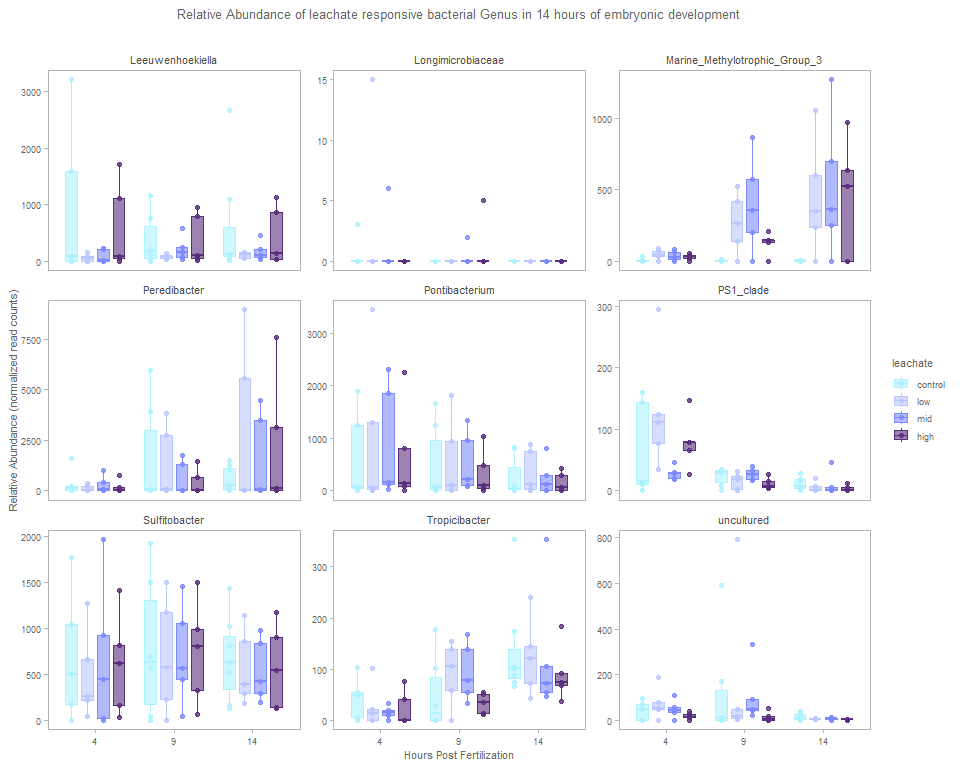
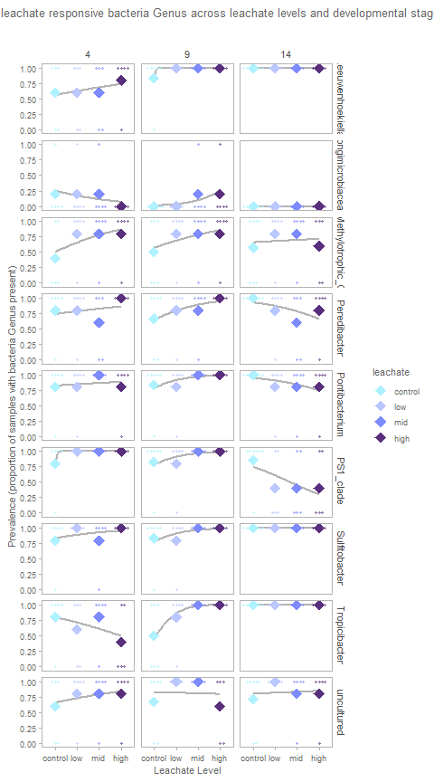
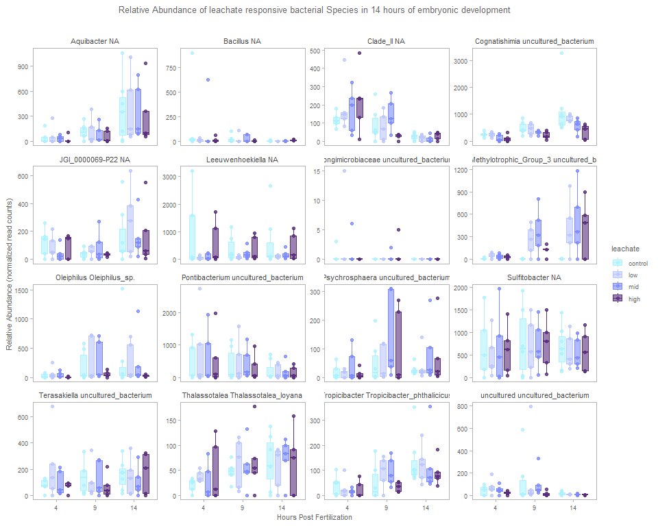
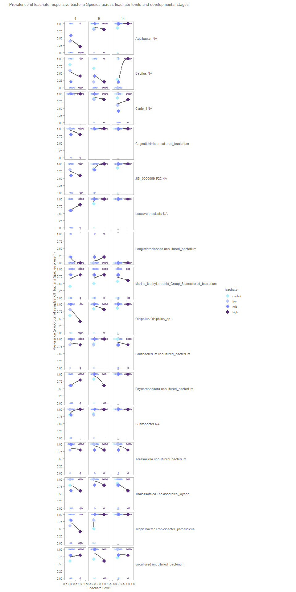
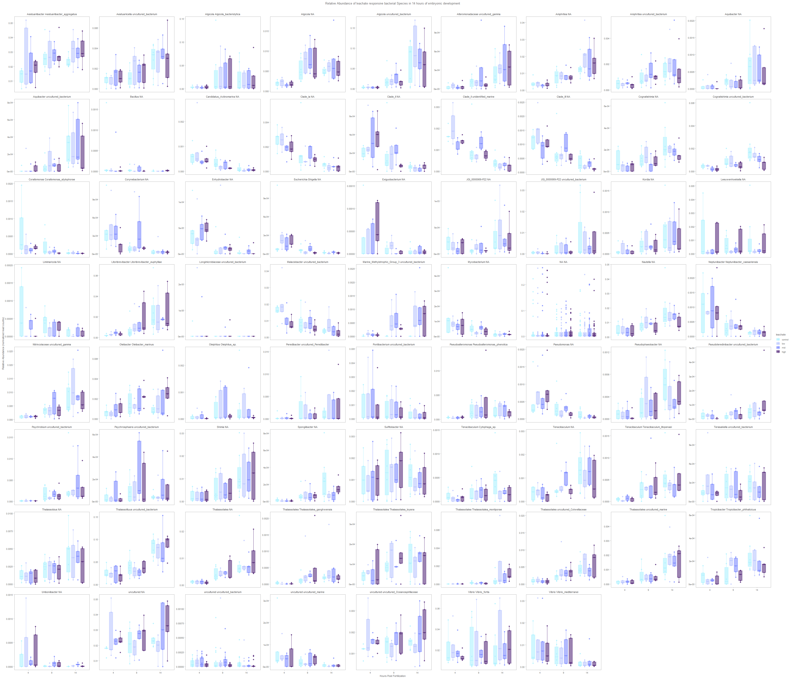

# Differential abundance of bacterial taxa at various taxonomic levels
Sarah Tanja
2026-03-02

- [<span class="toc-section-number">1</span> Background](#background)
- [<span class="toc-section-number">2</span> Install
  MaAsLin3](#install-maaslin3)
- [<span class="toc-section-number">3</span> Load
  Libraries](#load-libraries)
- [<span class="toc-section-number">4</span> Setup](#setup)
  - [<span class="toc-section-number">4.1</span> Set custom ggplot
    theme](#set-custom-ggplot-theme)
  - [<span class="toc-section-number">4.2</span> Set
    colorschemes](#set-colorschemes)
  - [<span class="toc-section-number">4.3</span> Define file
    paths](#define-file-paths)
  - [<span class="toc-section-number">4.4</span> Load
    metadata](#load-metadata)
  - [<span class="toc-section-number">4.5</span> Put read depth per
    sample into the
    metadata](#put-read-depth-per-sample-into-the-metadata)
- [<span class="toc-section-number">5</span> Load Data](#load-data)
  - [<span class="toc-section-number">5.1</span> Feature tables
    L4-7](#feature-tables-l4-7)
- [<span class="toc-section-number">6</span> Run
  MaAslin3](#run-maaslin3)
- [<span class="toc-section-number">7</span> Interactive
  model](#interactive-model)
  - [<span class="toc-section-number">7.1</span> L4 Order](#l4-order)
    - [<span class="toc-section-number">7.1.1</span> Plots](#plots)
  - [<span class="toc-section-number">7.2</span> L5 Family](#l5-family)
    - [<span class="toc-section-number">7.2.1</span> Plots](#plots-1)
  - [<span class="toc-section-number">7.3</span> L6 Genus](#l6-genus)
    - [<span class="toc-section-number">7.3.1</span> Plots](#plots-2)
  - [<span class="toc-section-number">7.4</span> L7
    Species](#l7-species)
    - [<span class="toc-section-number">7.4.1</span> Plots](#plots-3)
- [<span class="toc-section-number">8</span> Summary](#summary)

# Background

H<sub>o</sub> : “PVC Leachate does not alter microbiome trajectory over
developmental time”

H<sub>a</sub> : “PVC Leachate alters microbiome trajectory over
developmental time”

Microbiome Multivariable Associations with Linear Models (MaAsLin)

[MaAslin3](https://huttenhower.sph.harvard.edu/MaAsLin3) improves on
MaAslin2 by accounting for compositionality and accommodates
cross-sectional studies (that’s ours!)

First read and get familiar with the: [MaAslin3 package
README](https://github.com/biobakery/maaslin3) & the [MaAslin3
tutorial](https://github.com/biobakery/biobakery/wiki/maaslin3) from the
Stanford University Huttenhower Lab.

Here we aim to test changes in relative abundance (how many) and
prevalence (presence/absence) of specific taxa due to leachate, and the
interaction of leachate exposure over time, while controlling for spawn
night and read depth.

Our PERMANOVA detected that spawn night was a significant batch effect
and introduced nuisance variation into our data. To account for this
`(1 | spawn_night)` adds a random intercept for each unique spawn night
— that is, each spawn night gets its own baseline shift in abundance,
but the effects of `hpf` and `leachate` is assumed to be the same across
nights.

[MaAsLin3 Wiki](https://github.com/biobakery/biobakery/wiki/maaslin3)
Any significant abundance associations with a categorical variable
should usually have at least 10 observations in each category.
Significant prevalence associations with categorical variables should
also have at least 10 samples in which the feature was present and at
least 10 samples in which it was absent for each significant category.
Significant abundance associations with continuous metadata should be
checked visually for influential outliers.

> [!IMPORTANT]
>
> There are also a few rules of thumb to keep in mind:
>
> - Models should ideally have about **10 times as many samples** (all
>   samples for logistic fits, non-zero samples for linear fits) **as
>   covariate terms** (**all continuous variables plus all categorical
>   variable levels**).
>
> <!-- -->
>
>     We have 63 samples... so the maximum number of terms we should use is 6 
>
> - Significant associations for MaAsLin 3 are results with no model
>   fitting errors, and joint q-value less than 0.1
>
> - Significant abundance associations with continuous metadata should
>   be checked visually for influential outliers.

# Install MaAsLin3

``` r
#library("devtools")
#install_github("biobakery/maaslin3")
```

# Load Libraries

``` r
library(maaslin3)
library(qiime2R)
library(tidyverse)
```

> MaAsLin3 requires two input files, one for taxonomic or functional
> feature abundances, and one for sample metadata.

1.  Data (or features) file

- This file is tab-delimited.
- Formatted with features as columns and samples as rows.
- The transpose of this format is also okay.
- Possible features in this file include **microbes**, genes, pathways,
  etc.

2.  Metadata file

- Formatted with metadata as columns and samples as rownames
- Is a data.frame object
- Includes per sample read counts

# Setup

## Set custom ggplot theme

``` r
library(ggsidekick) # theme by sean anderson
theme_sleek_axe <- function() {
  theme_sleek() +
    theme(
      panel.border = element_rect(
        color = "grey70",
        fill = NA,
        linewidth = 0.5
      ),
      axis.line.x  = element_line(color = "grey70"),
      axis.line.y  = element_line(color = "grey70"),
      
      plot.title = element_text(
        size  = 10,
        color = "grey40",
        hjust = 0.5,
        margin = margin(b = 20)
      ),
      
      strip.text = element_text(size = 8, color = "grey40"),
  
      
      plot.subtitle = element_text(
        size   = 8,
        color  = "grey40",
        hjust  = 0.5,
        margin = margin(b = 40)
      ),
      
      axis.title = element_text(size = 8, color = "grey40"),
      axis.text = element_text(size = 7, color = "grey40"),
      legend.title = element_text(size = 8, color = "grey40"),
      legend.text = element_text(size = 7, color = "grey40")
    )
}
```

## Set colorschemes

``` r
leachate.colors <- c(control = "#AEF1FF", 
                     low     = "#BBC7FF",
                     mid     = "#7D8BFF", 
                     high    = "#592F7D")

stage.5.colors <- c(egg           = "#FFE362",
                    cleavage      = "#EBA600", 
                    morula        = "#E6AA83",
                    prawnchip     = "#D9685B", 
                    earlygastrula = "#A2223C")

stage.3.colors <- c(cleavage      = "#EBA600", 
                    prawnchip     = "#D9685B", 
                    earlygastrula = "#A2223C")

status.colors <- c(typical   = "#75C165", 
                   uncertain = "#E3FAA5", 
                   malformed = "#8B0069")

night.colors <- c(July_6th = "#E3FAA5", 
                  July_7th = "#578B21", 
                  July_8th = "#1E2440")

night.colors.alt <- c(July_6th = "#21918C", 
                      July_7th = "#201158", 
                      July_8th = "#1E2440")
```

## Define file paths

``` r
feature_table_path <- "../../salipante/241121_StonyCoral/270x200/"
metadata_path <- "../../metadata/meta.csv"
output_path <- "../../output/maaslin/"
fig_path <- "../../output/figs"
```

## Load metadata

``` r
# Load metadata
metadata <- read_csv(metadata_path)

# set factors
metadata <- metadata %>% 
  mutate(
    collection_date = as.Date(collection_date, format = "%d-%b-%Y"),
    stage    = factor(stage,    levels = c("cleavage", "prawnchip", "earlygastrula"), ordered = TRUE),
    leachate = factor(leachate, levels = c("control", "low", "mid", "high"),        ordered = TRUE),
    spawn_night = factor(
      collection_date,
      levels  = as.Date(c("06-Jul-2024", "07-Jul-2024", "08-Jul-2024"), format = "%d-%b-%Y"),
      labels  = c("July 6th", "July 7th", "July 8th"),
      ordered = TRUE
    )
  )
```

## Put read depth per sample into the metadata

> Because MaAsLin 3 identifies prevalence (presence/absence)
> associations, sample read depth (number of reads) should be included
> as a covariate if available. Deeper sequencing will likely increase
> feature detection in a way that could spuriously correlate with
> metadata of interest when read depth is not included in the model.

``` r
readepth <- read_csv("../../salipante/Sarah_StonyCoral/241121_StonyCoral_readcounts.csv")
```

``` r
metadata <- metadata %>% 
  left_join(readepth, by = c("sample_id" = "sample"))
```

``` r
# make samples rownames
meta <- metadata %>% 
  column_to_rownames(var = "sample_id") %>% 
  as.data.frame()

# View metadata structure
str(meta)
```

    'data.frame':   63 obs. of  10 variables:
     $ collection_date: Date, format: "2024-07-08" "2024-07-08" ...
     $ parents        : num  101112 101112 101112 101112 101112 ...
     $ group          : chr  "C14" "C4" "C9" "H14" ...
     $ hpf            : num  14 4 9 14 4 9 14 4 9 14 ...
     $ stage          : Ord.factor w/ 3 levels "cleavage"<"prawnchip"<..: 3 1 2 3 1 2 3 1 2 3 ...
     $ leachate       : Ord.factor w/ 4 levels "control"<"low"<..: 1 1 1 4 4 4 2 2 2 3 ...
     $ leachate_mgL   : num  0 0 0 1 1 1 0.01 0.01 0.01 0.1 ...
     $ spawn_night    : Ord.factor w/ 3 levels "July 6th"<"July 7th"<..: 3 3 3 3 3 3 3 3 3 3 ...
     $ reads          : num  1315572 1691582 1663949 1339947 2341461 ...
     $ % of reads     : chr  "0.99%" "1.27%" "1.25%" "1.01%" ...

# Load Data

## Feature tables L4-7

``` r
# L4 Order
## Load feature table from QIIME2 artifact
ft_l4 <- read_qza(file.path(feature_table_path, "collapsed-l4.qza"))$data

## Convert to data.frame
ft_l4 <- ft_l4 %>% 
  as.data.frame()

# L5 Family
## Load feature table from QIIME2 artifact
ft_l5 <- read_qza(file.path(feature_table_path, "collapsed-l5.qza"))$data

## Convert to data.frame
ft_l5 <- ft_l5 %>% 
  as.data.frame()

# L6 Genus
## Load feature table from QIIME2 artifact
ft_l6 <- read_qza(file.path(feature_table_path, "collapsed-l6.qza"))$data

## Convert to data.frame
ft_l6 <- ft_l6 %>% 
  as.data.frame()

# L7 Species
## Load feature table from QIIME2 artifact
ft_l7 <- read_qza(file.path(feature_table_path, "collapsed-l7.qza"))$data

## Convert to data.frame
ft_l7 <- ft_l7 %>% 
  as.data.frame()
```

# Run MaAslin3

# Interactive model

**Model formula:**
`Abundance|Prevelance ~ leachate * hpf + reads + (1|spawn_night)`

**This model tests:**

- Main effect of `leachate` (categorical, control, low, mid, high):
  Differences in the response between the levels of the `leachate`
  treatment, averaged over all `hpf`values.

- Main effect of `hpf` (continuous): The overall linear trend in the
  response as hours post-fertilization (`hpf`) changes, averaged over
  all leachate groups.

- Interaction between `leachate` and `hpf`: Whether the slope of the
  response across hpf differs depending on the leachate category. This
  tests if `leachate` modifies how the response changes continuously
  over time; e.g., some leachate levels may accelerate or slow the
  effect of `hpf`.

- Effect of `reads` (continuous covariate): Controls for the influence
  of read depth on the response, adjusting other effects accordingly.

- Random intercept for `spawn_night`: Accounts for variability and
  non-independence among samples collected on the same spawn night by
  allowing different baseline response levels for each spawn night.

Interpretation-wise, if the interaction term is significant, it
indicates that the “trajectory” or slope of response change with `hpf`
differs by `leachate` group. If the interaction is not significant but
`leachate` is, then `leachate` affects overall response level but not
the shape of the response over time.

Graphically, imagine separate regression lines (response vs. `hpf`) for
each `leachate` group. The interaction tests whether these lines have
different slopes. The main effects test differences in intercepts and
general trend.

This model lets you hone in on how `leachate` influences response
patterns over continuous developmental time (`hpf`), adjusting for
sequencing depth (`reads`) and including random intercepts for
`spawn_night`.

## L4 Order

``` r
set.seed(03022026)
fit_Level4_Model1v1 <- maaslin3(
  input_data = ft_l4,
  input_metadata = meta,
  output = file.path(output_path, "Interaction/L4_interaction_cat.con"),
  formula = ~ leachate * hpf + reads + (1|spawn_night),
  verbosity = 'ERROR',
  cores = 3
)
```

Read in the significant results

``` r
sig_L4 <- read_tsv(file.path(output_path, "Interaction/L4_interaction_cat.con/significant_results.tsv"))
```

Filter for leachate

``` r
sig_pvc_L4 <- sig_L4 %>% 
  filter(is.na(error)) %>% 
  filter(metadata == "leachate") %>% 
  mutate(formula = "~ leachate * hpf + reads + (1|spawn_night)") %>% 
  mutate(level = "Order_L4")

sig_pvc_L4 %>% group_by(feature, model) %>% summarize(mean(coef))
```

    # A tibble: 6 × 3
    # Groups:   feature [3]
      feature                                                     model `mean(coef)`
      <chr>                                                       <chr>        <dbl>
    1 d__Bacteria;p__Proteobacteria;c__Alphaproteobacteria;o__Ca… abun…      0.208  
    2 d__Bacteria;p__Proteobacteria;c__Alphaproteobacteria;o__Ca… prev…     -0.687  
    3 d__Bacteria;p__Proteobacteria;c__Alphaproteobacteria;o__Pa… abun…     -0.425  
    4 d__Bacteria;p__Proteobacteria;c__Alphaproteobacteria;o__Pa… prev…     -0.00991
    5 d__Bacteria;p__Proteobacteria;c__Gammaproteobacteria;o__Ni… abun…      0.819  
    6 d__Bacteria;p__Proteobacteria;c__Gammaproteobacteria;o__Ni… prev…     -2.99   

``` r
length(unique(sig_pvc_L4$feature))
```

    [1] 3

``` r
L4_feat <- unique(sig_pvc_L4$feature)
```

### Plots

##### Make function to extract taxa levels

``` r
extract_tax_level <- function(x, rank) {
  # rank like "d", "p", "c", "o", "f", "g", "s"
  str_extract(x, paste0("(?<=", rank, "__)[^;]+"))
}
```

example to use funtion like: df2 \<- df %\>% mutate( domain =
extract_tax_level(feature, “d”), phylum = extract_tax_level(feature,
“p”), class = extract_tax_level(feature, “c”), order =
extract_tax_level(feature, “o”), family = extract_tax_level(feature,
“f”), genus = extract_tax_level(feature, “g”), species =
extract_tax_level(feature, “s”) )

Filter for Orders of interest (L4_feat), and prep data for plotting

``` r
sig_L4_long <- ft_l4 %>% 
  rownames_to_column(var = "feature") %>% 
  filter(feature %in% L4_feat) %>% 
  as_tibble() %>% 
  pivot_longer(
    cols = 2:last_col(),
    names_to = "sample_id",
    values_to = "rel_abundance"
  ) %>% 
  left_join(metadata, by = "sample_id") %>% 
  mutate(
    order = extract_tax_level(feature, "o"),
    order_label = factor(
      order,
      levels = c("Caulobacterales", "Parvibaculales", "Nitrosococcales"),
      labels = c(
        "A. Caulobacterales (Alphaproteobacteria)",
        "B. Parvibaculales (Alphaproteobacteria)",
        "C. Nitrosococcales (Gammaproteobacteria)"
      )
    )
  )
```

#### Abundance

Relative abundance plots for significant Orders across developmental
time and leachate treatments

``` r
## Relative abundance (normalized read counts)
ggplot(sig_L4_long, aes(x = factor(hpf), y = rel_abundance, color = leachate, fill = leachate)) +
  #geom_violin(alpha = 0.1, outlier.shape = NA, position = position_dodge(width = 0.8)) +
  geom_boxplot(width = 0.6, alpha = 0.6, outlier.shape = NA, position = position_dodge(width = 0.8)) +
  geom_jitter(alpha = 0.8, position = position_dodge(width = 0.8)) +
  facet_wrap(~ order_label, scales = "free_y") +
  scale_fill_manual(values = leachate.colors) +
  scale_color_manual(values = leachate.colors) +
  labs(
    title = "Relative Abundance of leachate responsive bacterial Orders in 14 hours of embryonic development",
    x = "Hours Post Fertilization",
    y = "Relative Abundance (normalized read counts)"
  ) +
  theme_sleek_axe()
```



Save abundance plot

``` r
ggsave(
  filename = file.path(fig_path, "order_abundance.png"),
  width = 10,
  height = 4,
  dpi = 900
)
```

#### Prevalence

Prevalence plots for significant Orders across developmental time and
leachate treatments

``` r
sig_L4_long <- sig_L4_long %>%
  mutate(presence = ifelse(rel_abundance > 0, 1, 0))
```

``` r
ggplot(sig_L4_long,
       aes(x = leachate,
           y = as.numeric(presence),
           color = leachate,
           fill = leachate)) +
    
  geom_smooth(
    aes(group = 1),
    method = "glm",
    method.args = list(family = "binomial"),
    se = FALSE,
    color = "grey70",
    fill = "grey90",
    linewidth = 0.8
  ) +
  
  geom_dotplot(
    binaxis = "y",
    stackdir = "centerwhole",
    alpha = 0.5,
    shape = 1,
    dotsize = 1.5
  ) +
    # mean points
  stat_summary(
    fun = mean,
    geom = "point",
    shape = 18,
    size = 4
  ) +

  facet_grid(order~hpf) +
  coord_fixed(ratio = 2.8) +
  scale_fill_manual(values = leachate.colors) +
  scale_color_manual(values = leachate.colors) +
  labs(
    title = "Prevalence of leachate responsive bacterial Orders across leachate levels and developmental stages",
    x = "Leachate Level",
    y = "Prevalence (proportion of samples with bacteria Order present)"
  ) +
  theme_sleek_axe()
```



``` r
ggsave(
  filename = file.path(fig_path, "order_prevalence.png"),
  width = 8,
  height = 6,
  dpi = 900
)
```

> [!IMPORTANT]
>
> ### Caulobacterales (Alphaproteobacteria)
>
> **Abundance model**
>
> **coef = +0.208**
>
> - Positive coefficient → abundance **increases with increasing
>   leachate**
>
> - Magnitude is modest
>
> - Because abundance was log-transformed, this reflects a proportional
>   change
>
> - As PVC leachate increases, *Caulobacterales* tend to increase in
>   relative abundance in samples where they are present.
>
> **Prevalence model**
>
> **coef = −0.687**
>
> - Negative coefficient → odds of detection decrease with leachate
>
> - Convert to odds ratio: $OR = e^{-0.687} ≈ 0.50$
>
> - With increasing leachate, the odds of detecting Caulobacterales are
>   about 50% lower per unit increase in leachate.
>
> **Combined biological interpretation**
>
> - When present → they increase in abundance
>
> - But → they are detected in fewer samples overall
>
> - That suggests **patchy enrichment**. Leachate may be selecting for
>   strong blooms in some samples while excluding them from others.
>
> - That’s not contradictory — it’s ecological heterogeneity.

> [!IMPORTANT]
>
> ### Parvibaculales (Alphaproteobacteria)
>
> **Abundance**
>
> **coef = −0.425**
>
> - Negative → abundance decreases with leachate
>
> - Moderate magnitude
>
> - Parvibaculales decline in relative abundance under increasing
>   leachate exposure.
>
> **Prevalence**
>
> **coef = −0.0099**
>
> - That is essentially zero
>
> - Leachate does not affect whether Parvibaculales are detected or not
>
> - Odds ratio: $OR = e^{-0.0099} ≈ 0.99$
>
> **Combined biological interpretation**
>
> - Leachate does not meaningfully change whether Parvibaculales are
>   detected, but when present, they are less abundant as leachate
>   increases.
>
> - That is a classic **sublethal suppression signal**.

> [!IMPORTANT]
>
> ### Nitrosococcales (Gammaproteobacteria; ammonia oxidizers)
>
> **Abundance**
>
> **coef = +0.819**
>
> - Nitrosococcales increase substantially in relative abundance with
>   increasing leachate.
>
> **Prevalence**
>
> **coef = −2.986**
>
> - Odds ratio: $OR = e^{−2.986} ≈ 0.05$
>
> - The odds of detecting Nitrosococcales decrease ~95% per unit
>   increase in leachate.
>
> **Combined biological interpretation**
>
> That looks paradoxical.
>
> So what’s going on?
>
> - Rare in many samples?
>
> - When present → bloom strongly under leachate
>
> - Leachate may be creating niches that strongly favor ammonia
>   oxidizers
>
> - But only in certain microenvironments (oxygen, nitrogen flux,
>   organic carbon gradients)

Why might AOB increase in treatments with PVC leachate?

If embryos are stressed:

- Protein turnover increases

- Catabolism increases

- Ammonia excretion increases

- Embryos excrete ammonia directly into surrounding water.

So if leachate causes:

- Metabolic stress

- Oxidative stress

- Increased cell death

- Increased protein breakdown

That alone can drive enrichment.

This could be strongest at stages with higher metabolic rates (e.g.,
gastrula vs cleavage).

## L5 Family

``` r
set.seed(03022026)
fit_Level5_Model1v1 <- maaslin3(
  input_data = ft_l5,
  input_metadata = meta,
  output = file.path(output_path, "Interaction/L5_interaction_cat.con"),
  formula = ~ leachate * hpf + reads + (1|spawn_night),
  verbosity = 'ERROR',
  cores = 3
)
```

Read in the significant results

``` r
sig_L5 <- read_tsv(file.path(output_path, "Interaction/L5_interaction_cat.con/significant_results.tsv"))
```

Filter for leachate

``` r
sig_pvc_L5 <- sig_L5 %>% 
  filter(is.na(error)) %>%
  filter(metadata == "leachate") %>% 
  mutate(formula = "~ leachate * hpf + reads + (1|spawn_night)") %>% 
  mutate(level = "Family_L5")

length(unique(sig_pvc_L5$feature))
```

    [1] 4

``` r
L5_feat <- unique(sig_pvc_L5$feature)
L5_feat
```

    [1] "d__Bacteria;p__Proteobacteria;c__Alphaproteobacteria;o__Rhizobiales;f__Rhizobiaceae"        
    [2] "d__Bacteria;p__Proteobacteria;c__Gammaproteobacteria;o__Burkholderiales;f__Burkholderiaceae"
    [3] "d__Bacteria;p__Proteobacteria;c__Alphaproteobacteria;o__Parvibaculales;f__PS1_clade"        
    [4] "d__Bacteria;p__Proteobacteria;c__Gammaproteobacteria;o__Nitrosococcales;f__Methylophagaceae"

### Plots

##### Filter for Family of interest (L4_feat), and prep data for plotting

``` r
sig_L5_long <- ft_l5 %>% 
  rownames_to_column(var = "feature") %>% 
  filter(feature %in% L5_feat) %>% 
  as_tibble() %>% 
  pivot_longer(
    cols = 2:last_col(),
    names_to = "sample_id",
    values_to = "rel_abundance"
  ) %>% 
  left_join(metadata, by = "sample_id") %>% 
  mutate(
    order = extract_tax_level(feature, "o"),
    family = extract_tax_level(feature, "f")
  ) %>% 
  mutate(presence = ifelse(rel_abundance > 0, 1, 0))
```

#### Abundance

``` r
## Relative abundance (normalized read counts)
ggplot(sig_L5_long, aes(x = factor(hpf), y = rel_abundance, color = leachate, fill = leachate)) +
  #geom_violin(alpha = 0.1, outlier.shape = NA, position = position_dodge(width = 0.8)) +
  geom_boxplot(width = 0.6, alpha = 0.6, outlier.shape = NA, position = position_dodge(width = 0.8)) +
  geom_jitter(alpha = 0.8, position = position_dodge(width = 0.8)) +
  facet_wrap(~ family, scales = "free_y") +
  scale_fill_manual(values = leachate.colors) +
  scale_color_manual(values = leachate.colors) +
  labs(
    title = "Relative Abundance of leachate responsive bacterial Families in 14 hours of embryonic development",
    x = "Hours Post Fertilization",
    y = "Relative Abundance (normalized read counts)"
  ) +
  theme_sleek_axe()
```



``` r
ggsave(
  filename = file.path(fig_path, "family_abundance.png"),
  width = 10,
  height = 8,
  dpi = 900
)
```

#### Prevalence

``` r
ggplot(sig_L5_long,
       aes(x = leachate,
           y = as.numeric(presence),
           color = leachate,
           fill = leachate)) +
    
  geom_smooth(
    aes(group = 1),
    method = "glm",
    method.args = list(family = "binomial"),
    se = FALSE,
    color = "grey70",
    fill = "grey90",
    linewidth = 0.8
  ) +
  
  geom_dotplot(
    binaxis = "y",
    stackdir = "centerwhole",
    alpha = 0.5,
    shape = 1,
    dotsize = 1.5
  ) +
    # mean points
  stat_summary(
    fun = mean,
    geom = "point",
    shape = 18,
    size = 4
  ) +

  facet_grid(family~hpf) +
  coord_fixed(ratio = 2.8) +
  scale_fill_manual(values = leachate.colors) +
  scale_color_manual(values = leachate.colors) +
  labs(
    title = "Prevalence of leachate responsive bacterial Families across leachate levels and developmental stages",
    x = "Leachate Level",
    y = "Prevalence (proportion of samples with bacteria Family present)"
  ) +
  theme_sleek_axe()
```



``` r
ggsave(
  filename = file.path(fig_path, "family_prevalence.png"),
  width = 7,
  height = 6,
  dpi = 900
)
```

> [!NOTE]
>
> 4 Families
>
> - Rhizobiaceae, logistic
>
> - Burkholderiaceae, logistic
>
> - Parvibaculales PS1 clade, logistic
>
> - Nitrosococcales Methylophagaceae, linear
>
>   - NOT ammonia-oxidizing…
>
>   - grow on **small one-carbon or methylated compounds**
>
>   - Methylated dissolved organic compounds
>
>   - Leachate is a source for a mixture of dissolved organic carbon?
>
>   - Methylophagaceae specialize in metabolizing **C1 compounds** and
>     methylated compounds that show up in marine DOM processing.

## L6 Genus

``` r
set.seed(03022026)
fit_Level6_Model1v1 <- maaslin3(
  input_data = ft_l6,
  input_metadata = meta,
  output = file.path(output_path, "Interaction/L6_interaction_cat.con"),
  formula = ~ leachate * hpf + reads + (1|spawn_night),
  verbosity = 'ERROR',
  cores = 3
)
```

##### Read in the significant results

``` r
sig_L6 <- read_tsv(file.path(output_path, "Interaction/L6_interaction_cat.con/significant_results.tsv"))
```

##### Filter for leachate responsive bacteria

``` r
sig_pvc_L6 <- sig_L6 %>% 
  filter(is.na(error)) %>% 
  filter(metadata == "leachate") %>% 
  mutate(formula = "~ leachate * hpf + reads + (1|spawn_night)") %>% 
  mutate(level = "Genus_L6")

sig_pvc_L6 %>% group_by(feature, model) %>% summarize(mean(coef))
```

    # A tibble: 16 × 3
    # Groups:   feature [9]
       feature                                                    model `mean(coef)`
       <chr>                                                      <chr>        <dbl>
     1 d__Bacteria;p__Bacteroidota;c__Bacteroidia;o__Flavobacter… abun…      1.52   
     2 d__Bacteria;p__Bdellovibrionota;c__Bdellovibrionia;o__Bac… abun…     -0.126  
     3 d__Bacteria;p__Bdellovibrionota;c__Bdellovibrionia;o__Bac… prev…      0.589  
     4 d__Bacteria;p__Gemmatimonadota;c__Longimicrobia;o__Longim… prev…      4.38   
     5 d__Bacteria;p__Proteobacteria;c__Alphaproteobacteria;o__P… abun…     -0.425  
     6 d__Bacteria;p__Proteobacteria;c__Alphaproteobacteria;o__P… prev…     -0.00991
     7 d__Bacteria;p__Proteobacteria;c__Alphaproteobacteria;o__R… abun…     -0.00511
     8 d__Bacteria;p__Proteobacteria;c__Alphaproteobacteria;o__R… prev…      0.826  
     9 d__Bacteria;p__Proteobacteria;c__Alphaproteobacteria;o__R… abun…     -0.164  
    10 d__Bacteria;p__Proteobacteria;c__Alphaproteobacteria;o__R… prev…      1.40   
    11 d__Bacteria;p__Proteobacteria;c__Gammaproteobacteria;o__B… abun…     -0.403  
    12 d__Bacteria;p__Proteobacteria;c__Gammaproteobacteria;o__B… prev…     -0.280  
    13 d__Bacteria;p__Proteobacteria;c__Gammaproteobacteria;o__N… abun…      0.806  
    14 d__Bacteria;p__Proteobacteria;c__Gammaproteobacteria;o__N… prev…      0.172  
    15 d__Bacteria;p__Proteobacteria;c__Gammaproteobacteria;o__O… abun…     -0.456  
    16 d__Bacteria;p__Proteobacteria;c__Gammaproteobacteria;o__O… prev…     -0.773  

``` r
length(unique(sig_pvc_L6$feature))
```

    [1] 9

``` r
L6_feat <- unique(sig_pvc_L6$feature)
```

##### Filter for Genus of interest (L6_feat), and prep data for plotting

``` r
sig_L6_long <- ft_l6 %>% 
  rownames_to_column(var = "feature") %>% 
  filter(feature %in% L6_feat) %>% 
  as_tibble() %>% 
  pivot_longer(
    cols = 2:last_col(),
    names_to = "sample_id",
    values_to = "rel_abundance"
  ) %>% 
  left_join(metadata, by = "sample_id") %>% 
  mutate(
    order = extract_tax_level(feature, "o"),
    family = extract_tax_level(feature, "f"), 
    genus = extract_tax_level(feature, "g")
  ) %>% 
  mutate(presence = ifelse(rel_abundance > 0, 1, 0))
```

### Plots

#### Abundance

Relative abundance plots for significant Orders across developmental
time and leachate treatments

``` r
## Relative abundance (normalized read counts)
ggplot(sig_L6_long, aes(x = factor(hpf), y = rel_abundance, color = leachate, fill = leachate)) +
  #geom_violin(alpha = 0.1, outlier.shape = NA, position = position_dodge(width = 0.8)) +
  geom_boxplot(width = 0.6, alpha = 0.6, outlier.shape = NA, position = position_dodge(width = 0.8)) +
  geom_jitter(alpha = 0.8, position = position_dodge(width = 0.8)) +
  facet_wrap(~ genus, scales = "free_y") +
  scale_fill_manual(values = leachate.colors) +
  scale_color_manual(values = leachate.colors) +
  labs(
    title = "Relative Abundance of leachate responsive bacterial Genus in 14 hours of embryonic development",
    x = "Hours Post Fertilization",
    y = "Relative Abundance (normalized read counts)"
  ) +
  theme_sleek_axe()
```



``` r
ggsave(
  filename = file.path(fig_path, "genus_abundance.png"),
  width = 10,
  height = 8,
  dpi = 900
)
```

#### Prevalence

Prevalence plots for significant Orders across developmental time and
leachate treatments

``` r
ggplot(sig_L6_long,
       aes(x = leachate,
           y = as.numeric(presence),
           color = leachate,
           fill = leachate)) +
    
  geom_smooth(
    aes(group = 1),
    method = "glm",
    method.args = list(family = "binomial"),
    se = FALSE,
    color = "grey70",
    fill = "grey90",
    linewidth = 0.8
  ) +
  
  geom_dotplot(
    binaxis = "y",
    stackdir = "centerwhole",
    alpha = 0.5,
    shape = 1,
    dotsize = 1.5
  ) +
    # mean points
  stat_summary(
    fun = mean,
    geom = "point",
    shape = 18,
    size = 4
  ) +

  facet_grid(genus~hpf) +
  coord_fixed(ratio = 2.8) +
  scale_fill_manual(values = leachate.colors) +
  scale_color_manual(values = leachate.colors) +
  labs(
    title = "Prevalence of leachate responsive bacteria Genus across leachate levels and developmental stages",
    x = "Leachate Level",
    y = "Prevalence (proportion of samples with bacteria Genus present)"
  ) +
  theme_sleek_axe()
```



``` r
ggsave(
  filename = file.path(fig_path, "genus_prevalence.png"),
  width = 5,
  height = 9,
  dpi = 900
)
```

## L7 Species

``` r
set.seed(03022026)
fit_Level7_Model1v1 <- maaslin3(
  input_data = ft_l7,
  input_metadata = meta,
  output = file.path(output_path, "Interaction/L7_interaction_cat.con"),
  formula = ~ leachate * hpf + reads + (1|spawn_night),
  verbosity = 'ERROR',
  cores = 3
)
```

##### Read in the significant results

``` r
sig_L7 <- read_tsv(file.path(output_path, "Interaction/L7_interaction_cat.con/significant_results.tsv"))
```

##### Filter for leachate responsive bacteria

``` r
sig_pvc_L7 <- sig_L7 %>% 
  filter(is.na(error)) %>% 
  filter(metadata == "leachate") %>% 
  mutate(formula = "~ leachate * hpf + reads + (1|spawn_night)") %>% 
  mutate(level = "Genus_L7")

sig_pvc_L7 %>% group_by(feature, model) %>% summarize(mean(coef))
```

    # A tibble: 30 × 3
    # Groups:   feature [16]
       feature                                                    model `mean(coef)`
       <chr>                                                      <chr>        <dbl>
     1 d__Bacteria;p__Bacteroidota;c__Bacteroidia;o__Flavobacter… abun…      -0.0660
     2 d__Bacteria;p__Bacteroidota;c__Bacteroidia;o__Flavobacter… prev…      -1.69  
     3 d__Bacteria;p__Bacteroidota;c__Bacteroidia;o__Flavobacter… abun…       1.52  
     4 d__Bacteria;p__Firmicutes;c__Bacilli;o__Bacillales;f__Bac… abun…      -1.16  
     5 d__Bacteria;p__Firmicutes;c__Bacilli;o__Bacillales;f__Bac… prev…       2.18  
     6 d__Bacteria;p__Gemmatimonadota;c__Longimicrobia;o__Longim… prev…       4.38  
     7 d__Bacteria;p__Patescibacteria;c__Gracilibacteria;o__JGI_… abun…      -0.201 
     8 d__Bacteria;p__Patescibacteria;c__Gracilibacteria;o__JGI_… prev…       4.39  
     9 d__Bacteria;p__Proteobacteria;c__Alphaproteobacteria;o__R… abun…      -1.12  
    10 d__Bacteria;p__Proteobacteria;c__Alphaproteobacteria;o__R… prev…      -3.62  
    # ℹ 20 more rows

``` r
length(unique(sig_pvc_L7$feature))
```

    [1] 16

``` r
L7_feat <- unique(sig_pvc_L7$feature)
```

##### Filter for Species of interest (L7_feat), and prep data for plotting

``` r
sig_L7_long <- ft_l7 %>% 
  rownames_to_column(var = "feature") %>% 
  filter(feature %in% L7_feat) %>% 
  as_tibble() %>% 
  pivot_longer(
    cols = 2:last_col(),
    names_to = "sample_id",
    values_to = "rel_abundance"
  ) %>% 
  left_join(metadata, by = "sample_id") %>% 
  mutate(
    order = extract_tax_level(feature, "o"),
    family = extract_tax_level(feature, "f"), 
    genus = extract_tax_level(feature, "g"),
    species = extract_tax_level(feature, "s"), 
    genus_species = paste0(genus, " ", species)
  ) %>% 
  mutate(presence = ifelse(rel_abundance > 0, 1, 0))
```

### Plots

#### Abundance

Relative abundance plots for significant Orders across developmental
time and leachate treatments

``` r
## Relative abundance (normalized read counts)
ggplot(sig_L7_long, aes(x = factor(hpf), y = rel_abundance, color = leachate, fill = leachate)) +
  #geom_violin(alpha = 0.1, outlier.shape = NA, position = position_dodge(width = 0.8)) +
geom_boxplot(width = 0.6, alpha = 0.6, outlier.shape = NA, position = position_dodge(width = 0.8)) +

geom_jitter(alpha = 0.8, position = position_dodge(width = 0.8)) +
  
facet_wrap(~genus_species, scales = "free_y") +
  
scale_fill_manual(values = leachate.colors) +
  
scale_color_manual(values = leachate.colors) +
  
labs(
    title = "Relative Abundance of leachate responsive bacterial Species in 14 hours of embryonic development",
    x = "Hours Post Fertilization",
    y = "Relative Abundance (normalized read counts)"
  ) +
  
theme_sleek_axe()
```



``` r
ggsave(
  filename = file.path(fig_path, "species_abundance.png"),
  width = 10,
  height = 8,
  dpi = 900
)
```

#### Prevalence

Prevalence plots for significant Orders across developmental time and
leachate treatments

``` r
ggplot(sig_L7_long,
       aes(x = leachate_mgL,
           y = as.numeric(presence),
           color = leachate,
           fill = leachate)) +
    
  geom_smooth(
    aes(group = 1),
    method = "glm",
    method.args = list(family = "binomial"),
    se = FALSE,
    color = "grey40",
    fill = "grey70",
    linewidth = 0.8
  ) +
  geom_rug(
    aes(x = leachate_mgL),
    sides = "bt",
    color = "grey70",
    alpha = 0.5
  ) +
  geom_dotplot(
    binaxis = "y",
    stackdir = "centerwhole",
    alpha = 0.5,
    shape = 1,
    dotsize = 1.5
  ) +
    # mean points
  stat_summary(
    fun = mean,
    geom = "point",
    shape = 18,
    size = 4
  ) +

  facet_grid(genus_species~hpf) +
  coord_fixed(ratio = 2.8) +
  scale_fill_manual(values = leachate.colors) +
  scale_color_manual(values = leachate.colors) +
  labs(
    title = "Prevalence of leachate responsive bacteria Species across leachate levels and developmental stages",
    x = "Leachate Level",
    y = "Prevalence (proportion of samples with bacteria Species present)"
  ) +
  theme_sleek_axe()+ 
  theme(
  strip.text.y = element_text(size = 8, color = "grey40", angle = 0, hjust = 0)
)
```



``` r
ggsave(
  filename = file.path(fig_path, "species_prevalence.png"),
  width = 10,
  height = 20,
  dpi = 900
)
```

# Summary

MaAsLin 3 identified 3 Orders, 4 Families, 9 Genera, and 16 Species that
show significant associations (either linear or logistic) with PVC
leachate exposure across dose and time.

What if we look only for the main effect of leachate and the interaction
between leachate and time, but exclude the coefficient for hpf itself?
That would let us focus on features that show significant differences
due either to leachate or the interaction between leachate and time,
without requiring a significant linear trend with time itself. That
might capture features that respond to leachate in a non-linear way
across development.

``` r
set.seed(03132026)
fit_Level7 <- maaslin3(
  input_data = ft_l7,
  input_metadata = meta,
  output = file.path(output_path, "Interaction/L7_coef_cat.con"),
  formula = ~ leachate + leachate:hpf + reads + (1|spawn_night),
  verbosity = 'ERROR',
  cores = 3, 
  plot_associations = FALSE
)
```

``` r
sig_L7 <- read_tsv(file.path(output_path, "Interaction/L7_leachatehpf_cat.con/significant_results.tsv"))

dn_L7 <- read_tsv(file.path(output_path, "Interaction/L7_leachatehpf_cat.con/features/data_norm.tsv"))

dt_L7 <- read_tsv(file.path(output_path, "Interaction/L7_leachatehpf_cat.con/features/data_transformed.tsv"))

fd_L7 <- read_tsv(file.path(output_path, "Interaction/L7_leachatehpf_cat.con/features/filtered_data.tsv"))
```

``` r
sig_pvc_L7 <- sig_L7 %>% 
  filter(is.na(error)) %>% 
  mutate(
    CI_lwr = coef - 1.98 * stderr,
    CI_upr = coef + 1.98 * stderr
  ) %>% 
  filter(is.na(error)) %>% 
  filter(metadata != "reads")

L7_feat <- unique(sig_pvc_L7$feature)
```

There are 57 unique features

``` r
sig_pvc_L7 %>% 
  group_by(model) %>%
  summarise(n = n_distinct(feature))
```

    # A tibble: 2 × 2
      model          n
      <chr>      <int>
    1 abundance     78
    2 prevalence    44

> In abundance models, a one-unit change in the metadatum variable
> corresponds to a 2coef fold change in the relative abundance of the
> feature.

> In prevalence models, a one-unit change in the metadatum variable
> corresponds to a coef change in the log-odds of a feature being
> present.

``` r
sig_L7_long <- fd_L7 %>% 
  as_tibble() %>% 
  rename(sample_id = feature) %>% 
  pivot_longer(
    cols = 2:last_col(),
    names_to = "feature",
    values_to = "norm_abundance"
  ) %>% 
  filter(feature %in% L7_feat) %>%
  replace_na(list(norm_abundance = 0)) %>%
  left_join(metadata, by = "sample_id") %>% 
  mutate(
    order = extract_tax_level(feature, "o"),
    family = extract_tax_level(feature, "f"), 
    genus = extract_tax_level(feature, "g"),
    species = extract_tax_level(feature, "s"), 
    genus_species = paste0(genus, " ", species)
  ) %>% 
  mutate(presence = ifelse(norm_abundance > 0, 1, 0))

taxa <- (unique(sig_L7_long$genus_species))
```

``` r
## Relative abundance (normalized read counts)
sig_L7_long %>% 
ggplot(., aes(x = factor(hpf), y = norm_abundance, color = leachate, fill = leachate)) +
  geom_boxplot(width = 0.6, alpha = 0.6, outlier.shape = NA, position = position_dodge(width = 0.8)) +
  geom_jitter(alpha = 0.8, position = position_dodge(width = 0.8)) +
  facet_wrap(~genus_species, scales = "free_y") +
  scale_fill_manual(values = leachate.colors) +
  scale_color_manual(values = leachate.colors) +
  labs(
      title = "Relative Abundance of leachate responsive bacterial Species in 14 hours of embryonic development",
      x = "Hours Post Fertilization",
      y = "Relative Abundance (normalized read counts)"
    ) +
  theme_sleek_axe()
```


