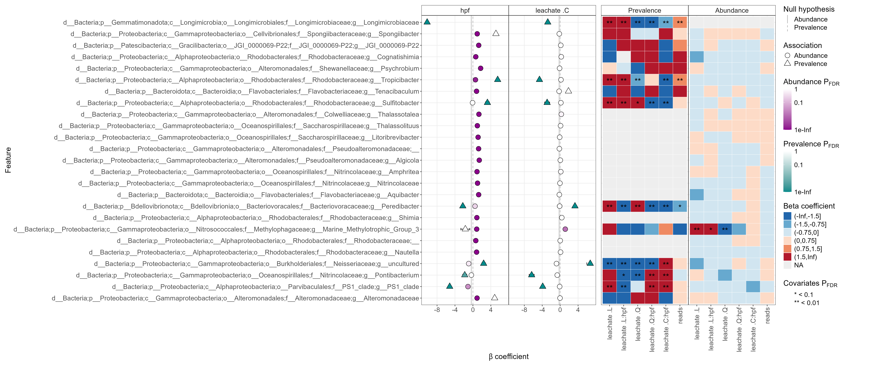

# Background

Trying to model the prevalence of features across leachate and time is a
bit more complex than modeling abundance, but it can be done using the
same general approach. You can use generalized additive models (GAMs) to
model the probability of detection of a feature as a function of
leachate and time, while accounting for the non-linear relationships
between these variables and the response variable.

This was a suggestion by Amy Van Cise, she did something similar here:

> The repo you're looking for is:
> <https://github.com/MMARINeDNA/zDistribution>.
>
> You can find the scripts in the Scripts folder, and specifically you
> want to look at:
>
> -   02_Model_with_GAMs_Q1.R (model m1.2)
>
> -   02.1_Plot_H1_models.R (plots for model m1.2)
>
> -   02.2_m1.2_performance.R
>
>     Note that these aren't microbiome specific models or plots. Since
>     your data are binomial you can use the same model structure as
>     this one to model your relationship and predict binomial
>     probability outcomes. Or, if you'd simply like to add rug plots to
>     your ggplot object, you can see code for that in the plotting
>     script. -- Amy Van Cise

MaAsLin3 already ran a model , we just have to use it to make
predictions and then visualize the probability of detection on the Y
axis for our differentially prevalent taxa (features).

## What model is MaAsLin3 using for prevalence?

For **prevalence (presence/absence)**, MaAsLin3 fits a **generalized
linear mixed model (GLMM)**:

-   **Family:** binomial

-   **Link:** logit

-   **Form:** logistic regression (with optional random effects)

# Questions

#### Which taxa show leachate-associated changes beyond expected developmental change through time?

#### Does the probability of detection (POD) of a feature vary with leachate pollution level and across exposure/developmental time?

H~o~: Probability of detection does not vary across leachate or time

H~a~1: Probability of detection varies across leachate and time by ASV
feature

# Load libraries

```{r load-libraries}
library(tidyverse)
library(kableExtra)
library(miaViz)
```

# Set paths

```{r set-paths}
input_path <- "../../output/maaslin_taxa/m1_l6"
```

# Load data

```{r}
# logistic model
m1_log <- readRDS(file.path(input_path, "fits/models_logistic.rds"))
```

There is one model per feature, so we need to know which features were
significant in the MaAsLin3 analysis to know which models to visualize.

Let's load the significant features from the MaAsLin3 results:

```{r}
m1_L6_sig_feats <- read_tsv(file.path(input_path, "significant_results.tsv"))
```

Filter for prevalence model and for leachate-responsive features \>
Significant associations for MaAsLin 3 are results with no model fitting
errors, and joint q-value less than 0.1

```{r}
m1_L6_sig_prev_feats <- m1_L6_sig_feats %>%
  filter(model == "prevalence", 
         metadata == "leachate", 
         is.na(error), 
         qval_joint < 0.1
        )

length(unique(m1_L6_sig_prev_feats$feature))
unique(m1_L6_sig_prev_feats$feature)
```


> We only have: 4 discrete treatment levels categorical inference model
> no evidence supporting a continuous linear relationship A GAM can
> visually imply smooth interpolation between doses that your model
> never estimated. Instead, the cleanest and most defensible approach
> is: Population-level predicted probability plots Specifically: x-axis
> = categorical leachate treatment y-axis = predicted probability of
> detection separate colored lines (or facets) for hpf/stage confidence
> intervals one panel per significant feature

What do we really want to show? We want to show how these taxa changed
over time and across leachate treatment. Is it more or less prevalent?
We can do this most simply by replotting the MaAsLin3 summary plot to
focus in on the significant features.

# Pivot to replotting MaAsLin3 summary plot



\^ We essentially want just the heatmap portion showing only the
leachate responsive taxa for all coef terms!

## Step 1. Select taxa to plot across prevalence and abundance

Our significant prevalence taxa are:

```{r}
m1_sig_prev <- unique(m1_L6_sig_prev_feats$feature)
```

Our significant abundance taxa are:

```{r}
m1_L6_sig_abun_feats <- m1_L6_sig_feats %>% 
  filter(model == "abundance", 
         metadata == "leachate", 
         is.na(error), 
         qval_joint < 0.1
        )

length(unique(m1_L6_sig_abun_feats$feature))
unique(m1_L6_sig_abun_feats$feature)

m1_sig_abun <- unique(m1_L6_sig_abun_feats$feature)
```

We have 8! Are they the same as the prevalence model 8??

```{r}
setequal(m1_sig_abun, m1_sig_prev)
setdiff(m1_sig_abun, m1_sig_prev) # unique to abundance 
setdiff(m1_sig_prev, m1_sig_abun) # unique to prevalence
```

Nope, they're not exactly the same! Flavobacteriaceae Leeuwenhoekiella
is uniquely significant to abundance and Longimicrobiaceae is uniquely
significant to prevalence.

OK let's join these lists

```{r join-lists}
m1_sig <- union(m1_sig_abun, m1_sig_prev)

m1_sig
```

Now we can filter the significant results down to this list

```{r sig-filt}
m1_L6_sig_filt <- m1_L6_sig_feats %>% 
        filter(feature %in% m1_sig, 
         metadata == "leachate",
         is.na(error), 
         qval_joint < 0.1
         )
```

Calculate 95% CIs

```{r}
# calculate the 95% CIs
m1_L6_sig_filt <- m1_L6_sig_filt  %>% 
    mutate(
        ci_lwr = coef - qt(.975, df = N) * stderr,
        ci_upr = coef + qt(.975, df = N) * stderr
    )
```

Heatmap

-   facet by model

-   color by coef

-   y axis is feature

-   x axis is name

```{r}
# Clean labels
res_sig <- m1_L6_sig_filt %>%
  mutate(
    feature = str_replace_all(feature, "_", " "),
    
    beta_bin = case_when(
      is.na(coef) ~ NA_character_,
      coef <= -1.5 ~ "(-Inf, -1.5]",
      coef > -1.5 & coef <= -0.75 ~ "(-1.5, -0.75]",
      coef > -0.75 & coef <= 0 ~ "(-0.75, 0]",
      coef > 0 & coef <= 0.75 ~ "(0, 0.75]",
      coef > 0.75 & coef <= 1.5 ~ "(0.75, 1.5]",
      coef > 1.5 ~ "(1.5, Inf)"
    ),
    
    beta_bin = factor(
      beta_bin,
      levels = c(
        "(-Inf, -1.5]",
        "(-1.5, -0.75]",
        "(-0.75, 0]",
        "(0, 0.75]",
        "(0.75, 1.5]",
        "(1.5, Inf)"
      )
    ),
    
    sig_label = case_when(
      qval_joint < 0.01 ~ "**",
      qval_joint < 0.1 ~ "*",
      TRUE ~ ""
    )
  )

# Order features by strongest effect size
feature_order <- res_sig %>%
  group_by(feature) %>%
  summarize(max_coef = max(abs(coef), na.rm = TRUE)) %>%
  arrange(max_coef) %>%
  pull(feature)

res_sig$feature <- factor(
  res_sig$feature,
  levels = feature_order
) 
```

```{r}
ggplot(
  res_sig,
  aes(x = name, y = feature, fill = beta_bin)
) +
  geom_tile(color = "grey90", linewidth = 0.25) +
  
  geom_text(
    aes(label = sig_label),
    size = 3,
    color = "black"
  ) +
  
  facet_wrap(~ model, scales = "free_x") +
  
  scale_fill_manual(
    values = c(
      "(-Inf, -1.5]" = "#2166AC",
      "(-1.5, -0.75]" = "#67A9CF",
      "(-0.75, 0]" = "#D1E5F0",
      "(0, 0.75]" = "#FDDBC7",
      "(0.75, 1.5]" = "#EF8A62",
      "(1.5, Inf)" = "#B2182B"
    ),
    na.value = "grey90",
    name = "Beta coefficient"
  ) +
  
  labs(
    x = "",
    y = "Feature"
  ) +
  
  theme_minimal(base_size = 11) +
  theme(
    panel.grid = element_blank(),
    axis.text.x = element_text(angle = 90, hjust = 1, vjust = 0.5),
    axis.text.y = element_text(size = 7),
    strip.text = element_text(face = "bold"),
    legend.position = "right"
  )
```

## Load metadata

```{r metadata}
# Load metadata
metadata <- read_csv(metadata_path)

# set factors
metadata <- metadata %>% 
  mutate(
    collection_date = as.Date(collection_date, format = "%d-%b-%Y"),
    stage    = factor(stage,    levels = c("cleavage", "prawnchip", "earlygastrula"), ordered = TRUE),
    leachate = factor(leachate, levels = c("control", "low", "mid", "high"),        ordered = TRUE),
    spawn_night = factor(
      collection_date,
      levels  = as.Date(c("06-Jul-2024", "07-Jul-2024", "08-Jul-2024"), format = "%d-%b-%Y"),
      labels  = c("July 6th", "July 7th", "July 8th"),
      ordered = TRUE
    )
  )
```

## Put read depth per sample into the metadata

> Because MaAsLin 3 identifies prevalence (presence/absence)
> associations, sample read depth (number of reads) should be included
> as a covariate if available. Deeper sequencing will likely increase
> feature detection in a way that could spuriously correlate with
> metadata of interest when read depth is not included in the model.

```{r read-depths}
readepth <- read_csv("../../salipante/Sarah_StonyCoral/241121_StonyCoral_readcounts.csv")
```

```{r join-meta-reads}
metadata <- metadata %>% 
  left_join(readepth, by = c("sample_id" = "sample"))
```

```{r make-samples-rownames}
meta <- metadata %>% 
  column_to_rownames(var = "sample_id") %>% 
  as.data.frame()

# View metadata structure
str(meta)
```

# miaViz

<https://microbiome.github.io/OMA/docs/devel/pages/differential_abundance.html#sec-daa-viz>

```{r miaviz-extract}
# Extract the results from the list object and calculate the 95% CIs
res_daa <- m1_L6_sig_filt  %>% 
    mutate(
        ci_lwr = coef - qt(.975, df = N) * stderr,
        ci_upr = coef + qt(.975, df = N) * stderr
    ) %>% 
    select(feature, 
           name, 
           coef, 
           pval_individual, 
           qval_individual, 
           pval_joint, 
           qval_joint, 
           ci_lwr, 
           ci_upr)

# Print the results for taxa with the smallest p-values
res_daa %>% 
    arrange(qval_joint)  %>% 
    head()  %>% 
    kable()
```

> -   `feature` indicates the name of a taxon (here genus).
>
> -   `name` indicates the predictor variable. As `leachate` is a
>     categorical variable and `hpf` is a numerical variable,
>     `leachate.L` is linear response across categories, `leachate.Q` is
>     a quadtratic response (one point of inflection, ◡ or ◠ shaped)
>     `leachate.C` is a cubic response (two points of inflection, ∿
>     shaped)
>
> -   `coef` is the log~2~-fold change estimate, a standard way to
>     express effect size in DAA. Most importantly, positive values
>     indicate abundance being higher.
>
> -   `pval` is the unadjusted p-value.
>
> -   `qval` (q-value) is the FDR adjusted p-value. This is generally
>     used to define statistical significance. Typically, q-values \<
>     .05 are considered (statistically) significant.
>
> -   `ci_lwr` and `ci_upr` are the lower and upper bounds of the 95%
>     confidence intervals for the log~2~-fold change.

```{r}
m1_norm <- read_tsv(file.path(input_path, "features/data_norm.tsv"))
m1_trans <- read_tsv(file.path(input_path, "features/data_transformed.tsv"))
m1_filt <- read_tsv(file.path(input_path, "features/filtered_data.tsv"))
```

We are going to use the tranformed `m1_trans` feature table to visualize
results... here data has been filtered, normalized, and transformed
using TSS normalization.

-   Each row should be a feature (bacterial taxa)

-   We want to pivot the table so that columns are the rel_abundance
    value

```{r}
m1_plot <- m1_trans %>% 
  filter()
```

```{r miaviz-strip-plot}

# Create strip plots with boxplots (and prevalence bars)
plotBoxplot(
    tse,
    features = ,
    assay.type = "relabundance", # To plot relative abundances
    x = "leachate", # The variable on the x (horizontal) axis
    facet.by = "rownames", # To create a separate facet for each feature
    scales = "free_y", # To allow different y-axis scales
    add.proportion = TRUE, # Add bars indicating prevalence
    point.offset = "quasirandom", # To plot points nicely
    point.size = 2, # The size of the points
    point.color = "black", # The color of the edges of the points
    point.alpha = 1, # The transparency of the edges of the points
    box.alpha = .20
) + # The transparency of the boxplots
    theme(strip.text = element_text(size = 7)) # The size of the facet labels
```
