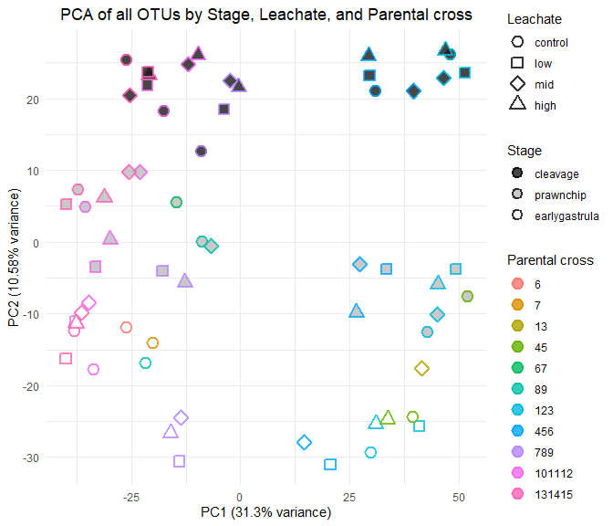
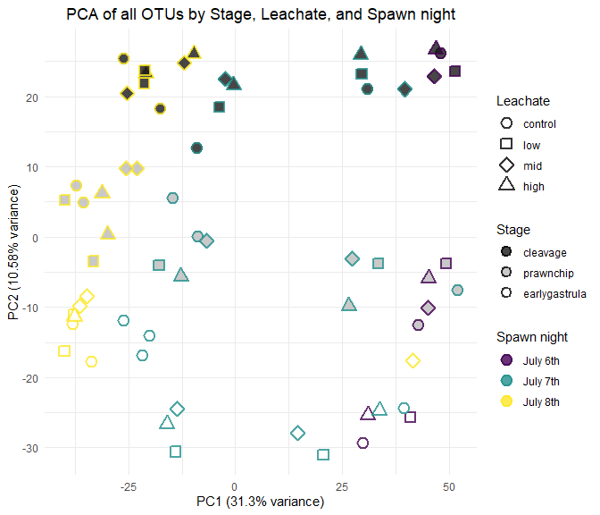
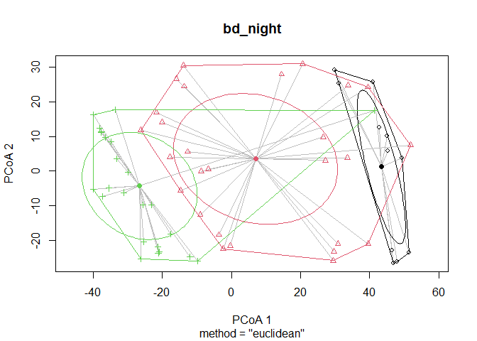
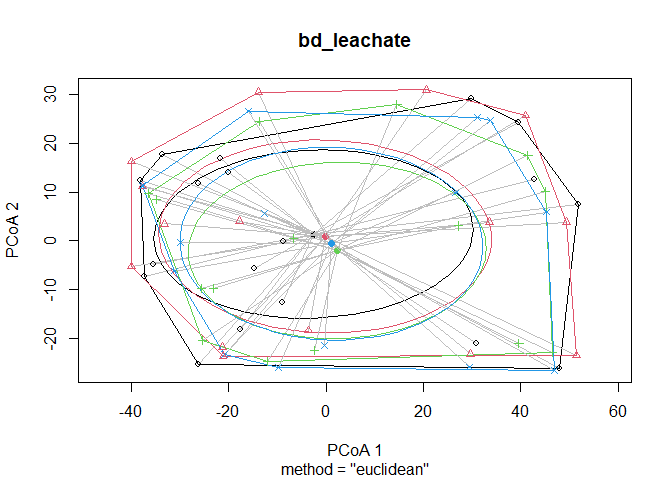
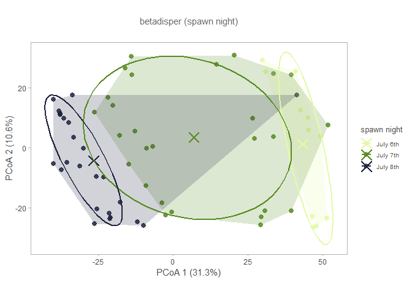
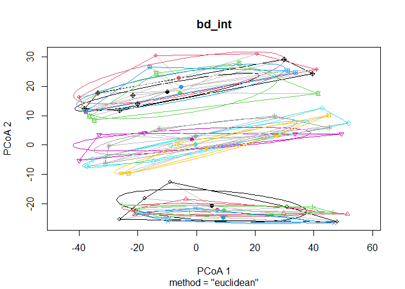

# Compositional Data Analysis
Sarah Tanja
2025-10-17

- [<span class="toc-section-number">1</span> Background](#background)
- [<span class="toc-section-number">2</span> Setup](#setup)
  - [<span class="toc-section-number">2.1</span> Install & load
    packages](#install--load-packages)
- [<span class="toc-section-number">3</span> Load Data](#load-data)
  - [<span class="toc-section-number">3.1</span> Load
    metadata](#load-metadata)
  - [<span class="toc-section-number">3.2</span> Import QIIME2
    artifacts](#import-qiime2-artifacts)
    - [<span class="toc-section-number">3.2.1</span> Feature
      table](#feature-table)
    - [<span class="toc-section-number">3.2.2</span>
      Taxonomy](#taxonomy)
  - [<span class="toc-section-number">3.3</span> Prepare data for
    analysis](#prepare-data-for-analysis)
- [<span class="toc-section-number">4</span> CLR
  Transformation](#clr-transformation)
- [<span class="toc-section-number">5</span> Aitchison
  Distance](#aitchison-distance)
- [<span class="toc-section-number">6</span> PCA Biplots](#pca-biplots)
  - [<span class="toc-section-number">6.1</span> Plot stage x leachate x
    cross](#plot-stage-x-leachate-x-cross)
  - [<span class="toc-section-number">6.2</span> Plot stage x leachate x
    spawn night](#plot-stage-x-leachate-x-spawn-night)
  - [<span class="toc-section-number">6.3</span> Interactive
    plotly](#interactive-plotly)
- [<span class="toc-section-number">7</span> PERMANOVA](#permanova)
  - [<span class="toc-section-number">7.1</span> Fit
    betadispr](#fit-betadispr)
    - [<span class="toc-section-number">7.1.1</span> night](#night)
    - [<span class="toc-section-number">7.1.2</span>
      leachate](#leachate)
    - [<span class="toc-section-number">7.1.3</span> stage](#stage)
    - [<span class="toc-section-number">7.1.4</span> leachate x
      stage](#leachate-x-stage)
  - [<span class="toc-section-number">7.2</span> Perform
    PERMANOVA](#perform-permanova)
- [<span class="toc-section-number">8</span> Summary](#summary)
  - [<span class="toc-section-number">8.1</span> Key
    Findings](#key-findings)
  - [<span class="toc-section-number">8.2</span> Next
    Steps](#next-steps)
  - [<span class="toc-section-number">8.3</span> Output
    Files](#output-files)
- [<span class="toc-section-number">9</span> Session
  Info](#session-info)

# Background

This analysis follows the recommendations from Gloor et al. 2017 for
compositional data analysis of microbiome data. Microbiome sequence
count data are compositional - they represent relative abundances
constrained to sum to a total (sequencing depth). This requires
specialized statistical methods that account for the compositional
nature of the data.

Key recommendations from Gloor et al. 2017: - Use centered log-ratio
(CLR) transformation to convert compositional data to Euclidean space -
Calculate Aitchison distance (Euclidean distance on CLR-transformed
data) for dissimilarity - Use variance-based methods like PCA on
CLR-transformed data - Perform statistical tests on transformed data

# Setup

``` r
# Define file paths
feature_table_path <- "../../salipante/241121_StonyCoral/270x200/250414_StonyCoral_270x200_featureTable_filtered.qza"
metadata_path <- "../../metadata/meta.csv"
taxonomy_path <- "../../salipante/241121_StonyCoral/270x200/250414_270x200_representative-sequences_taxonomy.qza"
```

## Install & load packages

``` r
# Check R version
# R.version.string

# Install and load required packages
#if (!requireNamespace("BiocManager", quietly = TRUE)) {
#  install.packages("BiocManager")
#}

# Install Bioconductor packages
#if (!requireNamespace("phyloseq", quietly = TRUE)) {
#  BiocManager::install("phyloseq")
#}
#if (!requireNamespace("ANCOMBC", quietly = TRUE)) {
#  BiocManager::install("ANCOMBC")
#}

# Install CRAN packages
#required_packages <- c("tidyverse", "vegan", "compositions", "zCompositions", 
#                       "ggplot2", "reshape2", "corrplot", "devtools")
#for (pkg in required_packages) {
#  if (!requireNamespace(pkg, quietly = TRUE)) {
#    install.packages(pkg)
#  }
#}

# Install qiime2R from GitHub
#if (!requireNamespace("qiime2R", quietly = TRUE)) {
#  devtools::install_github("jbisanz/qiime2R")
#}

# Install SpiecEasi for SparCC (optional, can be slow to install)
#if (!requireNamespace("SpiecEasi", quietly = TRUE)) {
#  devtools::install_github("zdk123/SpiecEasi")
#}
```

``` r
# Load libraries
library(tidyverse)
library(qiime2R)
library(phyloseq)
library(vegan)
library(compositions)
library(zCompositions)
library(ggplot2)
library(reshape2)
library(corrplot)
library(ANCOMBC)
```

# Load Data

## Load metadata

``` r
# Load metadata
meta <- read_csv(metadata_path)

# set factors
meta <- meta %>% 
  mutate(
    collection_date = as.Date(collection_date, format = "%d-%b-%Y"),
    stage    = factor(stage,    levels = c("cleavage", "prawnchip", "earlygastrula"), ordered = TRUE),
    leachate = factor(leachate, levels = c("control", "low", "mid", "high"),        ordered = TRUE),
    spawn_night = factor(
      collection_date,
      levels  = as.Date(c("06-Jul-2024", "07-Jul-2024", "08-Jul-2024"), format = "%d-%b-%Y"),
      labels  = c("July 6th", "July 7th", "July 8th"),
      ordered = TRUE
    )
  )


# View metadata structure
str(meta)
```

    tibble [63 × 9] (S3: tbl_df/tbl/data.frame)
     $ sample_id      : chr [1:63] "101112C14" "101112C4" "101112C9" "101112H14" ...
     $ collection_date: Date[1:63], format: "2024-07-08" "2024-07-08" ...
     $ parents        : num [1:63] 101112 101112 101112 101112 101112 ...
     $ group          : chr [1:63] "C14" "C4" "C9" "H14" ...
     $ hpf            : num [1:63] 14 4 9 14 4 9 14 4 9 14 ...
     $ stage          : Ord.factor w/ 3 levels "cleavage"<"prawnchip"<..: 3 1 2 3 1 2 3 1 2 3 ...
     $ leachate       : Ord.factor w/ 4 levels "control"<"low"<..: 1 1 1 4 4 4 2 2 2 3 ...
     $ leachate_mgL   : num [1:63] 0 0 0 1 1 1 0.01 0.01 0.01 0.1 ...
     $ spawn_night    : Ord.factor w/ 3 levels "July 6th"<"July 7th"<..: 3 3 3 3 3 3 3 3 3 3 ...

## Import QIIME2 artifacts

### Feature table

``` r
# Load feature table from QIIME2 artifact
feature_table <- read_qza(feature_table_path)$data
```

### Taxonomy

``` r
# Load taxonomy (optional, for annotation)
taxonomy <- read_qza(taxonomy_path)$data
```

``` r
# Display data dimensions
cat("Feature table dimensions:", dim(feature_table), "\n")
```

    Feature table dimensions: 6147 63 

``` r
cat("Number of samples in metadata:", nrow(meta), "\n")
```

    Number of samples in metadata: 63 

## Prepare data for analysis

``` r
# Convert feature table to matrix (samples as rows, features as columns)
# QIIME2 format typically has features as rows, samples as columns
feature_matrix <- as.matrix(feature_table)
feature_matrix_t <- t(feature_matrix)  # Transpose so samples are rows

# Ensure sample IDs match between feature table and metadata
sample_ids <- rownames(feature_matrix_t)
meta_filt <- meta %>%
  filter(sample_id %in% sample_ids) %>%
  arrange(match(sample_id, sample_ids))

cat("Samples in feature table:", nrow(feature_matrix_t), "\n")
```

    Samples in feature table: 63 

``` r
cat("Samples in metadata:", nrow(meta_filt), "\n")
```

    Samples in metadata: 63 

# CLR Transformation

The centered log-ratio (CLR) transformation converts compositional data
to Euclidean space. It handles zeros by replacing them with small values
(geometric Bayesian multiplicative replacement).

``` r
# Replace zeros with small values using cmultRepl from zCompositions
# This is necessary because log transformation is undefined for zeros
feature_matrix_nozero <- cmultRepl(feature_matrix_t, method = "CZM", label = 0)

# Apply CLR transformation
feature_clr <- clr(feature_matrix_nozero)

# Convert to data frame for easier handling
feature_clr_df <- as.data.frame(feature_clr)

cat("CLR-transformed data dimensions:", dim(feature_clr_df), "\n")
```

    CLR-transformed data dimensions: 63 663 

``` r
head(feature_clr_df[, 1:5])
```

              a04fbb7832640df06d3e5bcefe6e5801 10f0b9b94a3c8595e648259668664749
    101112C14                        0.2486652                         4.709150
    101112C4                        -3.7257422                         5.497918
    101112C9                        -0.3735785                         3.776336
    101112H14                       -0.6744121                         3.660698
    101112H4                        -3.9079152                         5.443821
    101112H9                        -3.2733059                         4.203059
              9a5dabc71f65a222f30b7415aa0d9dd0 cfb17500dcecfc7d15edf48a0c944272
    101112C14                         4.663244                        1.1531215
    101112C4                          5.248163                       -3.7257422
    101112C9                          4.105380                       -3.4432900
    101112H14                         4.517618                        0.9678157
    101112H4                          5.515943                        0.3069533
    101112H9                          5.086768                       -3.2733059
              069cf7a7c4b413f53230b4b140ff08c7
    101112C14                         2.912620
    101112C4                          2.151650
    101112C9                          1.885204
    101112H14                         2.087705
    101112H4                          1.925441
    101112H9                          2.621114

# Aitchison Distance

The Aitchison distance is the Euclidean distance between samples after
CLR transformation. This is the appropriate distance metric for
compositional data.

``` r
# Calculate Aitchison distance (Euclidean distance on CLR-transformed data)
aitchison_dist <- dist(feature_clr, method = "euclidean")

# Display distance matrix summary
cat("Aitchison distance matrix summary:\n")
```

    Aitchison distance matrix summary:

``` r
summary(as.vector(aitchison_dist))
```

       Min. 1st Qu.  Median    Mean 3rd Qu.    Max. 
      42.03   66.38   77.38   78.23   89.85  115.41 

# PCA Biplots

Variance-based compositional PCA on CLR-transformed data. \## Perform
PCA

``` r
# Perform PCA on CLR-transformed data
pca_result <- prcomp(feature_clr, scale. = FALSE)

# Calculate variance explained
variance_explained <- summary(pca_result)$importance[2, ] * 100

# Create data frame for plotting
pca_df <- data.frame(
  PC1 = pca_result$x[, 1],
  PC2 = pca_result$x[, 2],
  sample_id = rownames(feature_clr)
)

# Merge with metadata
pca_df <- pca_df %>%
  left_join(meta_filt, by = "sample_id")
```

## Plot stage x leachate x cross

``` r
pca_plot_cross <- ggplot(
  pca_df,
  aes(
    x = PC1, y = PC2,
    fill = stage,                   # inside color
    colour = factor(parents),       # outline color
    shape = leachate                # shape must be 21–25
  )
) +
  geom_point(size = 3.5, stroke = 1.5, alpha = 0.8) +   # stroke controls outline width
  scale_shape_manual(values = c(21, 22, 23, 24, 25)[seq_along(levels(pca_df$leachate))]) +
  # light grey -> dark grey for discrete stages (shows in legend)
  scale_fill_grey(name = "Stage", start = 0.1, end = 1) +
  labs(
    title = "PCA of all OTUs by Stage, Leachate, and Parental cross",
    x = paste0("PC1 (", round(variance_explained[1], 2), "% variance)"),
    y = paste0("PC2 (", round(variance_explained[2], 2), "% variance)"),
    shape = "Leachate",
    color = "Parental cross"
  ) +
  theme_minimal() +
  theme(
    legend.position = "right",
    plot.title = element_text(hjust = 0.5)
  )+
  # 3) make the fill legend draw a filled shape with an outline
  guides(
    shape  = guide_legend(order = 1),
    fill   = guide_legend(override.aes = list(shape = 21, stroke = 1.1, colour = "black"), 
                          order = 2),
    colour = guide_legend(order = 3)
    
  ) 

pca_plot_cross
```



``` r
# Save plot
ggsave("../../output/compositional_pca_cross.png", pca_plot_cross, 
       width = 10, height = 7, dpi = 300)
```

## Plot stage x leachate x spawn night

``` r
pca_plot_spawn_night <- ggplot(
  pca_df,
  aes(
    x = PC1, y = PC2,
    fill = stage,                   # inside color
    colour = factor(spawn_night),       # outline color
    shape = leachate                # shape must be 21–25
  )
) +
  geom_point(size = 3.5, stroke = 1.5, alpha = 0.8) +   # stroke controls outline width
  scale_shape_manual(values = c(21, 22, 23, 24, 25)[seq_along(levels(pca_df$leachate))]) +
  # light grey -> dark grey for discrete stages (shows in legend)
  scale_fill_grey(name = "Stage", start = 0.1, end = 1) +
  labs(
    title = "PCA of all OTUs by Stage, Leachate, and Spawn night",
    x = paste0("PC1 (", round(variance_explained[1], 2), "% variance)"),
    y = paste0("PC2 (", round(variance_explained[2], 2), "% variance)"),
    shape = "Leachate",
    color = "Spawn night"
  ) +
  theme_minimal() +
  theme(
    legend.position = "right",
    plot.title = element_text(hjust = 0.5)
  )+
  # 3) make the fill legend draw a filled shape with an outline
  guides(
    shape  = guide_legend(order = 1),
    fill   = guide_legend(override.aes = list(shape = 21, stroke = 1.1, colour = "black"), 
                          order = 2),
    colour = guide_legend(order = 3)
    
  ) 

pca_plot_spawn_night
```



``` r
# Save plot
ggsave("../../output/compositional_pca_spawn_night.png", pca_plot_spawn_night, 
       width = 10, height = 7, dpi = 300)
```

## Interactive plotly

> [!NOTE]
>
> This will only display in html format

# PERMANOVA

PERMANOVA (Permutational Multivariate Analysis of Variance) on the
Aitchison distance matrix to test for differences in microbial
composition across experimental factors.

> [!TIP]
>
> ### Learn More About PERMANOVA
>
> For a comprehensive explanation of PERMANOVA, including: - How
> PERMANOVA works and its underlying principles - What inputs are
> required and what outputs mean - How to interpret results in
> microbiome context - Complete working examples with all distance
> metrics
>
> See the dedicated documentation files: -
> **[`PERMANOVA_README.md`](PERMANOVA_README.md)** - Comprehensive
> theoretical guide -
> **[`permanova_analysis.qmd`](permanova_analysis.qmd)** - Working code
> examples and demonstrations

strata are groups within which to constrain permutations. Using strata =
parents controls for parent by preventing shuffles across parents; this
removes parent as a source of spurious differences.

Caveats to keep in mind

Dispersion sensitivity: PERMANOVA can flag significance if groups have
different dispersions (spread), not just different centroids. Consider
checking with `betadisper` and `permutest`.

Unbalanced designs / small strata: With blocking, you need enough
replicates within each parent and across factor levels to allow
permutations; otherwise p-values become conservative or unavailable.

Order dependence with by=“terms”: If you care about marginal effects “as
if added last,” refit with by=“margin”(or reorder terms thoughtfully).

## Fit betadispr

`betadisper` tests whether the within-group multivariate dispersion
(spread) differs among groups. It’s the multivariate analogue of
Levene’s test: it compares the distances of samples to their group
centroid.

What happens under the hood: - Performs a PCoA on your distance
matrix. - Computes each group’s centroid in that ordination space. -
Calculates each sample’s distance to its group centroid. - Stores those
distances for downstream tests/plots.

Define groups to test

``` r
grp_leachate <- meta_filt$leachate
grp_stage    <- meta_filt$stage     
grp_int    <- interaction(meta_filt$leachate, meta_filt$stage)
grp_night <- meta_filt$spawn_night
```

### night

``` r
# Fit beta dispersion model 
bd_night <- betadisper(aitchison_dist, group = grp_night, type = "centroid")

# Permutation test with no blocking
perm_night <- permutest(bd_night, permutations = 999, pairwise = FALSE)

# Result
perm_night
```


    Permutation test for homogeneity of multivariate dispersions
    Permutation: free
    Number of permutations: 999

    Response: Distances
              Df  Sum Sq Mean Sq      F N.Perm Pr(>F)   
    Groups     2  634.07  317.04 6.2856    999  0.003 **
    Residuals 60 3026.32   50.44                        
    ---
    Signif. codes:  0 '***' 0.001 '**' 0.01 '*' 0.05 '.' 0.1 ' ' 1

> [!NOTE]
>
> multivariate dispersion differs across spawn nights (groups = nights).
> In other words, samples from some nights are more spread out around
> their night-specific centroid than others.
>
> betadisper with group = spawn_night significant heterogeneous
> dispersion among nights.If your primary tests are leachate/stage,
> treat night as a nuisance: block by night in PERMANOVA (strata =
> spawn_night) so permutations happen within each night. This keeps
> night-to-night variance/dispersion from inflating your p-values for
> treatment effects.

``` r
plot(bd_night, hull = TRUE, ellipse = TRUE, label = FALSE, cex = 0.8)
```



### leachate

``` r
bd_leachate <- betadisper(aitchison_dist, group = grp_leachate, type = "centroid")

# Permutation test with optional blocking
perm_leachate <- permutest(bd_leachate, permutations = 999, pairwise = FALSE,
                  strata = meta_filt$spawn_night)  # optional
perm_leachate
```


    Permutation test for homogeneity of multivariate dispersions
    Permutation: free
    Number of permutations: 999

    Response: Distances
              Df Sum Sq Mean Sq      F N.Perm Pr(>F)
    Groups     3   22.5   7.484 0.1393    999  0.927
    Residuals 59 3169.8  53.725                     

What this tests: Null hypothesis (Ho): all groups have equal average
distance-to-centroid (equal dispersion/variance).If p \< 0.05, at least
one group is more/less dispersed than another.Why use the permutation
test? The distances depend on the PCoA, so permutation is safer than the
plain ANOVA F-test.

``` r
plot(bd_leachate, hull = TRUE, ellipse = TRUE, label = FALSE, cex = 0.8)
```



### stage

``` r
bd_stage <- betadisper(aitchison_dist, group = grp_stage, type = "centroid")

# Permutation test with optional blocking
perm_stage <- permutest(bd_stage, permutations = 999, pairwise = FALSE)
                  #strata = meta_filt$spawn_night)  # optional
perm_stage
```


    Permutation test for homogeneity of multivariate dispersions
    Permutation: free
    Number of permutations: 999

    Response: Distances
              Df  Sum Sq Mean Sq      F N.Perm Pr(>F)
    Groups     2   99.76  49.879 1.0498    999  0.354
    Residuals 60 2850.65  47.511                     

``` r
plot(bd_stage, hull = TRUE, ellipse = TRUE, label = FALSE, cex = 0.8)
```



### leachate x stage

``` r
bd_int <- betadisper(aitchison_dist, group = grp_int, type = "centroid")

# Permutation test with optional blocking
perm_int <- permutest(bd_int, permutations = 999, pairwise = FALSE)
                  #strata = meta_filt$spawn_night)  # optional
perm_int
```


    Permutation test for homogeneity of multivariate dispersions
    Permutation: free
    Number of permutations: 999

    Response: Distances
              Df  Sum Sq Mean Sq      F N.Perm Pr(>F)
    Groups    11  212.66  19.333 0.3491    999   0.96
    Residuals 51 2824.45  55.381                     

``` r
plot(bd_int, hull = TRUE, ellipse = TRUE, label = FALSE, cex = 0.8)
```



## Perform PERMANOVA

PERMANOVA mainly tests centroid location differences among groups (i.e.,
group separation).

betadisper tests dispersion (variance) differences among groups.

If PERMANOVA is significant and betadisper is non-significant, the
signal likely reflects location (good).

If both are significant, some of the PERMANOVA “difference” could be due
to dispersion heterogeneity (groups with different spreads). Report
both, and interpret cautiously.

``` r
set.seed(1)
# Perform PERMANOVA on Aitchison distance
# Test effects of leachate, stage, and their interaction (blocking permutations by parental cross)
permanova_result <- adonis2(
  aitchison_dist ~ leachate * stage,
  data = meta_filt,
  permutations = 999,
  by = "terms",
  strata = meta_filt$spawn_night
)

print(permanova_result)
```

    Permutation test for adonis under reduced model
    Terms added sequentially (first to last)
    Blocks:  strata 
    Permutation: free
    Number of permutations: 999

    adonis2(formula = aitchison_dist ~ leachate * stage, data = meta_filt, permutations = 999, by = "terms", strata = meta_filt$spawn_night)
                   Df SumOfSqs      R2      F Pr(>F)    
    leachate        3     7663 0.03901 0.8356  0.308    
    stage           2    23451 0.11936 3.8353  0.001 ***
    leachate:stage  6     9434 0.04802 0.5143  1.000    
    Residual       51   155919 0.79361                  
    Total          62   196468 1.00000                  
    ---
    Signif. codes:  0 '***' 0.001 '**' 0.01 '*' 0.05 '.' 0.1 ' ' 1

``` r
# Save results
write.csv(as.data.frame(permanova_result), 
          "../../output/permanova/permanova_result_interactionblocked.csv",
          row.names = TRUE)
```

``` r
set.seed(1)
# Additional PERMANOVA treating stage as continuous time 
permanova_cont.time <- adonis2(
  aitchison_dist ~ leachate * hpf,
  data = meta_filt,
  permutations = 999,
  by = "terms",
  strata = meta_filt$spawn_night # control for parental cross
)

print(permanova_cont.time)
```

    Permutation test for adonis under reduced model
    Terms added sequentially (first to last)
    Blocks:  strata 
    Permutation: free
    Number of permutations: 999

    adonis2(formula = aitchison_dist ~ leachate * hpf, data = meta_filt, permutations = 999, by = "terms", strata = meta_filt$spawn_night)
                 Df SumOfSqs      R2      F Pr(>F)    
    leachate      3     7663 0.03901 0.8614  0.285    
    hpf           1    20875 0.10625 7.0393  0.001 ***
    leachate:hpf  3     4827 0.02457 0.5426  0.996    
    Residual     55   163102 0.83017                  
    Total        62   196468 1.00000                  
    ---
    Signif. codes:  0 '***' 0.001 '**' 0.01 '*' 0.05 '.' 0.1 ' ' 1

``` r
# Save results
write.csv(as.data.frame(permanova_cont.time), 
          "../../output/permanova/permanova_result_cont.time.csv",
          row.names = TRUE)
```

# Summary

This analysis implemented the key recommendations from Gloor et al. 2017
for compositional microbiome data analysis:

1.  **CLR Transformation**: Applied centered log-ratio transformation to
    convert compositional data to Euclidean space
2.  **Aitchison Distance**: Calculated Euclidean distance on
    CLR-transformed data as the appropriate dissimilarity metric
3.  **PCA Biplot**: Created variance-based PCA visualizations on
    CLR-transformed data
4.  **PERMANOVA**: Tested for significant differences in microbial
    composition across experimental factors

## Key Findings

- PCA plots visually show clustering patterns by Developmental stage
  (aka timepoint/ hours post fertilization), Night of Spawn, and
  Parental cross (the later two are confounded)
- PERMANOVA results (blocked across Night of Spawn) indicate significant
  effects of Developmental stage (aka timepoint/ hours post
  fertilization), and non-significance for leachate and leahcate:stage
  interactions

## Next Steps

- Differential abundance analysis (MaAslin2)
- Conduct PERMANOVA on differentially abundant taxa
- Functional annotation of differentially abundant taxa (picrust)
- Differential abundance of functions (functional enrichment) (MaAslin2)

## Output Files

All results and visualizations have been saved to the
`../output/permanova` directory: - PCA biplots - PERMANOVA results
tables

# Session Info

``` r
sessionInfo()
```

    R version 4.5.1 (2025-06-13 ucrt)
    Platform: x86_64-w64-mingw32/x64
    Running under: Windows 11 x64 (build 26100)

    Matrix products: default
      LAPACK version 3.12.1

    locale:
    [1] LC_COLLATE=English_United States.utf8 
    [2] LC_CTYPE=English_United States.utf8   
    [3] LC_MONETARY=English_United States.utf8
    [4] LC_NUMERIC=C                          
    [5] LC_TIME=English_United States.utf8    

    time zone: America/Los_Angeles
    tzcode source: internal

    attached base packages:
    [1] stats     graphics  grDevices utils     datasets  methods   base     

    other attached packages:
     [1] ANCOMBC_2.10.1        corrplot_0.95         reshape2_1.4.4       
     [4] zCompositions_1.5.0-5 survival_3.8-3        truncnorm_1.0-9      
     [7] MASS_7.3-65           compositions_2.0-9    vegan_2.7-2          
    [10] permute_0.9-8         phyloseq_1.52.0       qiime2R_0.99.6       
    [13] lubridate_1.9.4       forcats_1.0.1         stringr_1.5.2        
    [16] dplyr_1.1.4           purrr_1.1.0           readr_2.1.5          
    [19] tidyr_1.3.1           tibble_3.3.0          ggplot2_4.0.0        
    [22] tidyverse_2.0.0      

    loaded via a namespace (and not attached):
      [1] RColorBrewer_1.1-3      tensorA_0.36.2.1        rstudioapi_0.17.1      
      [4] jsonlite_2.0.0          magrittr_2.0.4          TH.data_1.1-4          
      [7] nloptr_2.2.1            farver_2.1.2            rmarkdown_2.30         
     [10] ragg_1.5.0              fs_1.6.6                vctrs_0.6.5            
     [13] multtest_2.64.0         minqa_1.2.8             base64enc_0.1-3        
     [16] htmltools_0.5.8.1       energy_1.7-12           haven_2.5.5            
     [19] cellranger_1.1.0        Rhdf5lib_1.30.0         Formula_1.2-5          
     [22] rhdf5_2.52.1            htmlwidgets_1.6.4       sandwich_3.1-1         
     [25] plyr_1.8.9              zoo_1.8-14              rootSolve_1.8.2.4      
     [28] igraph_2.2.0            lifecycle_1.0.4         iterators_1.0.14       
     [31] pkgconfig_2.0.3         Matrix_1.7-4            R6_2.6.1               
     [34] fastmap_1.2.0           GenomeInfoDbData_1.2.14 rbibutils_2.3          
     [37] numDeriv_2016.8-1.1     digest_0.6.37           Exact_3.3              
     [40] colorspace_2.1-2        S4Vectors_0.46.0        textshaping_1.0.4      
     [43] Hmisc_5.2-4             labeling_0.4.3          timechange_0.3.0       
     [46] httr_1.4.7              mgcv_1.9-3              compiler_4.5.1         
     [49] rngtools_1.5.2          proxy_0.4-27            gsl_2.1-8              
     [52] bit64_4.6.0-1           withr_3.0.2             doParallel_1.0.17      
     [55] htmlTable_2.4.3         S7_0.2.0                backports_1.5.0        
     [58] bayesm_3.1-6            biomformat_1.36.0       gtools_3.9.5           
     [61] CVXR_1.0-15             gld_2.6.8               tools_4.5.1            
     [64] foreign_0.8-90          ape_5.8-1               nnet_7.3-20            
     [67] glue_1.8.0              nlme_3.1-168            rhdf5filters_1.20.0    
     [70] grid_4.5.1              checkmate_2.3.3         cluster_2.1.8.1        
     [73] ade4_1.7-23             generics_0.1.4          gtable_0.3.6           
     [76] tzdb_0.5.0              class_7.3-23            data.table_1.17.8      
     [79] lmom_3.2                hms_1.1.4               XVector_0.48.0         
     [82] BiocGenerics_0.54.1     foreach_1.5.2           pillar_1.11.1          
     [85] vroom_1.6.6             robustbase_0.99-6       splines_4.5.1          
     [88] lattice_0.22-7          gmp_0.7-5               bit_4.6.0              
     [91] tidyselect_1.2.1        Biostrings_2.76.0       knitr_1.50             
     [94] reformulas_0.4.1        gridExtra_2.3           IRanges_2.42.0         
     [97] stats4_4.5.1            xfun_0.53               expm_1.0-0             
    [100] Biobase_2.68.0          DEoptimR_1.1-4          DT_0.34.0              
    [103] stringi_1.8.7           UCSC.utils_1.4.0        yaml_2.3.10            
    [106] boot_1.3-32             evaluate_1.0.5          codetools_0.2-20       
    [109] cli_3.6.5               rpart_4.1.24            systemfonts_1.3.1      
    [112] DescTools_0.99.60       Rdpack_2.6.4            dichromat_2.0-0.1      
    [115] Rcpp_1.1.0              GenomeInfoDb_1.44.3     readxl_1.4.5           
    [118] parallel_4.5.1          doRNG_1.8.6.2           lme4_1.1-37            
    [121] Rmpfr_1.1-1             viridisLite_0.4.2       mvtnorm_1.3-3          
    [124] lmerTest_3.1-3          scales_1.4.0            e1071_1.7-16           
    [127] crayon_1.5.3            rlang_1.1.6             multcomp_1.4-29        
