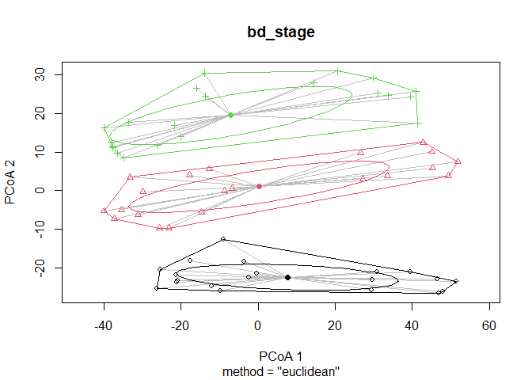

# Compositional Data Analysis
Sarah Tanja
2025-10-17

- [<span class="toc-section-number">1</span> Background](#background)
- [<span class="toc-section-number">2</span> Setup](#setup)
  - [<span class="toc-section-number">2.1</span> Load
    packages](#load-packages)
  - [<span class="toc-section-number">2.2</span> Set custom ggplot
    theme](#set-custom-ggplot-theme)
  - [<span class="toc-section-number">2.3</span> Set
    colorschemes](#set-colorschemes)
- [<span class="toc-section-number">3</span> Load Data](#load-data)
  - [<span class="toc-section-number">3.1</span> Load
    metadata](#load-metadata)
  - [<span class="toc-section-number">3.2</span> Import QIIME2
    artifacts](#import-qiime2-artifacts)
    - [<span class="toc-section-number">3.2.1</span> Feature
      table](#feature-table)
    - [<span class="toc-section-number">3.2.2</span>
      Taxonomy](#taxonomy)
  - [<span class="toc-section-number">3.3</span> Prepare data for
    analysis](#prepare-data-for-analysis)
- [<span class="toc-section-number">4</span> CLR
  Transformation](#clr-transformation)
- [<span class="toc-section-number">5</span> Aitchison Distance is a
  Beta Diversity metric for compositional
  data](#aitchison-distance-is-a-beta-diversity-metric-for-compositional-data)
- [<span class="toc-section-number">6</span> PCA Biplots](#pca-biplots)
  - [<span class="toc-section-number">6.1</span> Perform
    PCA](#perform-pca)
  - [<span class="toc-section-number">6.2</span> Plot stage x leachate x
    cross](#plot-stage-x-leachate-x-cross)
  - [<span class="toc-section-number">6.3</span> Plot stage x leachate x
    spawn night](#plot-stage-x-leachate-x-spawn-night)
  - [<span class="toc-section-number">6.4</span> Interactive
    plotly](#interactive-plotly)
- [<span class="toc-section-number">7</span> PERMANOVA](#permanova)
  - [<span class="toc-section-number">7.1</span> Fit
    betadispr](#fit-betadispr)
    - [<span class="toc-section-number">7.1.1</span> night](#night)
    - [<span class="toc-section-number">7.1.2</span>
      leachate](#leachate)
    - [<span class="toc-section-number">7.1.3</span> stage](#stage)
    - [<span class="toc-section-number">7.1.4</span> leachate x
      stage](#leachate-x-stage)
  - [<span class="toc-section-number">7.2</span> Perform
    PERMANOVA](#perform-permanova)
- [<span class="toc-section-number">8</span> Summary](#summary)
  - [<span class="toc-section-number">8.1</span> Key
    Findings](#key-findings)
  - [<span class="toc-section-number">8.2</span> Next
    Steps](#next-steps)
  - [<span class="toc-section-number">8.3</span> Output
    Files](#output-files)
- [<span class="toc-section-number">9</span> Session
  Info](#session-info)

# Background

This analysis follows the recommendations from Gloor et al. 2017 for
compositional data analysis of microbiome data. Microbiome sequence
count data are compositional - they represent relative abundances
constrained to sum to a total (sequencing depth). This requires
specialized statistical methods that account for the compositional
nature of the data.

Key recommendations from Gloor et al. 2017: - Use centered log-ratio
(CLR) transformation to convert compositional data to Euclidean space -
Calculate Aitchison distance (Euclidean distance on CLR-transformed
data) for dissimilarity - Use variance-based methods like PCA on
CLR-transformed data - Perform statistical tests on transformed data

# Setup

``` r
# Define file paths
feature_table_path <- "../../salipante/241121_StonyCoral/270x200/250414_StonyCoral_270x200_featureTable_filtered.qza"
metadata_path <- "../../metadata/meta.csv"
taxonomy_path <- "../../salipante/241121_StonyCoral/270x200/250414_270x200_representative-sequences_taxonomy.qza"
```

## Load packages

``` r
# Check R version
# R.version.string

# Install and load required packages
#if (!requireNamespace("BiocManager", quietly = TRUE)) {
#  install.packages("BiocManager")
#}
# Install Bioconductor packages
#if (!requireNamespace("phyloseq", quietly = TRUE)) {
#  BiocManager::install("phyloseq")
#}
# Install qiime2R from GitHub
#if (!requireNamespace("qiime2R", quietly = TRUE)) {
#  devtools::install_github("jbisanz/qiime2R")
#}
```

``` r
# Load libraries
library(tidyverse)
library(qiime2R)
library(phyloseq)
library(vegan)
library(compositions)
library(zCompositions)
library(ggplot2)
library(reshape2)
library(corrplot)
library(ggsidekick) # for theme_sleek from sean anderson
library(patchwork)
```

## Set custom ggplot theme

``` r
theme_sleek_axe <- function() {
  theme_sleek() +
    theme(
      panel.border = element_line(color = "grey70", size = 0.5),
      axis.line.x  = element_line(color = "grey70"),
      axis.line.y  = element_line(color = "grey70"),
      plot.title = element_text(
      size  = 11,
      color = "grey40",
      hjust = 0.5,    # center
      margin = margin(b = 20) # add space BELOW title
      ),
      plot.subtitle = element_text(
      size   = 8,       # smaller than title
      colour = "grey60", # lighter grey
      hjust  = 0.5 ),      # center
      margin = margin(b = 40) # add space BELOW title
      )
}
```

``` r
theme_sleek_axe <- function() {
  theme_sleek() +
    theme(
      panel.border = element_rect(color = "grey70", fill = NA, linewidth = 0.5),
      axis.line.x  = element_line(color = "grey70"),
      axis.line.y  = element_line(color = "grey70"),

      plot.title = element_text(
        size  = 11,
        color = "grey40",
        hjust = 0.5,
        margin = margin(b = 20)
      ),

      plot.subtitle = element_text(
        size   = 8,
        color  = "grey60",
        hjust  = 0.5,
        margin = margin(b = 40)
      )
    )
}
```

## Set colorschemes

``` r
leachate.colors <- c(control = "#AEF1FF", 
                low = "#BBC7FF",
                mid = "#7D8BFF", 
                high = "#592F7D")

stage.5.colors <- c(egg = "#FFE362",
                    cleavage = "#EBA600", 
                    morula = "#E6AA83",
                    prawnchip = "#D9685B", 
                    earlygastrula = "#A2223C")


stage.3.colors <- c(cleavage = "#EBA600", 
                  prawnchip = "#D9685B", 
                  earlygastrula = "#A2223C")

night.colors <- c("July 6th" = "#E3FAA5", 
                  "July 7th" = "#578B21", 
                  "July 8th" = "#1E2440")
```

# Load Data

## Load metadata

``` r
# Load metadata
meta <- read_csv(metadata_path)

# set factors
meta <- meta %>% 
  mutate(
    collection_date = as.Date(collection_date, format = "%d-%b-%Y"),
    stage    = factor(stage,    levels = c("cleavage", "prawnchip", "earlygastrula"), ordered = TRUE),
    leachate = factor(leachate, levels = c("control", "low", "mid", "high"),        ordered = TRUE),
    spawn_night = factor(
      collection_date,
      levels  = as.Date(c("06-Jul-2024", "07-Jul-2024", "08-Jul-2024"), format = "%d-%b-%Y"),
      labels  = c("July 6th", "July 7th", "July 8th"),
      ordered = TRUE
    )
  )


# View metadata structure
str(meta)
```

    tibble [63 × 9] (S3: tbl_df/tbl/data.frame)
     $ sample_id      : chr [1:63] "101112C14" "101112C4" "101112C9" "101112H14" ...
     $ collection_date: Date[1:63], format: "2024-07-08" "2024-07-08" ...
     $ parents        : num [1:63] 101112 101112 101112 101112 101112 ...
     $ group          : chr [1:63] "C14" "C4" "C9" "H14" ...
     $ hpf            : num [1:63] 14 4 9 14 4 9 14 4 9 14 ...
     $ stage          : Ord.factor w/ 3 levels "cleavage"<"prawnchip"<..: 3 1 2 3 1 2 3 1 2 3 ...
     $ leachate       : Ord.factor w/ 4 levels "control"<"low"<..: 1 1 1 4 4 4 2 2 2 3 ...
     $ leachate_mgL   : num [1:63] 0 0 0 1 1 1 0.01 0.01 0.01 0.1 ...
     $ spawn_night    : Ord.factor w/ 3 levels "July 6th"<"July 7th"<..: 3 3 3 3 3 3 3 3 3 3 ...

## Import QIIME2 artifacts

### Feature table

Our qiime2 feature table is in a .qza artifact format, which we can read
into R using the `qiime2R` package. The feature table contains the
“count” data for each sample (in columns) and Amplicon Sequence Variance
(ASV) feature (in rows). The ASV features in the feature table rows are
renamed as MD5 hashes of the DNA sequence. Instead of storing the full
sequence as the feature ID, the pipeline stores a hash of the sequence
string.The hash string uniquely identifies one exact DNA sequence in the
feature table.

ASV (Amplicon Sequence Variant) :

- An exact biological sequence inferred after error correction.
- No clustering threshold.
- Each unique sequence (after denoising) is treated as its own unit.
- Higher resolution and reproducible across studies.
- Think exact sequence identity.

``` r
# Load feature table from QIIME2 artifact
feature_table <- read_qza(feature_table_path)$data
```

### Taxonomy

The taxonomy table links the ASV MD5 hashes to the lowest taxonomic
level

``` r
# Load taxonomy (optional, for annotation)
taxonomy <- read_qza(taxonomy_path)$data

glimpse(taxonomy)
```

    Rows: 7,182
    Columns: 3
    $ Feature.ID <chr> "42cd6cc02e1ce6e3d88b88ee33a4a42e", "512cbdc4ff56528b80785e…
    $ Taxon      <chr> "Unassigned", "d__Bacteria; p__Proteobacteria; c__Gammaprot…
    $ Confidence <dbl> 0.3059555, 0.9813632, 0.9349637, 0.9565742, 0.7907833, 0.91…

> [!IMPORTANT]
>
> Why are there still **“Unassigned”** ASVs? I thought I had filtered
> those out… should I do that now? Or would that skew the sample
> similarity? I think it could skew sample similarity analysis so I’ll
> leave it in… but flag this to ask Dr. Steve Salipante or Dr. Amy Van
> Cise ….

``` r
# Display data dimensions
cat("Feature table dimensions:", dim(feature_table), "\n")
```

    Feature table dimensions: 6147 63 

``` r
cat("Number of samples in metadata:", nrow(meta), "\n")
```

    Number of samples in metadata: 63 

## Prepare data for analysis

``` r
# Convert feature table to matrix (samples as rows, features as columns)
# QIIME2 format typically has features as rows, samples as columns
feature_matrix <- as.matrix(feature_table)
feature_matrix_t <- t(feature_matrix)  # Transpose so samples are rows

# Ensure sample IDs match between feature table and metadata
sample_ids <- rownames(feature_matrix_t)
meta_filt <- meta %>%
  filter(sample_id %in% sample_ids) %>%
  arrange(match(sample_id, sample_ids))

cat("Samples in feature table:", nrow(feature_matrix_t), "\n")
```

    Samples in feature table: 63 

``` r
cat("Samples in metadata:", nrow(meta_filt), "\n")
```

    Samples in metadata: 63 

# CLR Transformation

The centered log-ratio (CLR) transformation converts compositional data
to Euclidean space. It handles zeros by replacing them with small values
(geometric Bayesian multiplicative replacement).

``` r
# Replace zeros with small values using cmultRepl from zCompositions
# This is necessary because log transformation is undefined for zeros
feature_matrix_nozero <- cmultRepl(feature_matrix_t, method = "CZM", label = 0)

# Apply CLR transformation
feature_clr <- clr(feature_matrix_nozero)

# Convert to data frame for easier handling
feature_clr_df <- as.data.frame(feature_clr)

write_csv(feature_clr_df, "../../output/CLR_feature_table.csv")


cat("CLR-transformed data dimensions:", dim(feature_clr_df), "\n")
```

    CLR-transformed data dimensions: 63 663 

``` r
head(feature_clr_df[, 1:5])
```

              a04fbb7832640df06d3e5bcefe6e5801 10f0b9b94a3c8595e648259668664749
    101112C14                        0.2486652                         4.709150
    101112C4                        -3.7257422                         5.497918
    101112C9                        -0.3735785                         3.776336
    101112H14                       -0.6744121                         3.660698
    101112H4                        -3.9079152                         5.443821
    101112H9                        -3.2733059                         4.203059
              9a5dabc71f65a222f30b7415aa0d9dd0 cfb17500dcecfc7d15edf48a0c944272
    101112C14                         4.663244                        1.1531215
    101112C4                          5.248163                       -3.7257422
    101112C9                          4.105380                       -3.4432900
    101112H14                         4.517618                        0.9678157
    101112H4                          5.515943                        0.3069533
    101112H9                          5.086768                       -3.2733059
              069cf7a7c4b413f53230b4b140ff08c7
    101112C14                         2.912620
    101112C4                          2.151650
    101112C9                          1.885204
    101112H14                         2.087705
    101112H4                          1.925441
    101112H9                          2.621114

# Aitchison Distance is a Beta Diversity metric for compositional data

The Aitchison distance is the Euclidean distance between samples after
CLR transformation. This is the appropriate distance metric for
compositional data.

``` r
# Calculate Aitchison distance (Euclidean distance on CLR-transformed data)
aitchison_dist <- dist(feature_clr, method = "euclidean")

# Display distance matrix summary
cat("Aitchison distance matrix summary:\n")
```

    Aitchison distance matrix summary:

``` r
summary(as.vector(aitchison_dist))
```

       Min. 1st Qu.  Median    Mean 3rd Qu.    Max. 
      42.03   66.38   77.38   78.23   89.85  115.41 

# PCA Biplots

Variance-based compositional PCA on CLR transformed feature table.

## Perform PCA

``` r
# Perform PCA on CLR transformed feature table 
pca_result <- prcomp(feature_clr, scale. = FALSE)

# Calculate variance explained
variance_explained <- summary(pca_result)$importance[2, ] * 100

# Create data frame for plotting
pca_df <- data.frame(
  PC1 = pca_result$x[, 1],
  PC2 = pca_result$x[, 2],
  sample_id = rownames(feature_clr)
)

# Merge with metadata
pca_df <- pca_df %>%
  left_join(meta_filt, by = "sample_id")
```

## Plot stage x leachate x cross

``` r
pca_plot_cross <- ggplot(
  pca_df,
  aes(
    x = PC1, y = PC2,
    fill = stage,                   # inside color
    colour = factor(parents),       # outline color
    shape = leachate                # shape must be 21–25
  )
) +
  coord_equal()+
  geom_point(size = 3.5, stroke = 1.5, alpha = 0.8) +   # stroke controls outline width
  scale_shape_manual(values = c(21, 22, 23, 24, 25)[seq_along(levels(pca_df$leachate))]) +
  # light grey -> dark grey for discrete stages (shows in legend)
  scale_fill_grey(name = "Stage", start = 0.1, end = 1) +
  labs(
    title = "PCA of CLR transformed  by Stage, Leachate, and Parental cross",
    x = paste0("PC1 (", round(variance_explained[1], 2), "% variance)"),
    y = paste0("PC2 (", round(variance_explained[2], 2), "% variance)"),
    shape = "Leachate",
    color = "Parental cross"
  ) +
  theme_sleek_axe() +
  theme(
    legend.position = "right",
    plot.title = element_text(hjust = 0.5)
  )+
  # 3) make the fill legend draw a filled shape with an outline
  guides(
    shape  = guide_legend(order = 1),
    fill   = guide_legend(override.aes = list(shape = 21, stroke = 1.1, colour = "black"), 
                          order = 2),
    colour = guide_legend(order = 3)
    
  ) 

pca_plot_cross
```


``` r
# Save plot
ggsave("../../output/compositional_pca_cross.png", pca_plot_cross, 
       width = 10, height = 7, dpi = 300)
```

## Plot stage x leachate x spawn night

``` r
pca_plot_spawn_night <- ggplot(
  pca_df,
  aes(
    x = PC1, y = PC2,
    fill = stage,                   # inside color
    colour = factor(spawn_night),       # outline color
    shape = leachate                # shape must be 21–25
  )
) +
  coord_equal()+
  geom_point(size = 3.5, stroke = 1.5, alpha = 0.8) +   # stroke controls outline width
  scale_shape_manual(values = c(21, 22, 23, 24, 25)[seq_along(levels(pca_df$leachate))]) +
  # light grey -> dark grey for discrete stages (shows in legend)
  scale_fill_grey(name = "Stage", start = 0.1, end = 1) +
  labs(
    title = "PCA of all ASVs by Stage, Leachate, and Spawn night",
    x = paste0("PC1 (", round(variance_explained[1], 2), "% variance)"),
    y = paste0("PC2 (", round(variance_explained[2], 2), "% variance)"),
    shape = "Leachate",
    color = "Spawn night"
  ) +
  theme_sleek_axe() +
  theme(
    legend.position = "right",
    plot.title = element_text(hjust = 0.5)
  )+
  # 3) make the fill legend draw a filled shape with an outline
  guides(
    shape  = guide_legend(order = 1),
    fill   = guide_legend(override.aes = list(shape = 21, stroke = 1.1, colour = "black"), 
                          order = 2),
    colour = guide_legend(order = 3)
    
  ) 

pca_plot_spawn_night
```


``` r
# Save plot
ggsave("../../output/compositional_pca_spawn_night.png", pca_plot_spawn_night, 
       width = 10, height = 7, dpi = 300)
```

## Interactive plotly

> [!NOTE]
>
> This will only display in html format

# PERMANOVA

Here we run a PERMANOVA (Permutational Multivariate Analysis of
Variance) on the Aitchison distance matrix to test for differences in
microbial composition across experimental factors.

- **Strata** are groups within which to constrain permutations. Using
  `strata = spawn night` controls for spawn night by constraining
  shuffles to within the spawn night groupings; this removes spawn night
  as a source of spurious differences.

- **Dispersion sensitivity**: PERMANOVA can flag significance if groups
  have different dispersions (spread), not just different centroids.
  Consider checking with `betadisper` and `permutest`.

- Unbalanced designs / small strata: With blocking, you need enough
  replicates within each strata and across factor levels to allow
  permutations; otherwise p-values become conservative or unavailable.
  **This is why we don’t fit a betadispersion model to parental cross,
  there aren’t enough replicates.**

## Fit betadispr

`betadisper` tests whether the within-group multivariate dispersion
(spread) differs among groups. It’s the multivariate analogue of
Levene’s test: it compares the distances of samples to their group
centroid.

What happens under the hood:

- Performs a PCoA on your distance matrix.
- Computes each group’s centroid in that ordination space.
- Calculates each sample’s distance to its group centroid.
- Stores those distances for downstream tests/plots.

Define groups to test

``` r
grp_leachate <- meta_filt$leachate
grp_stage    <- meta_filt$stage     
grp_int    <- interaction(meta_filt$leachate, meta_filt$stage)
grp_night <- meta_filt$spawn_night
```

### night

``` r
set.seed(02192026)
# Fit beta dispersion model 
bd_night <- betadisper(aitchison_dist, group = grp_night, type = "centroid")

# Permutation test with no blocking
perm_night <- permutest(bd_night, permutations = 999, pairwise = FALSE)

# Result
perm_night
```


    Permutation test for homogeneity of multivariate dispersions
    Permutation: free
    Number of permutations: 999

    Response: Distances
              Df  Sum Sq Mean Sq      F N.Perm Pr(>F)   
    Groups     2  634.07  317.04 6.2856    999  0.003 **
    Residuals 60 3026.32   50.44                        
    ---
    Signif. codes:  0 '***' 0.001 '**' 0.01 '*' 0.05 '.' 0.1 ' ' 1

> [!NOTE]
>
> multivariate dispersion differs across spawn nights (groups = nights).
> In other words, samples from some nights are more spread out around
> their night-specific centroid than others.
>
> A permutation test for homogeneity of multivariate dispersions
> revealed a significant difference in dispersion among groups (
> F2,60=6.29F\_{2,60} = 6.29F2,60​=6.29, p=0.003p = 0.003p=0.003, 999
> permutations), indicating that within-group variability in
> multivariate distance to centroid differed across nights.
>
> betadisper with group = spawn_night significant heterogeneous
> dispersion among nights. If your primary tests are leachate/stage,
> treat night as a nuisance: block by night in PERMANOVA (strata =
> spawn_night) so permutations happen within each night. This keeps
> night-to-night variance/dispersion from inflating your p-values for
> treatment effects.

``` r
plot(bd_night, hull = TRUE, ellipse = TRUE, label = FALSE, cex = 0.8)
```


In a betadisper object, the sample coordinates are in `bd_night$vectors`
and the group centroids are in `bd_night$centroids`. You can extract
these for custom plotting or further analysis. `chull()` is a function
convex hull that finds the outermost points that form the smallest
convex polygon around a set of points, which is useful for visualizing
group dispersion in ordination plots, wrapped in `slice()` which keeps
only the rows corresponding to those hull points for each group.

``` r
# sample scores (vectors)
bd_night_df <- as.data.frame(bd_night$vectors[, 1:2])
bd_night_df$group <- bd_night$group

# centroid scores
bd_night_centroids <- as.data.frame(bd_night$centroids[, 1:2])
bd_night_centroids$group <- factor(rownames(bd_night_centroids), levels = levels(bd_night$group))

# axis labels with %variance explained
eig <- bd_night$eig
pct <- eig / sum(eig) * 100
xlab <- sprintf("PCoA 1 (%.1f%%)", pct[1])
ylab <- sprintf("PCoA 2 (%.1f%%)", pct[2])

# hulls
hulls <- bd_night_df %>%
  group_by(group) %>%
  slice(chull(PCoA1, PCoA2))

# force consistent factor levels across spawn night
unique(bd_night_df$group)
```

    [1] July 8th July 6th July 7th
    Levels: July 6th < July 7th < July 8th

``` r
names(night.colors)
```

    [1] "July 6th" "July 7th" "July 8th"

``` r
lvls <- levels(factor(bd_night_df$group))

bd_night_df <- bd_night_df %>% mutate(group = factor(group, levels = lvls))
hulls <- hulls %>% mutate(group = factor(group, levels = lvls))
bd_night_centroids <- bd_night_centroids %>% mutate(group = factor(group, levels = lvls))


# plot
bd_night_plot <- ggplot(bd_night_df, aes(PCoA1, PCoA2, color = group)) +
  geom_point(size = 2.6, alpha = 0.85) +
  geom_polygon(
    data = hulls,
    aes(fill = group),
    alpha = 0.2,
    color = NA,
    show.legend = FALSE
  ) +
  geom_point(
    data = bd_night_centroids,
    shape = 4,
    stroke = 1.2,
    size = 5
  ) +
  stat_ellipse(level = 0.68, linewidth = 0.8) +
  coord_equal() +
  scale_color_manual(values = night.colors) +
  scale_fill_manual(values = night.colors) +
  theme_sleek_axe() +
  labs(
    title = "betadisper (spawn night)",
    x = xlab,
    y = ylab,
    color = "spawn night"
  )

bd_night_plot
```



### leachate

``` r
set.seed(02192026)
bd_leachate <- betadisper(aitchison_dist, group = grp_leachate, type = "centroid")

# Permutation test with optional blocking
perm_leachate <- permutest(bd_leachate, permutations = 999, pairwise = FALSE,
                  strata = meta_filt$spawn_night)  # optional
perm_leachate
```


    Permutation test for homogeneity of multivariate dispersions
    Permutation: free
    Number of permutations: 999

    Response: Distances
              Df Sum Sq Mean Sq      F N.Perm Pr(>F)
    Groups     3   22.5   7.484 0.1393    999  0.939
    Residuals 59 3169.8  53.725                     

> [!NOTE]
>
> A permutation test for homogeneity of multivariate dispersions
> revealed no significant difference in dispersion across leachate
> (*F*<sub>3,59</sub> = 0.1393, *p* = 0.939, 999 permutations)

What this tests: Null hypothesis (Ho): all groups have equal average
distance-to-centroid (equal dispersion/variance).If p \< 0.05, at least
one group is more/less dispersed than another. Why use the permutation
test? The distances depend on the PCoA, so permutation is safer than the
plain ANOVA F-test.

``` r
plot(bd_leachate, hull = TRUE, ellipse = TRUE, label = FALSE, cex = 0.8)
```


``` r
# sample scores (vectors)
bd_leachate_df <- as.data.frame(bd_leachate$vectors[, 1:2])
bd_leachate_df$group <- bd_leachate$group

# centroid scores
bd_leachate_centroids <- as.data.frame(bd_leachate$centroids[, 1:2])
bd_leachate_centroids$group <- factor(rownames(bd_leachate_centroids), levels = levels(bd_leachate$group))

# axis labels with %variance explained
eig <- bd_leachate$eig
pct <- eig / sum(eig) * 100
xlab <- sprintf("PCoA 1 (%.1f%%)", pct[1])
ylab <- sprintf("PCoA 2 (%.1f%%)", pct[2])

# hulls
hulls <- bd_leachate_df %>%
  group_by(group) %>%
  slice(chull(PCoA1, PCoA2))

# force consistent factor levels across leachate
unique(bd_leachate_df$group)
```

    [1] control high    low     mid    
    Levels: control < low < mid < high

``` r
names(leachate.colors)
```

    [1] "control" "low"     "mid"     "high"   

``` r
lvls <- levels(factor(bd_leachate_df$group))

bd_leachate_df <- bd_leachate_df %>% mutate(group = factor(group, levels = lvls))
hulls <- hulls %>% mutate(group = factor(group, levels = lvls))
bd_leachate_centroids <- bd_leachate_centroids %>% mutate(group = factor(group, levels = lvls))


# plot
bd_leachate_plot <- ggplot(bd_leachate_df, aes(PCoA1, PCoA2, color = group)) +
  geom_point(size = 2.6, alpha = 0.85) +
  geom_polygon(
    data = hulls,
    aes(fill = group),
    alpha = 0.2,
    color = NA,
    show.legend = FALSE
  ) +
  geom_point(
    data = bd_leachate_centroids,
    shape = 4,
    stroke = 1.2,
    size = 5
  ) +
  stat_ellipse(level = 0.68, linewidth = 0.8) +
  coord_equal() +
  scale_color_manual(values = leachate.colors) +
  scale_fill_manual(values = leachate.colors) +
  theme_sleek_axe() +
  labs(
    title = "betadisper (leachate)",
    x = xlab,
    y = ylab,
    color = "leachate"
  )

bd_leachate_plot
```


### stage

``` r
set.seed(02192026)
bd_stage <- betadisper(aitchison_dist, group = grp_stage, type = "centroid")

# Permutation test with optional blocking
perm_stage <- permutest(bd_stage, permutations = 999, pairwise = FALSE)
                  #strata = meta_filt$spawn_night)  # optional
perm_stage
```


    Permutation test for homogeneity of multivariate dispersions
    Permutation: free
    Number of permutations: 999

    Response: Distances
              Df  Sum Sq Mean Sq      F N.Perm Pr(>F)
    Groups     2   99.76  49.879 1.0498    999  0.359
    Residuals 60 2850.65  47.511                     

> [!NOTE]
>
> A permutation test for homogeneity of multivariate dispersions
> revealed no significant difference in dispersion across stage
> (*F*<sub>2,60</sub> = 1.0498, *p* = 0.359, 999 permutations)

``` r
plot(bd_stage, hull = TRUE, ellipse = TRUE, label = FALSE, cex = 0.8)
```


``` r
# sample scores (vectors)
bd_stage_df <- as.data.frame(bd_stage$vectors[, 1:2])
bd_stage_df$group <- bd_stage$group

# centroid scores
bd_stage_centroids <- as.data.frame(bd_stage$centroids[, 1:2])
bd_stage_centroids$group <- factor(rownames(bd_stage_centroids), levels = levels(bd_stage$group))

# axis labels with %variance explained
eig <- bd_stage$eig
pct <- eig / sum(eig) * 100
xlab <- sprintf("PCoA 1 (%.1f%%)", pct[1])
ylab <- sprintf("PCoA 2 (%.1f%%)", pct[2])

# hulls
hulls <- bd_stage_df %>%
  group_by(group) %>%
  slice(chull(PCoA1, PCoA2))

# force consistent factor levels across stage
unique(bd_stage_df$group)
```

    [1] earlygastrula cleavage      prawnchip    
    Levels: cleavage < prawnchip < earlygastrula

``` r
names(stage.3.colors)
```

    [1] "cleavage"      "prawnchip"     "earlygastrula"

``` r
lvls <- levels(factor(bd_stage_df$group))

bd_stage_df <- bd_stage_df %>% mutate(group = factor(group, levels = lvls))
hulls <- hulls %>% mutate(group = factor(group, levels = lvls))
bd_stage_centroids <- bd_stage_centroids %>% mutate(group = factor(group, levels = lvls))

# plot
bd_stage_plot <- ggplot(bd_stage_df, aes(PCoA1, PCoA2, color = group)) +
  geom_point(size = 2.6, alpha = 0.85) +
  geom_polygon(
    data = hulls,
    aes(fill = group),
    alpha = 0.2,
    color = NA,
    show.legend = FALSE
  ) +
  geom_point(
    data = bd_stage_centroids,
    shape = 4,
    stroke = 1.2,
    size = 5
  ) +
  stat_ellipse(level = 0.68, linewidth = 0.8) +
  coord_equal() +
  scale_color_manual(values = stage.3.colors) +
  scale_fill_manual(values = stage.3.colors) +
  theme_sleek_axe() +
  labs(
    title = "betadisper (stage)",
    x = xlab,
    y = ylab,
    color = "stage"
  )

bd_stage_plot
```


### leachate x stage

``` r
set.seed(02192026)
bd_int <- betadisper(aitchison_dist, group = grp_int, type = "centroid")

# Permutation test with optional blocking
perm_int <- permutest(bd_int, permutations = 999, pairwise = FALSE)
                  #strata = meta_filt$spawn_night)  # optional
perm_int
```


    Permutation test for homogeneity of multivariate dispersions
    Permutation: free
    Number of permutations: 999

    Response: Distances
              Df  Sum Sq Mean Sq      F N.Perm Pr(>F)
    Groups    11  212.66  19.333 0.3491    999  0.971
    Residuals 51 2824.45  55.381                     

> [!NOTE]
>
> A permutation test for homogeneity of multivariate dispersions
> revealed no significant difference in dispersion across the
> interaction between leachate and stage (*F*<sub>11,51</sub> = 0.3491,
> *p* = 0.971, 999 permutations)

``` r
plot(bd_int, hull = TRUE, ellipse = TRUE, label = FALSE, cex = 0.8)
```


``` r
# sample scores (vectors)
bd_int_df <- as.data.frame(bd_int$vectors[, 1:2])
bd_int_df$group <- bd_int$group

# centroid scores
bd_int_centroids <- as.data.frame(bd_int$centroids[, 1:2])
bd_int_centroids$group <- factor(rownames(bd_int_centroids), levels = levels(bd_int$group))

# axis labels with %variance explained
eig <- bd_int$eig
pct <- eig / sum(eig) * 100
xlab <- sprintf("PCoA 1 (%.1f%%)", pct[1])
ylab <- sprintf("PCoA 2 (%.1f%%)", pct[2])

# hulls
hulls <- bd_int_df %>%
  group_by(group) %>%
  slice(chull(PCoA1, PCoA2))

# plot
ggplot(bd_int_df, aes(PCoA1, PCoA2, color = group)) +
  geom_point(size = 2.6, alpha = 0.85) +
  geom_polygon(data = hulls, aes(fill = group), alpha = 0.18, color = NA, show.legend = FALSE) +
  geom_point(data = bd_int_centroids, shape = 4, stroke = 1.2, size = 5) +
  stat_ellipse(level = 0.68, linewidth = 0.8) +
  coord_equal() +
  theme_minimal(base_size = 14) +
  labs(title = "betadisper (int)", x = xlab, y = ylab, color = "int")
```


## Perform PERMANOVA

PERMANOVA mainly tests centroid location differences among groups (i.e.,
group separation).

betadisper tests dispersion (variance) differences among groups.

If PERMANOVA is significant and betadisper is non-significant, the
signal likely reflects location (good).

If both are significant, some of the PERMANOVA “difference” could be due
to dispersion heterogeneity (groups with different spreads). Report
both, and interpret cautiously.

> In adonis2, the strata argument restricts permutations to occur within
> levels of the strata variable (here, spawn night). This controls for
> the grouping effect by ensuring samples are only permuted among others
> within the same spawn night, which accounts for the non-independence
> of samples collected on the same night when calculating significance
> of other factors. `adonis2` does not currently support specifying
> random effects in the model formula like mixed models do. So you
> cannot directly include spawn night as a random effect.Using strata is
> a practical approach to avoid inflating Type I error due to
> pseudoreplication or clustering of samples within levels of spawn
> night and tests effects of leachate and stage while controlling for
> spawn night as a grouping factor.

``` r
set.seed(02192026)
# Perform PERMANOVA on Aitchison distance
# Test effects of leachate, stage, and their interaction (blocking permutations by spawn night)
permanova_int.stage <- adonis2(
  aitchison_dist ~ leachate * stage,
  data = meta_filt,
  permutations = 999,
  by = "terms",
  strata = meta_filt$spawn_night
)

print(permanova_int.stage)
```

    Permutation test for adonis under reduced model
    Terms added sequentially (first to last)
    Blocks:  strata 
    Permutation: free
    Number of permutations: 999

    adonis2(formula = aitchison_dist ~ leachate * stage, data = meta_filt, permutations = 999, by = "terms", strata = meta_filt$spawn_night)
                   Df SumOfSqs      R2      F Pr(>F)    
    leachate        3     7663 0.03901 0.8356  0.297    
    stage           2    23451 0.11936 3.8353  0.001 ***
    leachate:stage  6     9434 0.04802 0.5143  1.000    
    Residual       51   155919 0.79361                  
    Total          62   196468 1.00000                  
    ---
    Signif. codes:  0 '***' 0.001 '**' 0.01 '*' 0.05 '.' 0.1 ' ' 1

``` r
# Save results
write.csv(as.data.frame(permanova_int.stage), 
          "../../output/permanova/perm_result_int.stage.csv",
          row.names = TRUE)
```

``` r
set.seed(02192026)
# Additional PERMANOVA treating stage as continuous time 
permanova_int.hpf <- adonis2(
  aitchison_dist ~ leachate * hpf,
  data = meta_filt,
  permutations = 999,
  by = "terms",
  strata = meta_filt$spawn_night # control for parental cross
)

print(permanova_int.hpf)
```

    Permutation test for adonis under reduced model
    Terms added sequentially (first to last)
    Blocks:  strata 
    Permutation: free
    Number of permutations: 999

    adonis2(formula = aitchison_dist ~ leachate * hpf, data = meta_filt, permutations = 999, by = "terms", strata = meta_filt$spawn_night)
                 Df SumOfSqs      R2      F Pr(>F)    
    leachate      3     7663 0.03901 0.8614  0.282    
    hpf           1    20875 0.10625 7.0393  0.001 ***
    leachate:hpf  3     4827 0.02457 0.5426  0.998    
    Residual     55   163102 0.83017                  
    Total        62   196468 1.00000                  
    ---
    Signif. codes:  0 '***' 0.001 '**' 0.01 '*' 0.05 '.' 0.1 ' ' 1

``` r
# Save results
write.csv(as.data.frame(permanova_int.hpf), 
          "../../output/permanova/perm_result_int.hpf.csv",
          row.names = TRUE)
```

Whether we use developmental stage (categorical factor) or hours post
fertilization (continuous numerical) the results are the same… stage/hpf
is significant and leachate and the interactions between leachate and
stage/hpf are not.

# Summary

This analysis implemented the key recommendations from Gloor et al. 2017
for compositional microbiome data analysis:

1.  **CLR Transformation**: Applied centered log-ratio transformation to
    convert compositional data to Euclidean space
2.  **Aitchison Distance**: Calculated Euclidean distance on
    CLR-transformed data as the appropriate dissimilarity metric
3.  **PCA Biplot**: Created variance-based PCA visualizations on
    CLR-transformed data
4.  **PERMANOVA**: Tested for significant differences in microbial
    composition across experimental factors

``` r
bd_plots <- (bd_night_plot / bd_leachate_plot / bd_stage_plot) +
  plot_annotation(tag_levels = "A") &
  theme(
    plot.tag = element_text(color = "grey60", size = 11),
    legend.position = "right",
    panel.spacing = unit(0.2, "lines")
  ) +
  plot_layout(guides = "collect", heights = c(1,1,1))

bd_plots
```


Save combined plot

``` r
ggsave("../../output/figs/betadisper_plots.png", plot = bd_plots, height = 12, dpi = 900)
```

## Key Findings

- PCA plots visually show clustering patterns by Developmental stage
  (aka timepoint/ hours post fertilization), Night of Spawn, and
  Parental cross (the later two are confounded)
- betadispersion results indicate significant difference in variance
  (dispersion) across night of spawn
- PERMANOVA results (blocked across Night of Spawn) indicate significant
  effects of Developmental stage (aka timepoint/ hours post
  fertilization), and non-significance for leachate and leahcate:stage
  interactions

## Next Steps

- Differential abundance analysis (MaAslin3)
- Conduct PERMANOVA on differentially abundant taxa
- Functional annotation of differentially abundant taxa (picrust)
- Differential abundance of functions (functional enrichment) (MaAslin3)

## Output Files

All results and visualizations have been saved to the
`../output/permanova` directory: - PCA biplots - PERMANOVA results
tables

# Session Info

``` r
sessionInfo()
```

    R version 4.5.1 (2025-06-13 ucrt)
    Platform: x86_64-w64-mingw32/x64
    Running under: Windows 11 x64 (build 26200)

    Matrix products: default
      LAPACK version 3.12.1

    locale:
    [1] LC_COLLATE=English_United States.utf8 
    [2] LC_CTYPE=English_United States.utf8   
    [3] LC_MONETARY=English_United States.utf8
    [4] LC_NUMERIC=C                          
    [5] LC_TIME=English_United States.utf8    

    time zone: America/Los_Angeles
    tzcode source: internal

    attached base packages:
    [1] stats     graphics  grDevices utils     datasets  methods   base     

    other attached packages:
     [1] patchwork_1.3.2       ggsidekick_0.0.3      corrplot_0.95        
     [4] reshape2_1.4.5        zCompositions_1.5.0-5 survival_3.8-3       
     [7] truncnorm_1.0-9       MASS_7.3-65           compositions_2.0-9   
    [10] vegan_2.7-2           permute_0.9-8         phyloseq_1.52.0      
    [13] qiime2R_0.99.6        lubridate_1.9.4       forcats_1.0.1        
    [16] stringr_1.6.0         dplyr_1.1.4           purrr_1.2.1          
    [19] readr_2.1.6           tidyr_1.3.2           tibble_3.3.1         
    [22] ggplot2_4.0.1         tidyverse_2.0.0      

    loaded via a namespace (and not attached):
     [1] gridExtra_2.3           rlang_1.1.6             magrittr_2.0.4         
     [4] ade4_1.7-23             otel_0.2.0              compiler_4.5.1         
     [7] mgcv_1.9-4              systemfonts_1.3.1       vctrs_0.6.5            
    [10] pkgconfig_2.0.3         crayon_1.5.3            fastmap_1.2.0          
    [13] backports_1.5.0         XVector_0.48.0          labeling_0.4.3         
    [16] rmarkdown_2.30          tzdb_0.5.0              UCSC.utils_1.4.0       
    [19] ragg_1.5.0              bit_4.6.0               xfun_0.54              
    [22] GenomeInfoDb_1.44.3     jsonlite_2.0.0          biomformat_1.36.0      
    [25] rhdf5filters_1.20.0     Rhdf5lib_1.30.0         parallel_4.5.1         
    [28] cluster_2.1.8.1         R6_2.6.1                stringi_1.8.7          
    [31] RColorBrewer_1.1-3      rpart_4.1.24            Rcpp_1.1.1             
    [34] iterators_1.0.14        knitr_1.51              base64enc_0.1-3        
    [37] IRanges_2.42.0          Matrix_1.7-4            splines_4.5.1          
    [40] nnet_7.3-20             igraph_2.2.1            timechange_0.3.0       
    [43] tidyselect_1.2.1        rstudioapi_0.18.0       dichromat_2.0-0.1      
    [46] yaml_2.3.12             codetools_0.2-20        lattice_0.22-7         
    [49] plyr_1.8.9              Biobase_2.68.0          withr_3.0.2            
    [52] S7_0.2.1                evaluate_1.0.5          foreign_0.8-90         
    [55] bayesm_3.1-7            Biostrings_2.76.0       pillar_1.11.1          
    [58] tensorA_0.36.2.1        checkmate_2.3.3         DT_0.34.0              
    [61] foreach_1.5.2           stats4_4.5.1            generics_0.1.4         
    [64] vroom_1.6.7             S4Vectors_0.46.0        hms_1.1.4              
    [67] scales_1.4.0            glue_1.8.0              Hmisc_5.2-5            
    [70] tools_4.5.1             robustbase_0.99-6       data.table_1.18.0      
    [73] rhdf5_2.52.1            grid_4.5.1              ape_5.8-1              
    [76] colorspace_2.1-2        nlme_3.1-168            GenomeInfoDbData_1.2.14
    [79] htmlTable_2.4.3         Formula_1.2-5           cli_3.6.5              
    [82] textshaping_1.0.4       viridisLite_0.4.2       gtable_0.3.6           
    [85] DEoptimR_1.1-4          digest_0.6.39           BiocGenerics_0.54.1    
    [88] htmlwidgets_1.6.4       farver_2.1.2            htmltools_0.5.9        
    [91] multtest_2.64.0         lifecycle_1.0.5         httr_1.4.7             
    [94] bit64_4.6.0-1          
