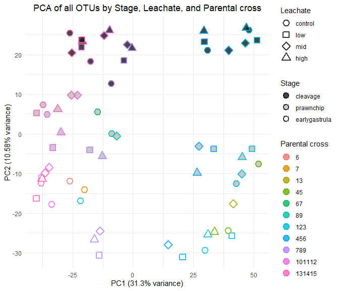
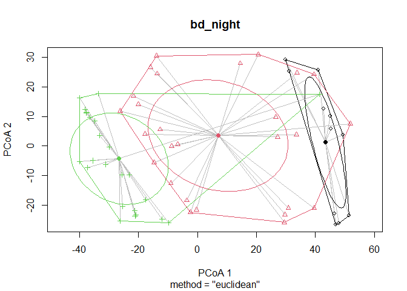
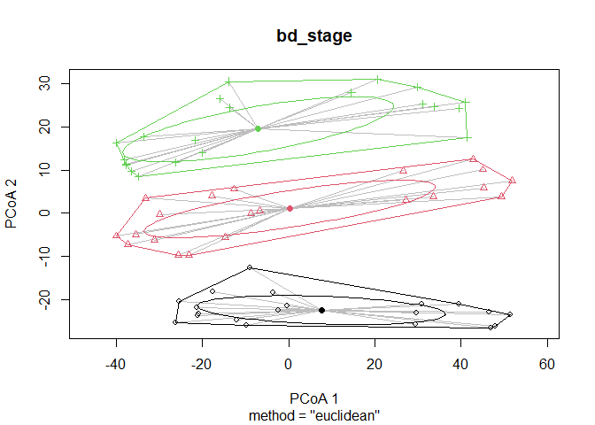

# Compositional Data Analysis
Sarah Tanja
2025-10-17

<link href="compositional_analysis_files/libs/htmltools-fill-0.5.8.1/fill.css" rel="stylesheet" />
<script src="compositional_analysis_files/libs/htmlwidgets-1.6.4/htmlwidgets.js"></script>
<script src="compositional_analysis_files/libs/plotly-binding-4.11.0/plotly.js"></script>
<script src="compositional_analysis_files/libs/setprototypeof-0.1/setprototypeof.js"></script>
<script src="compositional_analysis_files/libs/typedarray-0.1/typedarray.min.js"></script>
<script src="compositional_analysis_files/libs/jquery-3.5.1/jquery.min.js"></script>
<link href="compositional_analysis_files/libs/crosstalk-1.2.2/css/crosstalk.min.css" rel="stylesheet" />
<script src="compositional_analysis_files/libs/crosstalk-1.2.2/js/crosstalk.min.js"></script>
<link href="compositional_analysis_files/libs/plotly-htmlwidgets-css-2.11.1/plotly-htmlwidgets.css" rel="stylesheet" />
<script src="compositional_analysis_files/libs/plotly-main-2.11.1/plotly-latest.min.js"></script>

- [<span class="toc-section-number">1</span> Background](#background)
- [<span class="toc-section-number">2</span> Setup](#setup)
  - [<span class="toc-section-number">2.1</span> Install & load
    packages](#install--load-packages)
- [<span class="toc-section-number">3</span> Load Data](#load-data)
  - [<span class="toc-section-number">3.1</span> Load
    metadata](#load-metadata)
  - [<span class="toc-section-number">3.2</span> Import QIIME2
    artifacts](#import-qiime2-artifacts)
    - [<span class="toc-section-number">3.2.1</span> Feature
      table](#feature-table)
    - [<span class="toc-section-number">3.2.2</span>
      Taxonomy](#taxonomy)
  - [<span class="toc-section-number">3.3</span> Prepare data for
    analysis](#prepare-data-for-analysis)
- [<span class="toc-section-number">4</span> CLR
  Transformation](#clr-transformation)
- [<span class="toc-section-number">5</span> Aitchison
  Distance](#aitchison-distance)
- [<span class="toc-section-number">6</span> PCA Biplots](#pca-biplots)
  - [<span class="toc-section-number">6.1</span> Plot stage x leachate x
    cross](#plot-stage-x-leachate-x-cross)
  - [<span class="toc-section-number">6.2</span> Plot stage x leachate x
    spawn night](#plot-stage-x-leachate-x-spawn-night)
  - [<span class="toc-section-number">6.3</span> Interactive
    plotly](#interactive-plotly)
- [<span class="toc-section-number">7</span> PERMANOVA](#permanova)
  - [<span class="toc-section-number">7.1</span> Fit
    betadispr](#fit-betadispr)
    - [<span class="toc-section-number">7.1.1</span> night](#night)
    - [<span class="toc-section-number">7.1.2</span>
      leachate](#leachate)
    - [<span class="toc-section-number">7.1.3</span> stage](#stage)
    - [<span class="toc-section-number">7.1.4</span> leachate x
      stage](#leachate-x-stage)
  - [<span class="toc-section-number">7.2</span> Perform
    PERMANOVA](#perform-permanova)
- [<span class="toc-section-number">8</span> Summary](#summary)
  - [<span class="toc-section-number">8.1</span> Key
    Findings](#key-findings)
  - [<span class="toc-section-number">8.2</span> Next
    Steps](#next-steps)
  - [<span class="toc-section-number">8.3</span> Output
    Files](#output-files)
- [<span class="toc-section-number">9</span> Session
  Info](#session-info)

# Background

This analysis follows the recommendations from Gloor et al. 2017 for
compositional data analysis of microbiome data. Microbiome sequence
count data are compositional - they represent relative abundances
constrained to sum to a total (sequencing depth). This requires
specialized statistical methods that account for the compositional
nature of the data.

Key recommendations from Gloor et al. 2017: - Use centered log-ratio
(CLR) transformation to convert compositional data to Euclidean space -
Calculate Aitchison distance (Euclidean distance on CLR-transformed
data) for dissimilarity - Use variance-based methods like PCA on
CLR-transformed data - Perform statistical tests on transformed data

# Setup

``` r
# Define file paths
feature_table_path <- "../salipante/241121_StonyCoral/270x200/250414_StonyCoral_270x200_featureTable_filtered.qza"
metadata_path <- "../metadata/meta.csv"
taxonomy_path <- "../salipante/241121_StonyCoral/270x200/250414_270x200_representative-sequences_taxonomy.qza"
```

## Install & load packages

``` r
# Check R version
# R.version.string

# Install and load required packages
#if (!requireNamespace("BiocManager", quietly = TRUE)) {
#  install.packages("BiocManager")
#}

# Install Bioconductor packages
#if (!requireNamespace("phyloseq", quietly = TRUE)) {
#  BiocManager::install("phyloseq")
#}
#if (!requireNamespace("ANCOMBC", quietly = TRUE)) {
#  BiocManager::install("ANCOMBC")
#}

# Install CRAN packages
#required_packages <- c("tidyverse", "vegan", "compositions", "zCompositions", 
#                       "ggplot2", "reshape2", "corrplot", "devtools")
#for (pkg in required_packages) {
#  if (!requireNamespace(pkg, quietly = TRUE)) {
#    install.packages(pkg)
#  }
#}

# Install qiime2R from GitHub
#if (!requireNamespace("qiime2R", quietly = TRUE)) {
#  devtools::install_github("jbisanz/qiime2R")
#}

# Install SpiecEasi for SparCC (optional, can be slow to install)
#if (!requireNamespace("SpiecEasi", quietly = TRUE)) {
#  devtools::install_github("zdk123/SpiecEasi")
#}
```

``` r
# Load libraries
library(tidyverse)
library(qiime2R)
library(phyloseq)
library(vegan)
library(compositions)
library(zCompositions)
library(ggplot2)
library(reshape2)
library(corrplot)
library(ANCOMBC)
```

# Load Data

## Load metadata

``` r
# Load metadata
meta <- read_csv(metadata_path)

# set factors
meta <- meta %>% 
  mutate(
    collection_date = as.Date(collection_date, format = "%d-%b-%Y"),
    stage    = factor(stage,    levels = c("cleavage", "prawnchip", "earlygastrula"), ordered = TRUE),
    leachate = factor(leachate, levels = c("control", "low", "mid", "high"),        ordered = TRUE),
    spawn_night = factor(
      collection_date,
      levels  = as.Date(c("06-Jul-2024", "07-Jul-2024", "08-Jul-2024"), format = "%d-%b-%Y"),
      labels  = c("July 6th", "July 7th", "July 8th"),
      ordered = TRUE
    )
  )


# View metadata structure
str(meta)
```

    tibble [63 × 9] (S3: tbl_df/tbl/data.frame)
     $ sample_id      : chr [1:63] "101112C14" "101112C4" "101112C9" "101112H14" ...
     $ collection_date: Date[1:63], format: "2024-07-08" "2024-07-08" ...
     $ parents        : num [1:63] 101112 101112 101112 101112 101112 ...
     $ group          : chr [1:63] "C14" "C4" "C9" "H14" ...
     $ hpf            : num [1:63] 14 4 9 14 4 9 14 4 9 14 ...
     $ stage          : Ord.factor w/ 3 levels "cleavage"<"prawnchip"<..: 3 1 2 3 1 2 3 1 2 3 ...
     $ leachate       : Ord.factor w/ 4 levels "control"<"low"<..: 1 1 1 4 4 4 2 2 2 3 ...
     $ leachate_mgL   : num [1:63] 0 0 0 1 1 1 0.01 0.01 0.01 0.1 ...
     $ spawn_night    : Ord.factor w/ 3 levels "July 6th"<"July 7th"<..: 3 3 3 3 3 3 3 3 3 3 ...

## Import QIIME2 artifacts

### Feature table

``` r
# Load feature table from QIIME2 artifact
feature_table <- read_qza(feature_table_path)$data
```

### Taxonomy

``` r
# Load taxonomy (optional, for annotation)
taxonomy <- read_qza(taxonomy_path)$data
```

``` r
# Display data dimensions
cat("Feature table dimensions:", dim(feature_table), "\n")
```

    Feature table dimensions: 6147 63 

``` r
cat("Number of samples in metadata:", nrow(meta), "\n")
```

    Number of samples in metadata: 63 

## Prepare data for analysis

``` r
# Convert feature table to matrix (samples as rows, features as columns)
# QIIME2 format typically has features as rows, samples as columns
feature_matrix <- as.matrix(feature_table)
feature_matrix_t <- t(feature_matrix)  # Transpose so samples are rows

# Ensure sample IDs match between feature table and metadata
sample_ids <- rownames(feature_matrix_t)
meta_filt <- meta %>%
  filter(sample_id %in% sample_ids) %>%
  arrange(match(sample_id, sample_ids))

cat("Samples in feature table:", nrow(feature_matrix_t), "\n")
```

    Samples in feature table: 63 

``` r
cat("Samples in metadata:", nrow(meta_filt), "\n")
```

    Samples in metadata: 63 

# CLR Transformation

The centered log-ratio (CLR) transformation converts compositional data
to Euclidean space. It handles zeros by replacing them with small values
(geometric Bayesian multiplicative replacement).

``` r
# Replace zeros with small values using cmultRepl from zCompositions
# This is necessary because log transformation is undefined for zeros
feature_matrix_nozero <- cmultRepl(feature_matrix_t, method = "CZM", label = 0)

# Apply CLR transformation
feature_clr <- clr(feature_matrix_nozero)

# Convert to data frame for easier handling
feature_clr_df <- as.data.frame(feature_clr)

cat("CLR-transformed data dimensions:", dim(feature_clr_df), "\n")
```

    CLR-transformed data dimensions: 63 663 

``` r
head(feature_clr_df[, 1:5])
```

              a04fbb7832640df06d3e5bcefe6e5801 10f0b9b94a3c8595e648259668664749
    101112C14                        0.2486652                         4.709150
    101112C4                        -3.7257422                         5.497918
    101112C9                        -0.3735785                         3.776336
    101112H14                       -0.6744121                         3.660698
    101112H4                        -3.9079152                         5.443821
    101112H9                        -3.2733059                         4.203059
              9a5dabc71f65a222f30b7415aa0d9dd0 cfb17500dcecfc7d15edf48a0c944272
    101112C14                         4.663244                        1.1531215
    101112C4                          5.248163                       -3.7257422
    101112C9                          4.105380                       -3.4432900
    101112H14                         4.517618                        0.9678157
    101112H4                          5.515943                        0.3069533
    101112H9                          5.086768                       -3.2733059
              069cf7a7c4b413f53230b4b140ff08c7
    101112C14                         2.912620
    101112C4                          2.151650
    101112C9                          1.885204
    101112H14                         2.087705
    101112H4                          1.925441
    101112H9                          2.621114

# Aitchison Distance

The Aitchison distance is the Euclidean distance between samples after
CLR transformation. This is the appropriate distance metric for
compositional data.

``` r
# Calculate Aitchison distance (Euclidean distance on CLR-transformed data)
aitchison_dist <- dist(feature_clr, method = "euclidean")

# Display distance matrix summary
cat("Aitchison distance matrix summary:\n")
```

    Aitchison distance matrix summary:

``` r
summary(as.vector(aitchison_dist))
```

       Min. 1st Qu.  Median    Mean 3rd Qu.    Max. 
      42.03   66.38   77.38   78.23   89.85  115.41 

# PCA Biplots

Variance-based compositional PCA on CLR-transformed data. \## Perform
PCA

``` r
# Perform PCA on CLR-transformed data
pca_result <- prcomp(feature_clr, scale. = FALSE)

# Calculate variance explained
variance_explained <- summary(pca_result)$importance[2, ] * 100

# Create data frame for plotting
pca_df <- data.frame(
  PC1 = pca_result$x[, 1],
  PC2 = pca_result$x[, 2],
  sample_id = rownames(feature_clr)
)

# Merge with metadata
pca_df <- pca_df %>%
  left_join(meta_filt, by = "sample_id")
```

## Plot stage x leachate x cross

``` r
pca_plot_cross <- ggplot(
  pca_df,
  aes(
    x = PC1, y = PC2,
    fill = stage,                   # inside color
    colour = factor(parents),       # outline color
    shape = leachate                # shape must be 21–25
  )
) +
  geom_point(size = 3.5, stroke = 1.5, alpha = 0.8) +   # stroke controls outline width
  scale_shape_manual(values = c(21, 22, 23, 24, 25)[seq_along(levels(pca_df$leachate))]) +
  # light grey -> dark grey for discrete stages (shows in legend)
  scale_fill_grey(name = "Stage", start = 0.1, end = 1) +
  labs(
    title = "PCA of all OTUs by Stage, Leachate, and Parental cross",
    x = paste0("PC1 (", round(variance_explained[1], 2), "% variance)"),
    y = paste0("PC2 (", round(variance_explained[2], 2), "% variance)"),
    shape = "Leachate",
    color = "Parental cross"
  ) +
  theme_minimal() +
  theme(
    legend.position = "right",
    plot.title = element_text(hjust = 0.5)
  )+
  # 3) make the fill legend draw a filled shape with an outline
  guides(
    shape  = guide_legend(order = 1),
    fill   = guide_legend(override.aes = list(shape = 21, stroke = 1.1, colour = "black"), 
                          order = 2),
    colour = guide_legend(order = 3)
    
  ) 

pca_plot_cross
```



``` r
# Save plot
ggsave("../output/compositional_pca_cross.png", pca_plot_cross, 
       width = 10, height = 7, dpi = 300)
```

## Plot stage x leachate x spawn night

``` r
pca_plot_spawn_night <- ggplot(
  pca_df,
  aes(
    x = PC1, y = PC2,
    fill = stage,                   # inside color
    colour = factor(spawn_night),       # outline color
    shape = leachate                # shape must be 21–25
  )
) +
  geom_point(size = 3.5, stroke = 1.5, alpha = 0.8) +   # stroke controls outline width
  scale_shape_manual(values = c(21, 22, 23, 24, 25)[seq_along(levels(pca_df$leachate))]) +
  # light grey -> dark grey for discrete stages (shows in legend)
  scale_fill_grey(name = "Stage", start = 0.1, end = 1) +
  labs(
    title = "PCA of all OTUs by Stage, Leachate, and Spawn night",
    x = paste0("PC1 (", round(variance_explained[1], 2), "% variance)"),
    y = paste0("PC2 (", round(variance_explained[2], 2), "% variance)"),
    shape = "Leachate",
    color = "Spawn night"
  ) +
  theme_minimal() +
  theme(
    legend.position = "right",
    plot.title = element_text(hjust = 0.5)
  )+
  # 3) make the fill legend draw a filled shape with an outline
  guides(
    shape  = guide_legend(order = 1),
    fill   = guide_legend(override.aes = list(shape = 21, stroke = 1.1, colour = "black"), 
                          order = 2),
    colour = guide_legend(order = 3)
    
  ) 

pca_plot_spawn_night
```


``` r
# Save plot
ggsave("../output/compositional_pca_spawn_night.png", pca_plot_spawn_night, 
       width = 10, height = 7, dpi = 300)
```

## Interactive plotly

``` r
library(ggplot2)
library(plotly)

# add a tooltip aesthetic to your existing ggplot
pca_plot_hpf <- ggplot(
  pca_df,
  aes(
    x = PC1, y = PC2,
    fill = stage,                    # inside color
    colour = factor(parents),        # outline color
    shape = leachate,                # shape must be 21–25
    text = paste0(
      "Stage: ", stage,
      "<br>Leachate: ", leachate,
      "<br>Parent: ", parents
    )
  )
) +
  geom_point(size = 3.5, stroke = 1.5, alpha = 0.8) +
  scale_shape_manual(values = c(21, 22, 23, 24, 25)[seq_along(levels(pca_df$leachate))]) +
  scale_fill_grey(name = "Stage", start = 0.1, end = 1) +
  labs(
    title = "PCA of all OTUs by Stage, Leachate, and Parental cross",
    x = paste0("PC1 (", round(variance_explained[1], 2), "% variance)"),
    y = paste0("PC2 (", round(variance_explained[2], 2), "% variance)"),
    shape = "Leachate",
    color = "Parental cross"
  ) +
  theme_minimal() +
  theme(
    legend.position = "right",
    plot.title = element_text(hjust = 0.5)
  ) +
  guides(
    shape  = guide_legend(order = 1),
    fill   = guide_legend(override.aes = list(shape = 21, stroke = 1.1, colour = "black"),
                          order = 2),
    colour = guide_legend(order = 3)
  )

# convert to plotly and use only the custom text in the tooltip
pca_plot_hpf_interactive <- ggplotly(pca_plot_hpf, tooltip = "text")
pca_plot_hpf_interactive
```

<div class="plotly html-widget html-fill-item" id="htmlwidget-20c203d6201972acc888" style="width:672px;height:480px;"></div>
<script type="application/json" data-for="htmlwidget-20c203d6201972acc888">{"x":{"data":[{"x":[47.903501760984661],"y":[26.173885088862704],"text":"Stage: cleavage<br>Leachate: control<br>Parent: 123","type":"scatter","mode":"markers","marker":{"autocolorscale":false,"color":"rgba(25,25,25,1)","opacity":0.80000000000000004,"size":13.228346456692915,"symbol":"circle","line":{"width":5.6692913385826778,"color":"rgba(0,186,222,1)"}},"hoveron":"points","name":"(control,cleavage,123)","legendgroup":"(control,cleavage,123)","showlegend":true,"xaxis":"x","yaxis":"y","hoverinfo":"text","frame":null},{"x":[30.778686066616888],"y":[21.057441778281888],"text":"Stage: cleavage<br>Leachate: control<br>Parent: 456","type":"scatter","mode":"markers","marker":{"autocolorscale":false,"color":"rgba(25,25,25,1)","opacity":0.80000000000000004,"size":13.228346456692915,"symbol":"circle","line":{"width":5.6692913385826778,"color":"rgba(0,166,255,1)"}},"hoveron":"points","name":"(control,cleavage,456)","legendgroup":"(control,cleavage,456)","showlegend":true,"xaxis":"x","yaxis":"y","hoverinfo":"text","frame":null},{"x":[-9.0716835458250813],"y":[12.634689548172277],"text":"Stage: cleavage<br>Leachate: control<br>Parent: 789","type":"scatter","mode":"markers","marker":{"autocolorscale":false,"color":"rgba(25,25,25,1)","opacity":0.80000000000000004,"size":13.228346456692915,"symbol":"circle","line":{"width":5.6692913385826778,"color":"rgba(179,133,255,1)"}},"hoveron":"points","name":"(control,cleavage,789)","legendgroup":"(control,cleavage,789)","showlegend":true,"xaxis":"x","yaxis":"y","hoverinfo":"text","frame":null},{"x":[-17.62840777536832],"y":[18.2391470245352],"text":"Stage: cleavage<br>Leachate: control<br>Parent: 101112","type":"scatter","mode":"markers","marker":{"autocolorscale":false,"color":"rgba(25,25,25,1)","opacity":0.80000000000000004,"size":13.228346456692915,"symbol":"circle","line":{"width":5.6692913385826778,"color":"rgba(239,103,235,1)"}},"hoveron":"points","name":"(control,cleavage,101112)","legendgroup":"(control,cleavage,101112)","showlegend":true,"xaxis":"x","yaxis":"y","hoverinfo":"text","frame":null},{"x":[-26.23571584157088],"y":[25.398215050304888],"text":"Stage: cleavage<br>Leachate: control<br>Parent: 131415","type":"scatter","mode":"markers","marker":{"autocolorscale":false,"color":"rgba(25,25,25,1)","opacity":0.80000000000000004,"size":13.228346456692915,"symbol":"circle","line":{"width":5.6692913385826778,"color":"rgba(255,99,182,1)"}},"hoveron":"points","name":"(control,cleavage,131415)","legendgroup":"(control,cleavage,131415)","showlegend":true,"xaxis":"x","yaxis":"y","hoverinfo":"text","frame":null},{"x":[51.87112899126334],"y":[-7.4943755523967184],"text":"Stage: prawnchip<br>Leachate: control<br>Parent: 45","type":"scatter","mode":"markers","marker":{"autocolorscale":false,"color":"rgba(187,187,187,1)","opacity":0.80000000000000004,"size":13.228346456692915,"symbol":"circle","line":{"width":5.6692913385826778,"color":"rgba(100,178,0,1)"}},"hoveron":"points","name":"(control,prawnchip,45)","legendgroup":"(control,prawnchip,45)","showlegend":true,"xaxis":"x","yaxis":"y","hoverinfo":"text","frame":null},{"x":[-14.795237540103564],"y":[5.5849772191514075],"text":"Stage: prawnchip<br>Leachate: control<br>Parent: 67","type":"scatter","mode":"markers","marker":{"autocolorscale":false,"color":"rgba(187,187,187,1)","opacity":0.80000000000000004,"size":13.228346456692915,"symbol":"circle","line":{"width":5.6692913385826778,"color":"rgba(0,189,92,1)"}},"hoveron":"points","name":"(control,prawnchip,67)","legendgroup":"(control,prawnchip,67)","showlegend":true,"xaxis":"x","yaxis":"y","hoverinfo":"text","frame":null},{"x":[-8.7821816773731793],"y":[0.12945381754309732],"text":"Stage: prawnchip<br>Leachate: control<br>Parent: 89","type":"scatter","mode":"markers","marker":{"autocolorscale":false,"color":"rgba(187,187,187,1)","opacity":0.80000000000000004,"size":13.228346456692915,"symbol":"circle","line":{"width":5.6692913385826778,"color":"rgba(0,193,167,1)"}},"hoveron":"points","name":"(control,prawnchip,89)","legendgroup":"(control,prawnchip,89)","showlegend":true,"xaxis":"x","yaxis":"y","hoverinfo":"text","frame":null},{"x":[42.70835359672337],"y":[-12.534598446748662],"text":"Stage: prawnchip<br>Leachate: control<br>Parent: 123","type":"scatter","mode":"markers","marker":{"autocolorscale":false,"color":"rgba(187,187,187,1)","opacity":0.80000000000000004,"size":13.228346456692915,"symbol":"circle","line":{"width":5.6692913385826778,"color":"rgba(0,186,222,1)"}},"hoveron":"points","name":"(control,prawnchip,123)","legendgroup":"(control,prawnchip,123)","showlegend":true,"xaxis":"x","yaxis":"y","hoverinfo":"text","frame":null},{"x":[-35.541453611077877],"y":[4.9574971060711936],"text":"Stage: prawnchip<br>Leachate: control<br>Parent: 101112","type":"scatter","mode":"markers","marker":{"autocolorscale":false,"color":"rgba(187,187,187,1)","opacity":0.80000000000000004,"size":13.228346456692915,"symbol":"circle","line":{"width":5.6692913385826778,"color":"rgba(239,103,235,1)"}},"hoveron":"points","name":"(control,prawnchip,101112)","legendgroup":"(control,prawnchip,101112)","showlegend":true,"xaxis":"x","yaxis":"y","hoverinfo":"text","frame":null},{"x":[-37.292257490312501],"y":[7.3192425448471337],"text":"Stage: prawnchip<br>Leachate: control<br>Parent: 131415","type":"scatter","mode":"markers","marker":{"autocolorscale":false,"color":"rgba(187,187,187,1)","opacity":0.80000000000000004,"size":13.228346456692915,"symbol":"circle","line":{"width":5.6692913385826778,"color":"rgba(255,99,182,1)"}},"hoveron":"points","name":"(control,prawnchip,131415)","legendgroup":"(control,prawnchip,131415)","showlegend":true,"xaxis":"x","yaxis":"y","hoverinfo":"text","frame":null},{"x":[-26.252608727946651],"y":[-11.836973000624857],"text":"Stage: earlygastrula<br>Leachate: control<br>Parent: 6","type":"scatter","mode":"markers","marker":{"autocolorscale":false,"color":"rgba(255,255,255,1)","opacity":0.80000000000000004,"size":13.228346456692915,"symbol":"circle","line":{"width":5.6692913385826778,"color":"rgba(248,118,109,1)"}},"hoveron":"points","name":"(control,earlygastrula,6)","legendgroup":"(control,earlygastrula,6)","showlegend":true,"xaxis":"x","yaxis":"y","hoverinfo":"text","frame":null},{"x":[-20.123904887821684],"y":[-14.058490056040744],"text":"Stage: earlygastrula<br>Leachate: control<br>Parent: 7","type":"scatter","mode":"markers","marker":{"autocolorscale":false,"color":"rgba(255,255,255,1)","opacity":0.80000000000000004,"size":13.228346456692915,"symbol":"circle","line":{"width":5.6692913385826778,"color":"rgba(219,142,0,1)"}},"hoveron":"points","name":"(control,earlygastrula,7)","legendgroup":"(control,earlygastrula,7)","showlegend":true,"xaxis":"x","yaxis":"y","hoverinfo":"text","frame":null},{"x":[39.482988711094826],"y":[-24.305339849818957],"text":"Stage: earlygastrula<br>Leachate: control<br>Parent: 45","type":"scatter","mode":"markers","marker":{"autocolorscale":false,"color":"rgba(255,255,255,1)","opacity":0.80000000000000004,"size":13.228346456692915,"symbol":"circle","line":{"width":5.6692913385826778,"color":"rgba(100,178,0,1)"}},"hoveron":"points","name":"(control,earlygastrula,45)","legendgroup":"(control,earlygastrula,45)","showlegend":true,"xaxis":"x","yaxis":"y","hoverinfo":"text","frame":null},{"x":[-21.748188325331402],"y":[-16.860392154256356],"text":"Stage: earlygastrula<br>Leachate: control<br>Parent: 89","type":"scatter","mode":"markers","marker":{"autocolorscale":false,"color":"rgba(255,255,255,1)","opacity":0.80000000000000004,"size":13.228346456692915,"symbol":"circle","line":{"width":5.6692913385826778,"color":"rgba(0,193,167,1)"}},"hoveron":"points","name":"(control,earlygastrula,89)","legendgroup":"(control,earlygastrula,89)","showlegend":true,"xaxis":"x","yaxis":"y","hoverinfo":"text","frame":null},{"x":[29.848511167457509],"y":[-29.255197656247212],"text":"Stage: earlygastrula<br>Leachate: control<br>Parent: 123","type":"scatter","mode":"markers","marker":{"autocolorscale":false,"color":"rgba(255,255,255,1)","opacity":0.80000000000000004,"size":13.228346456692915,"symbol":"circle","line":{"width":5.6692913385826778,"color":"rgba(0,186,222,1)"}},"hoveron":"points","name":"(control,earlygastrula,123)","legendgroup":"(control,earlygastrula,123)","showlegend":true,"xaxis":"x","yaxis":"y","hoverinfo":"text","frame":null},{"x":[-33.713179780369032],"y":[-17.697425636709291],"text":"Stage: earlygastrula<br>Leachate: control<br>Parent: 101112","type":"scatter","mode":"markers","marker":{"autocolorscale":false,"color":"rgba(255,255,255,1)","opacity":0.80000000000000004,"size":13.228346456692915,"symbol":"circle","line":{"width":5.6692913385826778,"color":"rgba(239,103,235,1)"}},"hoveron":"points","name":"(control,earlygastrula,101112)","legendgroup":"(control,earlygastrula,101112)","showlegend":true,"xaxis":"x","yaxis":"y","hoverinfo":"text","frame":null},{"x":[-38.180874888186793],"y":[-12.345612818087835],"text":"Stage: earlygastrula<br>Leachate: control<br>Parent: 131415","type":"scatter","mode":"markers","marker":{"autocolorscale":false,"color":"rgba(255,255,255,1)","opacity":0.80000000000000004,"size":13.228346456692915,"symbol":"circle","line":{"width":5.6692913385826778,"color":"rgba(255,99,182,1)"}},"hoveron":"points","name":"(control,earlygastrula,131415)","legendgroup":"(control,earlygastrula,131415)","showlegend":true,"xaxis":"x","yaxis":"y","hoverinfo":"text","frame":null},{"x":[51.394871472463791],"y":[23.601764441768182],"text":"Stage: cleavage<br>Leachate: low<br>Parent: 123","type":"scatter","mode":"markers","marker":{"autocolorscale":false,"color":"rgba(25,25,25,1)","opacity":0.80000000000000004,"size":13.228346456692915,"symbol":"square","line":{"width":5.6692913385826778,"color":"rgba(0,186,222,1)"}},"hoveron":"points","name":"(low,cleavage,123)","legendgroup":"(low,cleavage,123)","showlegend":true,"xaxis":"x","yaxis":"y","hoverinfo":"text","frame":null},{"x":[29.580146035397728],"y":[23.220096137820867],"text":"Stage: cleavage<br>Leachate: low<br>Parent: 456","type":"scatter","mode":"markers","marker":{"autocolorscale":false,"color":"rgba(25,25,25,1)","opacity":0.80000000000000004,"size":13.228346456692915,"symbol":"square","line":{"width":5.6692913385826778,"color":"rgba(0,166,255,1)"}},"hoveron":"points","name":"(low,cleavage,456)","legendgroup":"(low,cleavage,456)","showlegend":true,"xaxis":"x","yaxis":"y","hoverinfo":"text","frame":null},{"x":[-3.6987423121916336],"y":[18.469983383831661],"text":"Stage: cleavage<br>Leachate: low<br>Parent: 789","type":"scatter","mode":"markers","marker":{"autocolorscale":false,"color":"rgba(25,25,25,1)","opacity":0.80000000000000004,"size":13.228346456692915,"symbol":"square","line":{"width":5.6692913385826778,"color":"rgba(179,133,255,1)"}},"hoveron":"points","name":"(low,cleavage,789)","legendgroup":"(low,cleavage,789)","showlegend":true,"xaxis":"x","yaxis":"y","hoverinfo":"text","frame":null},{"x":[-21.321708802639066],"y":[21.865709555900835],"text":"Stage: cleavage<br>Leachate: low<br>Parent: 101112","type":"scatter","mode":"markers","marker":{"autocolorscale":false,"color":"rgba(25,25,25,1)","opacity":0.80000000000000004,"size":13.228346456692915,"symbol":"square","line":{"width":5.6692913385826778,"color":"rgba(239,103,235,1)"}},"hoveron":"points","name":"(low,cleavage,101112)","legendgroup":"(low,cleavage,101112)","showlegend":true,"xaxis":"x","yaxis":"y","hoverinfo":"text","frame":null},{"x":[-21.19830266338969],"y":[23.725436111692083],"text":"Stage: cleavage<br>Leachate: low<br>Parent: 131415","type":"scatter","mode":"markers","marker":{"autocolorscale":false,"color":"rgba(25,25,25,1)","opacity":0.80000000000000004,"size":13.228346456692915,"symbol":"square","line":{"width":5.6692913385826778,"color":"rgba(255,99,182,1)"}},"hoveron":"points","name":"(low,cleavage,131415)","legendgroup":"(low,cleavage,131415)","showlegend":true,"xaxis":"x","yaxis":"y","hoverinfo":"text","frame":null},{"x":[49.28183142559844],"y":[-3.8171862301404853],"text":"Stage: prawnchip<br>Leachate: low<br>Parent: 123","type":"scatter","mode":"markers","marker":{"autocolorscale":false,"color":"rgba(187,187,187,1)","opacity":0.80000000000000004,"size":13.228346456692915,"symbol":"square","line":{"width":5.6692913385826778,"color":"rgba(0,186,222,1)"}},"hoveron":"points","name":"(low,prawnchip,123)","legendgroup":"(low,prawnchip,123)","showlegend":true,"xaxis":"x","yaxis":"y","hoverinfo":"text","frame":null},{"x":[33.52230484075838],"y":[-3.7931799031176636],"text":"Stage: prawnchip<br>Leachate: low<br>Parent: 456","type":"scatter","mode":"markers","marker":{"autocolorscale":false,"color":"rgba(187,187,187,1)","opacity":0.80000000000000004,"size":13.228346456692915,"symbol":"square","line":{"width":5.6692913385826778,"color":"rgba(0,166,255,1)"}},"hoveron":"points","name":"(low,prawnchip,456)","legendgroup":"(low,prawnchip,456)","showlegend":true,"xaxis":"x","yaxis":"y","hoverinfo":"text","frame":null},{"x":[-17.818076583419202],"y":[-4.0274255755013124],"text":"Stage: prawnchip<br>Leachate: low<br>Parent: 789","type":"scatter","mode":"markers","marker":{"autocolorscale":false,"color":"rgba(187,187,187,1)","opacity":0.80000000000000004,"size":13.228346456692915,"symbol":"square","line":{"width":5.6692913385826778,"color":"rgba(179,133,255,1)"}},"hoveron":"points","name":"(low,prawnchip,789)","legendgroup":"(low,prawnchip,789)","showlegend":true,"xaxis":"x","yaxis":"y","hoverinfo":"text","frame":null},{"x":[-33.251772855570692],"y":[-3.4853824325527829],"text":"Stage: prawnchip<br>Leachate: low<br>Parent: 101112","type":"scatter","mode":"markers","marker":{"autocolorscale":false,"color":"rgba(187,187,187,1)","opacity":0.80000000000000004,"size":13.228346456692915,"symbol":"square","line":{"width":5.6692913385826778,"color":"rgba(239,103,235,1)"}},"hoveron":"points","name":"(low,prawnchip,101112)","legendgroup":"(low,prawnchip,101112)","showlegend":true,"xaxis":"x","yaxis":"y","hoverinfo":"text","frame":null},{"x":[-39.933795227253817],"y":[5.2839624123654634],"text":"Stage: prawnchip<br>Leachate: low<br>Parent: 131415","type":"scatter","mode":"markers","marker":{"autocolorscale":false,"color":"rgba(187,187,187,1)","opacity":0.80000000000000004,"size":13.228346456692915,"symbol":"square","line":{"width":5.6692913385826778,"color":"rgba(255,99,182,1)"}},"hoveron":"points","name":"(low,prawnchip,131415)","legendgroup":"(low,prawnchip,131415)","showlegend":true,"xaxis":"x","yaxis":"y","hoverinfo":"text","frame":null},{"x":[41.022100957860154],"y":[-25.703961244779673],"text":"Stage: earlygastrula<br>Leachate: low<br>Parent: 123","type":"scatter","mode":"markers","marker":{"autocolorscale":false,"color":"rgba(255,255,255,1)","opacity":0.80000000000000004,"size":13.228346456692915,"symbol":"square","line":{"width":5.6692913385826778,"color":"rgba(0,186,222,1)"}},"hoveron":"points","name":"(low,earlygastrula,123)","legendgroup":"(low,earlygastrula,123)","showlegend":true,"xaxis":"x","yaxis":"y","hoverinfo":"text","frame":null},{"x":[20.578606996055143],"y":[-30.993666100896263],"text":"Stage: earlygastrula<br>Leachate: low<br>Parent: 456","type":"scatter","mode":"markers","marker":{"autocolorscale":false,"color":"rgba(255,255,255,1)","opacity":0.80000000000000004,"size":13.228346456692915,"symbol":"square","line":{"width":5.6692913385826778,"color":"rgba(0,166,255,1)"}},"hoveron":"points","name":"(low,earlygastrula,456)","legendgroup":"(low,earlygastrula,456)","showlegend":true,"xaxis":"x","yaxis":"y","hoverinfo":"text","frame":null},{"x":[-13.968353531563169],"y":[-30.563134756142386],"text":"Stage: earlygastrula<br>Leachate: low<br>Parent: 789","type":"scatter","mode":"markers","marker":{"autocolorscale":false,"color":"rgba(255,255,255,1)","opacity":0.80000000000000004,"size":13.228346456692915,"symbol":"square","line":{"width":5.6692913385826778,"color":"rgba(179,133,255,1)"}},"hoveron":"points","name":"(low,earlygastrula,789)","legendgroup":"(low,earlygastrula,789)","showlegend":true,"xaxis":"x","yaxis":"y","hoverinfo":"text","frame":null},{"x":[-37.820913899085674],"y":[-11.124846782773957],"text":"Stage: earlygastrula<br>Leachate: low<br>Parent: 101112","type":"scatter","mode":"markers","marker":{"autocolorscale":false,"color":"rgba(255,255,255,1)","opacity":0.80000000000000004,"size":13.228346456692915,"symbol":"square","line":{"width":5.6692913385826778,"color":"rgba(239,103,235,1)"}},"hoveron":"points","name":"(low,earlygastrula,101112)","legendgroup":"(low,earlygastrula,101112)","showlegend":true,"xaxis":"x","yaxis":"y","hoverinfo":"text","frame":null},{"x":[-39.976303376669435],"y":[-16.292698316951284],"text":"Stage: earlygastrula<br>Leachate: low<br>Parent: 131415","type":"scatter","mode":"markers","marker":{"autocolorscale":false,"color":"rgba(255,255,255,1)","opacity":0.80000000000000004,"size":13.228346456692915,"symbol":"square","line":{"width":5.6692913385826778,"color":"rgba(255,99,182,1)"}},"hoveron":"points","name":"(low,earlygastrula,131415)","legendgroup":"(low,earlygastrula,131415)","showlegend":true,"xaxis":"x","yaxis":"y","hoverinfo":"text","frame":null},{"x":[46.485450586134846],"y":[22.902858513465425],"text":"Stage: cleavage<br>Leachate: mid<br>Parent: 123","type":"scatter","mode":"markers","marker":{"autocolorscale":false,"color":"rgba(25,25,25,1)","opacity":0.80000000000000004,"size":13.228346456692915,"symbol":"diamond","line":{"width":5.6692913385826778,"color":"rgba(0,186,222,1)"}},"hoveron":"points","name":"(mid,cleavage,123)","legendgroup":"(mid,cleavage,123)","showlegend":true,"xaxis":"x","yaxis":"y","hoverinfo":"text","frame":null},{"x":[39.592725915061813],"y":[21.024192280323209],"text":"Stage: cleavage<br>Leachate: mid<br>Parent: 456","type":"scatter","mode":"markers","marker":{"autocolorscale":false,"color":"rgba(25,25,25,1)","opacity":0.80000000000000004,"size":13.228346456692915,"symbol":"diamond","line":{"width":5.6692913385826778,"color":"rgba(0,166,255,1)"}},"hoveron":"points","name":"(mid,cleavage,456)","legendgroup":"(mid,cleavage,456)","showlegend":true,"xaxis":"x","yaxis":"y","hoverinfo":"text","frame":null},{"x":[-2.3935787342086394],"y":[22.479729503933235],"text":"Stage: cleavage<br>Leachate: mid<br>Parent: 789","type":"scatter","mode":"markers","marker":{"autocolorscale":false,"color":"rgba(25,25,25,1)","opacity":0.80000000000000004,"size":13.228346456692915,"symbol":"diamond","line":{"width":5.6692913385826778,"color":"rgba(179,133,255,1)"}},"hoveron":"points","name":"(mid,cleavage,789)","legendgroup":"(mid,cleavage,789)","showlegend":true,"xaxis":"x","yaxis":"y","hoverinfo":"text","frame":null},{"x":[-11.981209682678791],"y":[24.825127648884042],"text":"Stage: cleavage<br>Leachate: mid<br>Parent: 101112","type":"scatter","mode":"markers","marker":{"autocolorscale":false,"color":"rgba(25,25,25,1)","opacity":0.80000000000000004,"size":13.228346456692915,"symbol":"diamond","line":{"width":5.6692913385826778,"color":"rgba(239,103,235,1)"}},"hoveron":"points","name":"(mid,cleavage,101112)","legendgroup":"(mid,cleavage,101112)","showlegend":true,"xaxis":"x","yaxis":"y","hoverinfo":"text","frame":null},{"x":[-25.442630037800527],"y":[20.486053294335413],"text":"Stage: cleavage<br>Leachate: mid<br>Parent: 131415","type":"scatter","mode":"markers","marker":{"autocolorscale":false,"color":"rgba(25,25,25,1)","opacity":0.80000000000000004,"size":13.228346456692915,"symbol":"diamond","line":{"width":5.6692913385826778,"color":"rgba(255,99,182,1)"}},"hoveron":"points","name":"(mid,cleavage,131415)","legendgroup":"(mid,cleavage,131415)","showlegend":true,"xaxis":"x","yaxis":"y","hoverinfo":"text","frame":null},{"x":[-6.6822653860449837],"y":[-0.51064189136776195],"text":"Stage: prawnchip<br>Leachate: mid<br>Parent: 89","type":"scatter","mode":"markers","marker":{"autocolorscale":false,"color":"rgba(187,187,187,1)","opacity":0.80000000000000004,"size":13.228346456692915,"symbol":"diamond","line":{"width":5.6692913385826778,"color":"rgba(0,193,167,1)"}},"hoveron":"points","name":"(mid,prawnchip,89)","legendgroup":"(mid,prawnchip,89)","showlegend":true,"xaxis":"x","yaxis":"y","hoverinfo":"text","frame":null},{"x":[44.986471820529211],"y":[-10.128149370111256],"text":"Stage: prawnchip<br>Leachate: mid<br>Parent: 123","type":"scatter","mode":"markers","marker":{"autocolorscale":false,"color":"rgba(187,187,187,1)","opacity":0.80000000000000004,"size":13.228346456692915,"symbol":"diamond","line":{"width":5.6692913385826778,"color":"rgba(0,186,222,1)"}},"hoveron":"points","name":"(mid,prawnchip,123)","legendgroup":"(mid,prawnchip,123)","showlegend":true,"xaxis":"x","yaxis":"y","hoverinfo":"text","frame":null},{"x":[27.214486715144762],"y":[-3.0586437170526235],"text":"Stage: prawnchip<br>Leachate: mid<br>Parent: 456","type":"scatter","mode":"markers","marker":{"autocolorscale":false,"color":"rgba(187,187,187,1)","opacity":0.80000000000000004,"size":13.228346456692915,"symbol":"diamond","line":{"width":5.6692913385826778,"color":"rgba(0,166,255,1)"}},"hoveron":"points","name":"(mid,prawnchip,456)","legendgroup":"(mid,prawnchip,456)","showlegend":true,"xaxis":"x","yaxis":"y","hoverinfo":"text","frame":null},{"x":[-23.098583814986441],"y":[9.7809033651442796],"text":"Stage: prawnchip<br>Leachate: mid<br>Parent: 101112","type":"scatter","mode":"markers","marker":{"autocolorscale":false,"color":"rgba(187,187,187,1)","opacity":0.80000000000000004,"size":13.228346456692915,"symbol":"diamond","line":{"width":5.6692913385826778,"color":"rgba(239,103,235,1)"}},"hoveron":"points","name":"(mid,prawnchip,101112)","legendgroup":"(mid,prawnchip,101112)","showlegend":true,"xaxis":"x","yaxis":"y","hoverinfo":"text","frame":null},{"x":[-25.559130962747872],"y":[9.7076248163583347],"text":"Stage: prawnchip<br>Leachate: mid<br>Parent: 131415","type":"scatter","mode":"markers","marker":{"autocolorscale":false,"color":"rgba(187,187,187,1)","opacity":0.80000000000000004,"size":13.228346456692915,"symbol":"diamond","line":{"width":5.6692913385826778,"color":"rgba(255,99,182,1)"}},"hoveron":"points","name":"(mid,prawnchip,131415)","legendgroup":"(mid,prawnchip,131415)","showlegend":true,"xaxis":"x","yaxis":"y","hoverinfo":"text","frame":null},{"x":[41.44610865568837],"y":[-17.549530859774826],"text":"Stage: earlygastrula<br>Leachate: mid<br>Parent: 13","type":"scatter","mode":"markers","marker":{"autocolorscale":false,"color":"rgba(255,255,255,1)","opacity":0.80000000000000004,"size":13.228346456692915,"symbol":"diamond","line":{"width":5.6692913385826778,"color":"rgba(174,162,0,1)"}},"hoveron":"points","name":"(mid,earlygastrula,13)","legendgroup":"(mid,earlygastrula,13)","showlegend":true,"xaxis":"x","yaxis":"y","hoverinfo":"text","frame":null},{"x":[14.520081036468627],"y":[-27.953700242432085],"text":"Stage: earlygastrula<br>Leachate: mid<br>Parent: 456","type":"scatter","mode":"markers","marker":{"autocolorscale":false,"color":"rgba(255,255,255,1)","opacity":0.80000000000000004,"size":13.228346456692915,"symbol":"diamond","line":{"width":5.6692913385826778,"color":"rgba(0,166,255,1)"}},"hoveron":"points","name":"(mid,earlygastrula,456)","legendgroup":"(mid,earlygastrula,456)","showlegend":true,"xaxis":"x","yaxis":"y","hoverinfo":"text","frame":null},{"x":[-13.666419120526205],"y":[-24.479671398978965],"text":"Stage: earlygastrula<br>Leachate: mid<br>Parent: 789","type":"scatter","mode":"markers","marker":{"autocolorscale":false,"color":"rgba(255,255,255,1)","opacity":0.80000000000000004,"size":13.228346456692915,"symbol":"diamond","line":{"width":5.6692913385826778,"color":"rgba(179,133,255,1)"}},"hoveron":"points","name":"(mid,earlygastrula,789)","legendgroup":"(mid,earlygastrula,789)","showlegend":true,"xaxis":"x","yaxis":"y","hoverinfo":"text","frame":null},{"x":[-34.835825262367102],"y":[-8.4466584793003978],"text":"Stage: earlygastrula<br>Leachate: mid<br>Parent: 101112","type":"scatter","mode":"markers","marker":{"autocolorscale":false,"color":"rgba(255,255,255,1)","opacity":0.80000000000000004,"size":13.228346456692915,"symbol":"diamond","line":{"width":5.6692913385826778,"color":"rgba(239,103,235,1)"}},"hoveron":"points","name":"(mid,earlygastrula,101112)","legendgroup":"(mid,earlygastrula,101112)","showlegend":true,"xaxis":"x","yaxis":"y","hoverinfo":"text","frame":null},{"x":[-36.463177937841408],"y":[-9.7962212991286304],"text":"Stage: earlygastrula<br>Leachate: mid<br>Parent: 131415","type":"scatter","mode":"markers","marker":{"autocolorscale":false,"color":"rgba(255,255,255,1)","opacity":0.80000000000000004,"size":13.228346456692915,"symbol":"diamond","line":{"width":5.6692913385826778,"color":"rgba(255,99,182,1)"}},"hoveron":"points","name":"(mid,earlygastrula,131415)","legendgroup":"(mid,earlygastrula,131415)","showlegend":true,"xaxis":"x","yaxis":"y","hoverinfo":"text","frame":null},{"x":[46.905759696265171],"y":[26.712155136036039],"text":"Stage: cleavage<br>Leachate: high<br>Parent: 123","type":"scatter","mode":"markers","marker":{"autocolorscale":false,"color":"rgba(25,25,25,1)","opacity":0.80000000000000004,"size":13.228346456692915,"symbol":"triangle-up","line":{"width":5.6692913385826778,"color":"rgba(0,186,222,1)"}},"hoveron":"points","name":"(high,cleavage,123)","legendgroup":"(high,cleavage,123)","showlegend":true,"xaxis":"x","yaxis":"y","hoverinfo":"text","frame":null},{"x":[29.354066717456014],"y":[25.913154489852385],"text":"Stage: cleavage<br>Leachate: high<br>Parent: 456","type":"scatter","mode":"markers","marker":{"autocolorscale":false,"color":"rgba(25,25,25,1)","opacity":0.80000000000000004,"size":13.228346456692915,"symbol":"triangle-up","line":{"width":5.6692913385826778,"color":"rgba(0,166,255,1)"}},"hoveron":"points","name":"(high,cleavage,456)","legendgroup":"(high,cleavage,456)","showlegend":true,"xaxis":"x","yaxis":"y","hoverinfo":"text","frame":null},{"x":[-0.4246123029974726],"y":[21.562274777955089],"text":"Stage: cleavage<br>Leachate: high<br>Parent: 789","type":"scatter","mode":"markers","marker":{"autocolorscale":false,"color":"rgba(25,25,25,1)","opacity":0.80000000000000004,"size":13.228346456692915,"symbol":"triangle-up","line":{"width":5.6692913385826778,"color":"rgba(179,133,255,1)"}},"hoveron":"points","name":"(high,cleavage,789)","legendgroup":"(high,cleavage,789)","showlegend":true,"xaxis":"x","yaxis":"y","hoverinfo":"text","frame":null},{"x":[-9.7630773470594647],"y":[26.018961432264611],"text":"Stage: cleavage<br>Leachate: high<br>Parent: 101112","type":"scatter","mode":"markers","marker":{"autocolorscale":false,"color":"rgba(25,25,25,1)","opacity":0.80000000000000004,"size":13.228346456692915,"symbol":"triangle-up","line":{"width":5.6692913385826778,"color":"rgba(239,103,235,1)"}},"hoveron":"points","name":"(high,cleavage,101112)","legendgroup":"(high,cleavage,101112)","showlegend":true,"xaxis":"x","yaxis":"y","hoverinfo":"text","frame":null},{"x":[-20.977287070596645],"y":[23.305792449716566],"text":"Stage: cleavage<br>Leachate: high<br>Parent: 131415","type":"scatter","mode":"markers","marker":{"autocolorscale":false,"color":"rgba(25,25,25,1)","opacity":0.80000000000000004,"size":13.228346456692915,"symbol":"triangle-up","line":{"width":5.6692913385826778,"color":"rgba(255,99,182,1)"}},"hoveron":"points","name":"(high,cleavage,131415)","legendgroup":"(high,cleavage,131415)","showlegend":true,"xaxis":"x","yaxis":"y","hoverinfo":"text","frame":null},{"x":[45.203645816904903],"y":[-5.9103154817412697],"text":"Stage: prawnchip<br>Leachate: high<br>Parent: 123","type":"scatter","mode":"markers","marker":{"autocolorscale":false,"color":"rgba(187,187,187,1)","opacity":0.80000000000000004,"size":13.228346456692915,"symbol":"triangle-up","line":{"width":5.6692913385826778,"color":"rgba(0,186,222,1)"}},"hoveron":"points","name":"(high,prawnchip,123)","legendgroup":"(high,prawnchip,123)","showlegend":true,"xaxis":"x","yaxis":"y","hoverinfo":"text","frame":null},{"x":[26.542512326716366],"y":[-9.8268674782444965],"text":"Stage: prawnchip<br>Leachate: high<br>Parent: 456","type":"scatter","mode":"markers","marker":{"autocolorscale":false,"color":"rgba(187,187,187,1)","opacity":0.80000000000000004,"size":13.228346456692915,"symbol":"triangle-up","line":{"width":5.6692913385826778,"color":"rgba(0,166,255,1)"}},"hoveron":"points","name":"(high,prawnchip,456)","legendgroup":"(high,prawnchip,456)","showlegend":true,"xaxis":"x","yaxis":"y","hoverinfo":"text","frame":null},{"x":[-12.724884325806597],"y":[-5.6011951313178328],"text":"Stage: prawnchip<br>Leachate: high<br>Parent: 789","type":"scatter","mode":"markers","marker":{"autocolorscale":false,"color":"rgba(187,187,187,1)","opacity":0.80000000000000004,"size":13.228346456692915,"symbol":"triangle-up","line":{"width":5.6692913385826778,"color":"rgba(179,133,255,1)"}},"hoveron":"points","name":"(high,prawnchip,789)","legendgroup":"(high,prawnchip,789)","showlegend":true,"xaxis":"x","yaxis":"y","hoverinfo":"text","frame":null},{"x":[-29.917342581515189],"y":[0.29509925443867702],"text":"Stage: prawnchip<br>Leachate: high<br>Parent: 101112","type":"scatter","mode":"markers","marker":{"autocolorscale":false,"color":"rgba(187,187,187,1)","opacity":0.80000000000000004,"size":13.228346456692915,"symbol":"triangle-up","line":{"width":5.6692913385826778,"color":"rgba(239,103,235,1)"}},"hoveron":"points","name":"(high,prawnchip,101112)","legendgroup":"(high,prawnchip,101112)","showlegend":true,"xaxis":"x","yaxis":"y","hoverinfo":"text","frame":null},{"x":[-31.218178929247745],"y":[6.2070093245568509],"text":"Stage: prawnchip<br>Leachate: high<br>Parent: 131415","type":"scatter","mode":"markers","marker":{"autocolorscale":false,"color":"rgba(187,187,187,1)","opacity":0.80000000000000004,"size":13.228346456692915,"symbol":"triangle-up","line":{"width":5.6692913385826778,"color":"rgba(255,99,182,1)"}},"hoveron":"points","name":"(high,prawnchip,131415)","legendgroup":"(high,prawnchip,131415)","showlegend":true,"xaxis":"x","yaxis":"y","hoverinfo":"text","frame":null},{"x":[33.685435254719735],"y":[-24.733505759338446],"text":"Stage: earlygastrula<br>Leachate: high<br>Parent: 45","type":"scatter","mode":"markers","marker":{"autocolorscale":false,"color":"rgba(255,255,255,1)","opacity":0.80000000000000004,"size":13.228346456692915,"symbol":"triangle-up","line":{"width":5.6692913385826778,"color":"rgba(100,178,0,1)"}},"hoveron":"points","name":"(high,earlygastrula,45)","legendgroup":"(high,earlygastrula,45)","showlegend":true,"xaxis":"x","yaxis":"y","hoverinfo":"text","frame":null},{"x":[30.999827831458621],"y":[-25.37698340850287],"text":"Stage: earlygastrula<br>Leachate: high<br>Parent: 123","type":"scatter","mode":"markers","marker":{"autocolorscale":false,"color":"rgba(255,255,255,1)","opacity":0.80000000000000004,"size":13.228346456692915,"symbol":"triangle-up","line":{"width":5.6692913385826778,"color":"rgba(0,186,222,1)"}},"hoveron":"points","name":"(high,earlygastrula,123)","legendgroup":"(high,earlygastrula,123)","showlegend":true,"xaxis":"x","yaxis":"y","hoverinfo":"text","frame":null},{"x":[-16.008038188759926],"y":[-26.648151232778154],"text":"Stage: earlygastrula<br>Leachate: high<br>Parent: 789","type":"scatter","mode":"markers","marker":{"autocolorscale":false,"color":"rgba(255,255,255,1)","opacity":0.80000000000000004,"size":13.228346456692915,"symbol":"triangle-up","line":{"width":5.6692913385826778,"color":"rgba(179,133,255,1)"}},"hoveron":"points","name":"(high,earlygastrula,789)","legendgroup":"(high,earlygastrula,789)","showlegend":true,"xaxis":"x","yaxis":"y","hoverinfo":"text","frame":null},{"x":[-37.744144077637586],"y":[-11.2643317571133],"text":"Stage: earlygastrula<br>Leachate: high<br>Parent: 101112","type":"scatter","mode":"markers","marker":{"autocolorscale":false,"color":"rgba(255,255,255,1)","opacity":0.80000000000000004,"size":13.228346456692915,"symbol":"triangle-up","line":{"width":5.6692913385826778,"color":"rgba(239,103,235,1)"}},"hoveron":"points","name":"(high,earlygastrula,101112)","legendgroup":"(high,earlygastrula,101112)","showlegend":true,"xaxis":"x","yaxis":"y","hoverinfo":"text","frame":null},{"x":[-37.65555528893065],"y":[-11.407983487443689],"text":"Stage: earlygastrula<br>Leachate: high<br>Parent: 131415","type":"scatter","mode":"markers","marker":{"autocolorscale":false,"color":"rgba(255,255,255,1)","opacity":0.80000000000000004,"size":13.228346456692915,"symbol":"triangle-up","line":{"width":5.6692913385826778,"color":"rgba(255,99,182,1)"}},"hoveron":"points","name":"(high,earlygastrula,131415)","legendgroup":"(high,earlygastrula,131415)","showlegend":true,"xaxis":"x","yaxis":"y","hoverinfo":"text","frame":null}],"layout":{"margin":{"t":40.840182648401829,"r":7.3059360730593621,"b":37.260273972602747,"l":43.105022831050235},"paper_bgcolor":"rgba(255,255,255,1)","font":{"color":"rgba(0,0,0,1)","family":"","size":14.611872146118724},"title":{"text":"PCA of all OTUs by Stage, Leachate, and Parental cross","font":{"color":"rgba(0,0,0,1)","family":"","size":17.534246575342465},"x":0.5,"xref":"paper"},"xaxis":{"domain":[0,1],"automargin":true,"type":"linear","autorange":false,"range":[-44.568674995066075,56.463500609659981],"tickmode":"array","ticktext":["-25","0","25","50"],"tickvals":[-25,0,25,50],"categoryorder":"array","categoryarray":["-25","0","25","50"],"nticks":null,"ticks":"","tickcolor":null,"ticklen":3.6529680365296811,"tickwidth":0,"showticklabels":true,"tickfont":{"color":"rgba(77,77,77,1)","family":"","size":11.68949771689498},"tickangle":-0,"showline":false,"linecolor":null,"linewidth":0,"showgrid":true,"gridcolor":"rgba(235,235,235,1)","gridwidth":0,"zeroline":false,"anchor":"y","title":{"text":"PC1 (31.3% variance)","font":{"color":"rgba(0,0,0,1)","family":"","size":14.611872146118724}},"hoverformat":".2f"},"yaxis":{"domain":[0,1],"automargin":true,"type":"linear","autorange":false,"range":[-33.878957162742878,29.597446197882654],"tickmode":"array","ticktext":["-30","-20","-10","0","10","20"],"tickvals":[-30,-20,-10,0,10,20],"categoryorder":"array","categoryarray":["-30","-20","-10","0","10","20"],"nticks":null,"ticks":"","tickcolor":null,"ticklen":3.6529680365296811,"tickwidth":0,"showticklabels":true,"tickfont":{"color":"rgba(77,77,77,1)","family":"","size":11.68949771689498},"tickangle":-0,"showline":false,"linecolor":null,"linewidth":0,"showgrid":true,"gridcolor":"rgba(235,235,235,1)","gridwidth":0,"zeroline":false,"anchor":"x","title":{"text":"PC2 (10.58% variance)","font":{"color":"rgba(0,0,0,1)","family":"","size":14.611872146118724}},"hoverformat":".2f"},"shapes":[{"type":"rect","fillcolor":null,"line":{"color":null,"width":0,"linetype":[]},"yref":"paper","xref":"paper","layer":"below","x0":0,"x1":1,"y0":0,"y1":1}],"showlegend":true,"legend":{"bgcolor":null,"bordercolor":null,"borderwidth":0,"font":{"color":"rgba(0,0,0,1)","family":"","size":11.68949771689498},"title":{"text":"Leachate<br />Stage<br />Parental cross","font":{"color":"rgba(0,0,0,1)","family":"","size":14.611872146118724}}},"hovermode":"closest","barmode":"relative"},"config":{"doubleClick":"reset","modeBarButtonsToAdd":["hoverclosest","hovercompare"],"showSendToCloud":false},"source":"A","attrs":{"55643c403803":{"x":{},"y":{},"fill":{},"colour":{},"shape":{},"text":{},"type":"scatter"}},"cur_data":"55643c403803","visdat":{"55643c403803":["function (y) ","x"]},"highlight":{"on":"plotly_click","persistent":false,"dynamic":false,"selectize":false,"opacityDim":0.20000000000000001,"selected":{"opacity":1},"debounce":0},"shinyEvents":["plotly_hover","plotly_click","plotly_selected","plotly_relayout","plotly_brushed","plotly_brushing","plotly_clickannotation","plotly_doubleclick","plotly_deselect","plotly_afterplot","plotly_sunburstclick"],"base_url":"https://plot.ly"},"evals":[],"jsHooks":[]}</script>

# PERMANOVA

PERMANOVA (Permutational Multivariate Analysis of Variance) on the
Aitchison distance matrix to test for differences in microbial
composition across experimental factors.

> [!TIP]
>
> ### Learn More About PERMANOVA
>
> For a comprehensive explanation of PERMANOVA, including: - How
> PERMANOVA works and its underlying principles - What inputs are
> required and what outputs mean - How to interpret results in
> microbiome context - Complete working examples with all distance
> metrics
>
> See the dedicated documentation files: -
> **[`PERMANOVA_README.md`](PERMANOVA_README.md)** - Comprehensive
> theoretical guide -
> **[`permanova_analysis.qmd`](permanova_analysis.qmd)** - Working code
> examples and demonstrations

strata are groups within which to constrain permutations. Using strata =
parents controls for parent by preventing shuffles across parents; this
removes parent as a source of spurious differences.

Caveats to keep in mind

Dispersion sensitivity: PERMANOVA can flag significance if groups have
different dispersions (spread), not just different centroids. Consider
checking with `betadisper` and `permutest`.

Unbalanced designs / small strata: With blocking, you need enough
replicates within each parent and across factor levels to allow
permutations; otherwise p-values become conservative or unavailable.

Order dependence with by=“terms”: If you care about marginal effects “as
if added last,” refit with by=“margin”(or reorder terms thoughtfully).

## Fit betadispr

`betadisper` tests whether the within-group multivariate dispersion
(spread) differs among groups. It’s the multivariate analogue of
Levene’s test: it compares the distances of samples to their group
centroid.

What happens under the hood: - Performs a PCoA on your distance
matrix. - Computes each group’s centroid in that ordination space. -
Calculates each sample’s distance to its group centroid. - Stores those
distances for downstream tests/plots.

Define groups to test

``` r
grp_leachate <- meta_filt$leachate
grp_stage    <- meta_filt$stage     
grp_int    <- interaction(meta_filt$leachate, meta_filt$stage)
grp_night <- meta_filt$spawn_night
```

### night

``` r
# Fit beta dispersion model 
bd_night <- betadisper(aitchison_dist, group = grp_night, type = "centroid")

# Permutation test with no blocking
perm_night <- permutest(bd_night, permutations = 999, pairwise = FALSE)

# Result
perm_night
```


    Permutation test for homogeneity of multivariate dispersions
    Permutation: free
    Number of permutations: 999

    Response: Distances
              Df  Sum Sq Mean Sq      F N.Perm Pr(>F)   
    Groups     2  634.07  317.04 6.2856    999  0.003 **
    Residuals 60 3026.32   50.44                        
    ---
    Signif. codes:  0 '***' 0.001 '**' 0.01 '*' 0.05 '.' 0.1 ' ' 1

> [!NOTE]
>
> multivariate dispersion differs across spawn nights (groups = nights).
> In other words, samples from some nights are more spread out around
> their night-specific centroid than others.
>
> betadisper with group = spawn_night significant heterogeneous
> dispersion among nights.If your primary tests are leachate/stage,
> treat night as a nuisance: block by night in PERMANOVA (strata =
> spawn_night) so permutations happen within each night. This keeps
> night-to-night variance/dispersion from inflating your p-values for
> treatment effects.

``` r
plot(bd_night, hull = TRUE, ellipse = TRUE, label = FALSE, cex = 0.8)
```



### leachate

``` r
bd_leachate <- betadisper(aitchison_dist, group = grp_leachate, type = "centroid")

# Permutation test with optional blocking
perm_leachate <- permutest(bd_leachate, permutations = 999, pairwise = FALSE,
                  strata = meta_filt$spawn_night)  # optional
perm_leachate
```


    Permutation test for homogeneity of multivariate dispersions
    Permutation: free
    Number of permutations: 999

    Response: Distances
              Df Sum Sq Mean Sq      F N.Perm Pr(>F)
    Groups     3   22.5   7.484 0.1393    999  0.944
    Residuals 59 3169.8  53.725                     

What this tests: Null hypothesis (Ho): all groups have equal average
distance-to-centroid (equal dispersion/variance).If p \< 0.05, at least
one group is more/less dispersed than another.Why use the permutation
test? The distances depend on the PCoA, so permutation is safer than the
plain ANOVA F-test.

``` r
plot(bd_leachate, hull = TRUE, ellipse = TRUE, label = FALSE, cex = 0.8)
```


### stage

``` r
bd_stage <- betadisper(aitchison_dist, group = grp_stage, type = "centroid")

# Permutation test with optional blocking
perm_stage <- permutest(bd_stage, permutations = 999, pairwise = FALSE)
                  #strata = meta_filt$spawn_night)  # optional
perm_stage
```


    Permutation test for homogeneity of multivariate dispersions
    Permutation: free
    Number of permutations: 999

    Response: Distances
              Df  Sum Sq Mean Sq      F N.Perm Pr(>F)
    Groups     2   99.76  49.879 1.0498    999  0.365
    Residuals 60 2850.65  47.511                     

``` r
plot(bd_stage, hull = TRUE, ellipse = TRUE, label = FALSE, cex = 0.8)
```



### leachate x stage

``` r
bd_int <- betadisper(aitchison_dist, group = grp_int, type = "centroid")

# Permutation test with optional blocking
perm_int <- permutest(bd_int, permutations = 999, pairwise = FALSE)
                  #strata = meta_filt$spawn_night)  # optional
perm_int
```


    Permutation test for homogeneity of multivariate dispersions
    Permutation: free
    Number of permutations: 999

    Response: Distances
              Df  Sum Sq Mean Sq      F N.Perm Pr(>F)
    Groups    11  212.66  19.333 0.3491    999  0.969
    Residuals 51 2824.45  55.381                     

``` r
plot(bd_int, hull = TRUE, ellipse = TRUE, label = FALSE, cex = 0.8)
```


## Perform PERMANOVA

PERMANOVA mainly tests centroid location differences among groups (i.e.,
group separation).

betadisper tests dispersion (variance) differences among groups.

If PERMANOVA is significant and betadisper is non-significant, the
signal likely reflects location (good).

If both are significant, some of the PERMANOVA “difference” could be due
to dispersion heterogeneity (groups with different spreads). Report
both, and interpret cautiously.

``` r
set.seed(1)
# Perform PERMANOVA on Aitchison distance
# Test effects of leachate, stage, and their interaction (blocking permutations by parental cross)
permanova_result <- adonis2(
  aitchison_dist ~ leachate * stage,
  data = meta_filt,
  permutations = 999,
  by = "terms",
  strata = meta_filt$spawn_night
)

print(permanova_result)
```

    Permutation test for adonis under reduced model
    Terms added sequentially (first to last)
    Blocks:  strata 
    Permutation: free
    Number of permutations: 999

    adonis2(formula = aitchison_dist ~ leachate * stage, data = meta_filt, permutations = 999, by = "terms", strata = meta_filt$spawn_night)
                   Df SumOfSqs      R2      F Pr(>F)    
    leachate        3     7663 0.03901 0.8356  0.308    
    stage           2    23451 0.11936 3.8353  0.001 ***
    leachate:stage  6     9434 0.04802 0.5143  1.000    
    Residual       51   155919 0.79361                  
    Total          62   196468 1.00000                  
    ---
    Signif. codes:  0 '***' 0.001 '**' 0.01 '*' 0.05 '.' 0.1 ' ' 1

``` r
# Save results
write.csv(as.data.frame(permanova_result), 
          "../output/permanova/permanova_result_interactionblocked.csv",
          row.names = TRUE)
```

``` r
set.seed(1)
# Additional PERMANOVA treating stage as continuous time 
permanova_cont.time <- adonis2(
  aitchison_dist ~ leachate * hpf,
  data = meta_filt,
  permutations = 999,
  by = "terms",
  strata = meta_filt$spawn_night # control for parental cross
)

print(permanova_cont.time)
```

    Permutation test for adonis under reduced model
    Terms added sequentially (first to last)
    Blocks:  strata 
    Permutation: free
    Number of permutations: 999

    adonis2(formula = aitchison_dist ~ leachate * hpf, data = meta_filt, permutations = 999, by = "terms", strata = meta_filt$spawn_night)
                 Df SumOfSqs      R2      F Pr(>F)    
    leachate      3     7663 0.03901 0.8614  0.285    
    hpf           1    20875 0.10625 7.0393  0.001 ***
    leachate:hpf  3     4827 0.02457 0.5426  0.996    
    Residual     55   163102 0.83017                  
    Total        62   196468 1.00000                  
    ---
    Signif. codes:  0 '***' 0.001 '**' 0.01 '*' 0.05 '.' 0.1 ' ' 1

``` r
# Save results
write.csv(as.data.frame(permanova_cont.time), 
          "../output/permanova/permanova_result_cont.time.csv",
          row.names = TRUE)
```

# Summary

This analysis implemented the key recommendations from Gloor et al. 2017
for compositional microbiome data analysis:

1.  **CLR Transformation**: Applied centered log-ratio transformation to
    convert compositional data to Euclidean space
2.  **Aitchison Distance**: Calculated Euclidean distance on
    CLR-transformed data as the appropriate dissimilarity metric
3.  **PCA Biplot**: Created variance-based PCA visualizations on
    CLR-transformed data
4.  **PERMANOVA**: Tested for significant differences in microbial
    composition across experimental factors

## Key Findings

- PCA plots visually show clustering patterns by Developmental stage
  (aka timepoint/ hours post fertilization), Night of Spawn, and
  Parental cross (the later two are confounded)
- PERMANOVA results (blocked across Night of Spawn) indicate significant
  effects of Developmental stage (aka timepoint/ hours post
  fertilization), and non-significance for leachate and leahcate:stage
  interactions

## Next Steps

- Differential abundance analysis (MaAslin2)
- Conduct PERMANOVA on differentially abundant taxa
- Functional annotation of differentially abundant taxa (picrust)
- Differential abundance of functions (functional enrichment) (MaAslin2)

## Output Files

All results and visualizations have been saved to the
`../output/permanova` directory: - PCA biplots - PERMANOVA results
tables

# Session Info

``` r
sessionInfo()
```

    R version 4.5.1 (2025-06-13 ucrt)
    Platform: x86_64-w64-mingw32/x64
    Running under: Windows 11 x64 (build 26100)

    Matrix products: default
      LAPACK version 3.12.1

    locale:
    [1] LC_COLLATE=English_United States.utf8 
    [2] LC_CTYPE=English_United States.utf8   
    [3] LC_MONETARY=English_United States.utf8
    [4] LC_NUMERIC=C                          
    [5] LC_TIME=English_United States.utf8    

    time zone: America/Los_Angeles
    tzcode source: internal

    attached base packages:
    [1] stats     graphics  grDevices utils     datasets  methods   base     

    other attached packages:
     [1] plotly_4.11.0         ANCOMBC_2.10.1        corrplot_0.95        
     [4] reshape2_1.4.4        zCompositions_1.5.0-5 survival_3.8-3       
     [7] truncnorm_1.0-9       MASS_7.3-65           compositions_2.0-9   
    [10] vegan_2.7-2           permute_0.9-8         phyloseq_1.52.0      
    [13] qiime2R_0.99.6        lubridate_1.9.4       forcats_1.0.1        
    [16] stringr_1.5.2         dplyr_1.1.4           purrr_1.1.0          
    [19] readr_2.1.5           tidyr_1.3.1           tibble_3.3.0         
    [22] ggplot2_4.0.0         tidyverse_2.0.0      

    loaded via a namespace (and not attached):
      [1] RColorBrewer_1.1-3      tensorA_0.36.2.1        rstudioapi_0.17.1      
      [4] jsonlite_2.0.0          magrittr_2.0.4          TH.data_1.1-4          
      [7] nloptr_2.2.1            farver_2.1.2            rmarkdown_2.30         
     [10] ragg_1.5.0              fs_1.6.6                vctrs_0.6.5            
     [13] multtest_2.64.0         minqa_1.2.8             base64enc_0.1-3        
     [16] htmltools_0.5.8.1       energy_1.7-12           haven_2.5.5            
     [19] cellranger_1.1.0        Rhdf5lib_1.30.0         Formula_1.2-5          
     [22] rhdf5_2.52.1            htmlwidgets_1.6.4       sandwich_3.1-1         
     [25] plyr_1.8.9              zoo_1.8-14              rootSolve_1.8.2.4      
     [28] igraph_2.2.0            lifecycle_1.0.4         iterators_1.0.14       
     [31] pkgconfig_2.0.3         Matrix_1.7-4            R6_2.6.1               
     [34] fastmap_1.2.0           GenomeInfoDbData_1.2.14 rbibutils_2.3          
     [37] numDeriv_2016.8-1.1     digest_0.6.37           Exact_3.3              
     [40] colorspace_2.1-2        S4Vectors_0.46.0        crosstalk_1.2.2        
     [43] textshaping_1.0.4       Hmisc_5.2-4             labeling_0.4.3         
     [46] timechange_0.3.0        httr_1.4.7              mgcv_1.9-3             
     [49] compiler_4.5.1          rngtools_1.5.2          proxy_0.4-27           
     [52] gsl_2.1-8               bit64_4.6.0-1           withr_3.0.2            
     [55] doParallel_1.0.17       htmlTable_2.4.3         S7_0.2.0               
     [58] backports_1.5.0         bayesm_3.1-6            biomformat_1.36.0      
     [61] gtools_3.9.5            CVXR_1.0-15             gld_2.6.8              
     [64] tools_4.5.1             foreign_0.8-90          ape_5.8-1              
     [67] nnet_7.3-20             glue_1.8.0              nlme_3.1-168           
     [70] rhdf5filters_1.20.0     grid_4.5.1              checkmate_2.3.3        
     [73] cluster_2.1.8.1         ade4_1.7-23             generics_0.1.4         
     [76] gtable_0.3.6            tzdb_0.5.0              class_7.3-23           
     [79] data.table_1.17.8       lmom_3.2                hms_1.1.4              
     [82] XVector_0.48.0          BiocGenerics_0.54.1     foreach_1.5.2          
     [85] pillar_1.11.1           vroom_1.6.6             robustbase_0.99-6      
     [88] splines_4.5.1           lattice_0.22-7          gmp_0.7-5              
     [91] bit_4.6.0               tidyselect_1.2.1        Biostrings_2.76.0      
     [94] knitr_1.50              reformulas_0.4.1        gridExtra_2.3          
     [97] IRanges_2.42.0          stats4_4.5.1            xfun_0.53              
    [100] expm_1.0-0              Biobase_2.68.0          DEoptimR_1.1-4         
    [103] DT_0.34.0               stringi_1.8.7           UCSC.utils_1.4.0       
    [106] lazyeval_0.2.2          yaml_2.3.10             boot_1.3-32            
    [109] evaluate_1.0.5          codetools_0.2-20        cli_3.6.5              
    [112] rpart_4.1.24            systemfonts_1.3.1       DescTools_0.99.60      
    [115] Rdpack_2.6.4            dichromat_2.0-0.1       Rcpp_1.1.0             
    [118] GenomeInfoDb_1.44.3     readxl_1.4.5            parallel_4.5.1         
    [121] doRNG_1.8.6.2           lme4_1.1-37             Rmpfr_1.1-1            
    [124] viridisLite_0.4.2       mvtnorm_1.3-3           lmerTest_3.1-3         
    [127] scales_1.4.0            e1071_1.7-16            crayon_1.5.3           
    [130] rlang_1.1.6             multcomp_1.4-29        
