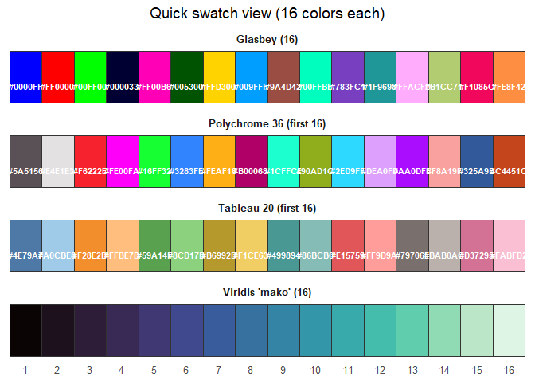
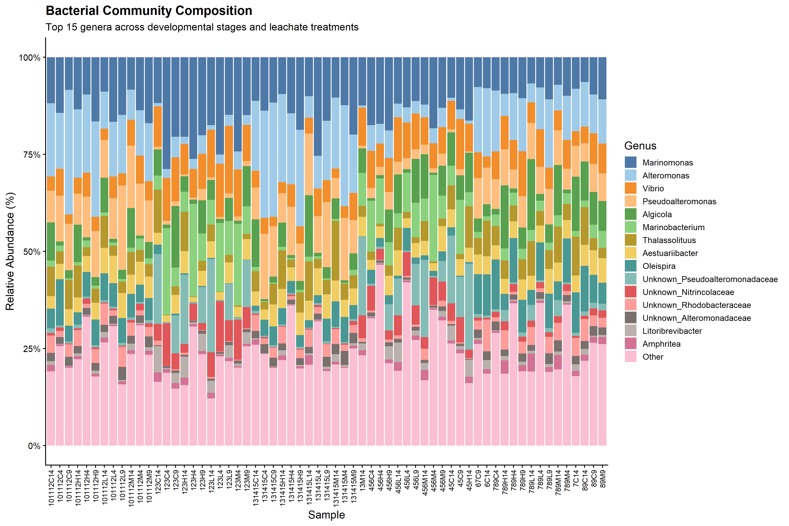
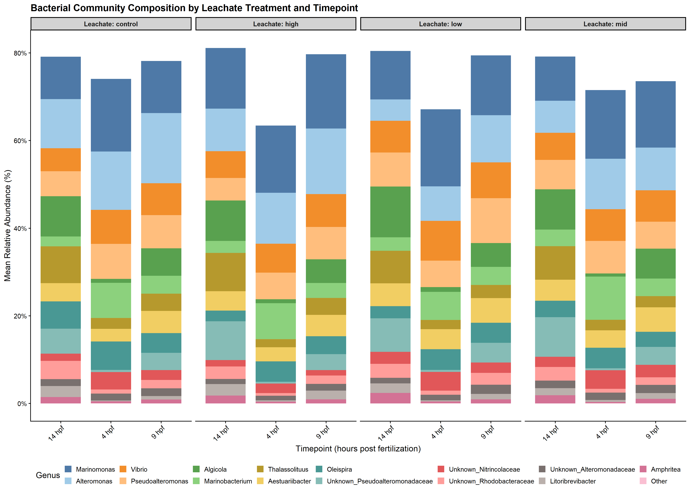
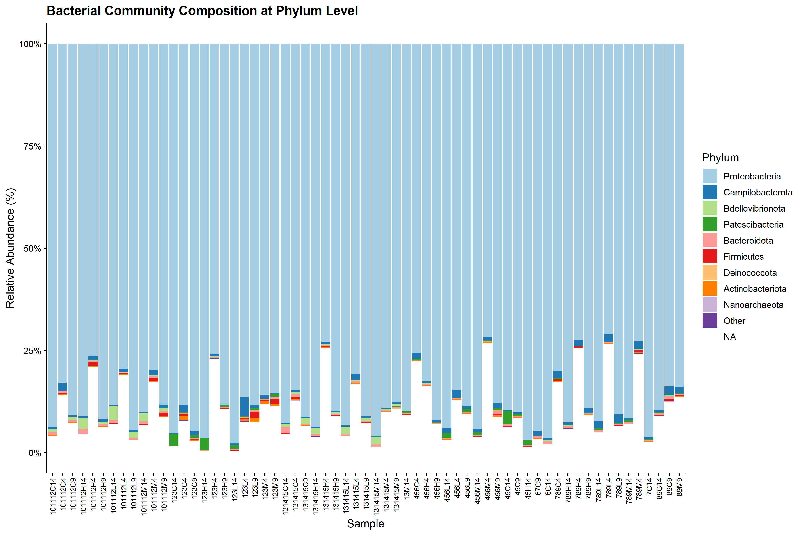

# Taxa Barplot Visualization from QIIME2
Sarah Tanja
2025-10-21

# Background

This document creates a publication-ready taxa barplot visualization
from QIIME2 visualization files (.qzv). The script extracts taxonomic
composition data from the QIIME2 artifacts and visualizes it using
ggplot2.

## Inputs

- QIIME2 visualization file:
  `salipante/Sarah_StonyCoral/250414_StonyCoral_270x200_filtered_taxa-bar-plots.qzv`
- Metadata file: `metadata/metadata.tsv`

## Outputs

- Publication-ready taxa barplot figure
- Summary statistics of taxonomic composition

# Setup

## Load libraries

``` r
library(tidyverse)
library(scales)
library(viridis)
library(RColorBrewer)
```

# Import Data

## Extract data from .qzv file

QIIME2 visualization files (.qzv) are zip archives containing CSV files
with taxonomic data at different levels.

``` r
# Define paths
qzv_file <- "../salipante/Sarah_StonyCoral/250414_StonyCoral_270x200_filtered_taxa-bar-plots.qzv"
temp_dir <- tempdir()
extract_dir <- file.path(temp_dir, "qzv_extract")

# Extract the .qzv file
unzip(qzv_file, exdir = extract_dir)

# Find the UUID directory (QIIME2 uses UUIDs for internal structure)
uuid_dir <- list.dirs(extract_dir, recursive = FALSE, full.names = TRUE)[1]
data_dir <- file.path(uuid_dir, "data")

# List available taxonomic levels
available_files <- list.files(data_dir, pattern = "\\.csv$")
cat("Available taxonomic levels:\n")
```

    Available taxonomic levels:

``` r
print(available_files)
```

    [1] "level-1.csv" "level-2.csv" "level-3.csv" "level-4.csv" "level-5.csv"
    [6] "level-6.csv" "level-7.csv"

## Load taxonomic data at different levels

``` r
# Load level 7 (most detailed, species level)
level7_file <- file.path(data_dir, "level-7.csv")
taxa_l7 <- read_csv(level7_file, show_col_types = FALSE)

# Load level 6 (genus level) - often better for visualization
level6_file <- file.path(data_dir, "level-6.csv")
taxa_l6 <- read_csv(level6_file, show_col_types = FALSE)

# Load level 5 (family level)
level5_file <- file.path(data_dir, "level-5.csv")
taxa_l5 <- read_csv(level5_file, show_col_types = FALSE)

cat("Level 7 dimensions:", dim(taxa_l7), "\n")
```

    Level 7 dimensions: 63 1402 

``` r
cat("Level 6 dimensions:", dim(taxa_l6), "\n")
```

    Level 6 dimensions: 63 890 

``` r
cat("Level 5 dimensions:", dim(taxa_l5), "\n")
```

    Level 5 dimensions: 63 405 

## Load metadata

``` r
meta <- read_csv("../metadata/meta.csv") 
```

    Rows: 63 Columns: 8
    ── Column specification ────────────────────────────────────────────────────────
    Delimiter: ","
    chr (5): sample_id, collection_date, group, stage, leachate
    dbl (3): parents, hpf, leachate_mgL

    ℹ Use `spec()` to retrieve the full column specification for this data.
    ℹ Specify the column types or set `show_col_types = FALSE` to quiet this message.

``` r
# set factors
metadata <- meta %>% 
  mutate(
    collection_date = as.Date(collection_date, format = "%d-%b-%Y"),
    stage    = factor(stage,    levels = c("cleavage", "prawnchip", "earlygastrula"), ordered = TRUE),
    leachate = factor(leachate, levels = c("control", "low", "mid", "high"),        ordered = TRUE),
    spawn_night = factor(
      collection_date,
      levels  = as.Date(c("06-Jul-2024", "07-Jul-2024", "08-Jul-2024"), format = "%d-%b-%Y"),
      labels  = c("July 6th", "July 7th", "July 8th"),
      ordered = TRUE
    )
  )
# Display metadata structure
head(metadata)
```

    # A tibble: 6 × 9
      sample_id collection_date parents group   hpf stage      leachate leachate_mgL
      <chr>     <date>            <dbl> <chr> <dbl> <ord>      <ord>           <dbl>
    1 101112C14 2024-07-08       101112 C14      14 earlygast… control             0
    2 101112C4  2024-07-08       101112 C4        4 cleavage   control             0
    3 101112C9  2024-07-08       101112 C9        9 prawnchip  control             0
    4 101112H14 2024-07-08       101112 H14      14 earlygast… high                1
    5 101112H4  2024-07-08       101112 H4        4 cleavage   high                1
    6 101112H9  2024-07-08       101112 H9        9 prawnchip  high                1
    # ℹ 1 more variable: spawn_night <ord>

# Data Processing

## Transform data for visualization

We’ll use Level 6 (genus level) as it provides a good balance between
detail and interpretability.

``` r
# Transform data to long format
taxa_long <- taxa_l6 %>%
  pivot_longer(
    cols = -c(index, `development-stage`, cross, timepoint, leachate), 
    names_to = "taxon",
    values_to = "count"
  ) %>% 
  rename(sample_id = index)

# Calculate relative abundance
taxa_long <- taxa_long %>%
  group_by(sample_id) %>%
  mutate(
    total_count = sum(count),
    rel_abundance = count / total_count * 100
  ) %>%
  ungroup()

# Extract taxonomic rank information
taxa_long <- taxa_long %>%
  mutate(
    # Extract genus (last named rank before __)
    genus = str_extract(taxon, "g__([^;_]+)", group = 1),
    # Extract family
    family = str_extract(taxon, "f__([^;_]+)", group = 1),
    # Extract phylum
    phylum = str_extract(taxon, "p__([^;_]+)", group = 1),
    # Create a simplified label
    genus = if_else(is.na(genus) | genus == "", 
                    paste0("Unknown_", family), 
                    genus)
  )

# Join with metadata
taxa_long <- taxa_long %>%
  left_join(metadata, by = "sample_id")

head(taxa_long)
```

    # A tibble: 6 × 20
      sample_id `development-stage`  cross timepoint leachate.x taxon          count
      <chr>     <chr>                <dbl>     <dbl>      <dbl> <chr>          <dbl>
    1 101112C14 early gastrula      101112        14          0 d__Bacteria;p…     0
    2 101112C14 early gastrula      101112        14          0 d__Bacteria;p… 20329
    3 101112C14 early gastrula      101112        14          0 d__Bacteria;p…     0
    4 101112C14 early gastrula      101112        14          0 d__Bacteria;p… 17475
    5 101112C14 early gastrula      101112        14          0 d__Bacteria;p…     0
    6 101112C14 early gastrula      101112        14          0 d__Bacteria;p… 41708
    # ℹ 13 more variables: total_count <dbl>, rel_abundance <dbl>, genus <chr>,
    #   family <chr>, phylum <chr>, collection_date <date>, parents <dbl>,
    #   group <chr>, hpf <dbl>, stage <ord>, leachate.y <ord>, leachate_mgL <dbl>,
    #   spawn_night <ord>

## Select top taxa for visualization

``` r
# Calculate mean relative abundance per genus
top_genera <- taxa_long %>%
  group_by(genus) %>%
  summarize(mean_abundance = mean(rel_abundance)) %>%
  arrange(desc(mean_abundance)) %>%
  slice_head(n = 15) %>%
  pull(genus)

# Create a factor for plotting (top genera + "Other")
taxa_plot <- taxa_long %>%
  mutate(
    genus_grouped = if_else(genus %in% top_genera, genus, "Other")
  ) %>%
  group_by(sample_id, genus_grouped, stage, 
           hpf, leachate.y) %>%
  summarize(rel_abundance = sum(rel_abundance), .groups = "drop")

# Order samples by metadata
taxa_plot <- taxa_plot %>%
  mutate(
    sample_id = factor(sample_id),
    genus_grouped = factor(genus_grouped, 
                          levels = c(top_genera, "Other"))
  )
```

# Visualization

``` r
# install if needed:
# install.packages(c("ggplot2", "ggthemes", "pals", "Polychrome", "viridisLite"))
library(ggplot2)
library(ggthemes)
library(pals)
```


    Attaching package: 'pals'

    The following objects are masked from 'package:viridis':

        cividis, inferno, magma, plasma, turbo, viridis

    The following objects are masked from 'package:viridisLite':

        cividis, inferno, magma, plasma, turbo, viridis

``` r
library(Polychrome)
library(viridisLite)
library(dplyr)
library(tidyr)
library(stringr)

# helper to turn a vector of colors into a swatch data frame
as_swatch <- function(cols, name) {
  tibble(palette = name,
         idx = seq_along(cols),
         hex = cols)
}

# build the four palettes (16 colors each)
pal_glasbey  <- pals::glasbey(16)
pal_tableau  <- ggthemes::tableau_color_pal("Tableau 20")(20)[1:16]
pal_poly36   <- Polychrome::palette36.colors(16)
pal_mako16   <- viridisLite::viridis(16, option = "mako")

swatches <- bind_rows(
  as_swatch(pal_glasbey, "Glasbey (16)"),
  as_swatch(pal_tableau, "Tableau 20 (first 16)"),
  as_swatch(pal_poly36, "Polychrome 36 (first 16)"),
  as_swatch(pal_mako16, "Viridis 'mako' (16)")
) %>%
  mutate(idx = factor(idx, levels = 1:16))

# plot swatches
ggplot(swatches, aes(x = idx, y = 1, fill = hex)) +
  geom_tile(color = "grey20") +
  geom_text(aes(label = hex),
            size = 3, vjust = 1.7, color = "white", fontface = "bold",
            data = ~ .x %>% filter(palette != "Viridis 'mako' (16)")) +
  scale_fill_identity() +
  facet_wrap(~ palette, ncol = 1, strip.position = "top") +
  scale_x_discrete(drop = FALSE) +
  labs(x = NULL, y = NULL,
       title = "Quick swatch view (16 colors each)") +
  theme_minimal(base_size = 12) +
  theme(panel.grid = element_blank(),
        axis.text.y = element_blank(),
        axis.ticks = element_blank(),
        plot.title = element_text(hjust = 0.5),
        strip.text = element_text(face = "bold"))
```



## Taxa barplot - Main Figure

``` r
# Create color palette
n_colors <- length(top_genera) + 1
colors <- pal_tableau

# Create the barplot
p1 <- ggplot(taxa_plot, 
             aes(x = sample_id, y = rel_abundance, fill = genus_grouped)) +
  geom_bar(stat = "identity", width = 0.9) +
  scale_fill_manual(values = colors, name = "Genus") +
  scale_y_continuous(labels = percent_format(scale = 1)) +
  labs(
    title = "Bacterial Community Composition",
    subtitle = "Top 15 genera across developmental stages and leachate treatments",
    x = "Sample",
    y = "Relative Abundance (%)"
  ) +
  theme_classic(base_size = 12) +
  theme(
    axis.text.x = element_text(angle = 90, hjust = 1, vjust = 0.5, size = 8),
    legend.position = "right",
    legend.key.size = unit(0.5, "cm"),
    legend.text = element_text(size = 9),
    plot.title = element_text(face = "bold", size = 14),
    plot.subtitle = element_text(size = 11)
  )

print(p1)
```



## Taxa barplot - Faceted by Treatment

``` r
# Aggregate by treatment groups
taxa_treatment <- taxa_long %>%
  mutate(
    genus_grouped = if_else(genus %in% top_genera, genus, "Other"),
    leachate_label = paste0("Leachate: ", leachate.y),
    timepoint_label = paste0(timepoint, " hpf")
  ) %>%
  group_by(leachate_label, timepoint_label, genus_grouped) %>%
  summarize(mean_rel_abundance = mean(rel_abundance), .groups = "drop") %>%
  mutate(
    genus_grouped = factor(genus_grouped, levels = c(top_genera, "Other"))
  )

# Create faceted barplot
p2 <- ggplot(taxa_treatment, 
             aes(x = timepoint_label, y = mean_rel_abundance, fill = genus_grouped)) +
  geom_bar(stat = "identity", width = 0.8) +
  scale_fill_manual(values = colors, name = "Genus") +
  scale_y_continuous(labels = percent_format(scale = 1)) +
  facet_wrap(~ leachate_label, ncol = 4) +
  labs(
    title = "Bacterial Community Composition by Leachate Treatment and Timepoint",
    x = "Timepoint (hours post fertilization)",
    y = "Mean Relative Abundance (%)"
  ) +
  theme_classic(base_size = 12) +
  theme(
    axis.text.x = element_text(angle = 45, hjust = 1, size = 10),
    legend.position = "bottom",
    legend.key.size = unit(0.4, "cm"),
    strip.background = element_rect(fill = "lightgray", color = "black"),
    strip.text = element_text(face = "bold"),
    plot.title = element_text(face = "bold", size = 14)
  ) +
  guides(fill = guide_legend(nrow = 2))

print(p2)
```



## Taxa barplot - Phylum Level

``` r
# Calculate top phyla
top_phyla <- taxa_long %>%
  group_by(phylum) %>%
  summarize(mean_abundance = mean(rel_abundance)) %>%
  arrange(desc(mean_abundance)) %>%
  slice_head(n = 10) %>%
  pull(phylum)

# Aggregate by phylum
taxa_phylum <- taxa_long %>%
  mutate(
    phylum_grouped = if_else(phylum %in% top_phyla, phylum, "Other")
  ) %>%
  group_by(sample_id, phylum_grouped, stage, 
           timepoint, leachate.x) %>%
  summarize(rel_abundance = sum(rel_abundance), .groups = "drop") %>%
  mutate(
    phylum_grouped = factor(phylum_grouped, levels = c(top_phyla, "Other"))
  )

# Create phylum-level barplot
p3 <- ggplot(taxa_phylum, 
             aes(x = sample_id, y = rel_abundance, fill = phylum_grouped)) +
  geom_bar(stat = "identity", width = 0.9) +
  scale_fill_brewer(palette = "Paired", name = "Phylum") +
  scale_y_continuous(labels = percent_format(scale = 1)) +
  labs(
    title = "Bacterial Community Composition at Phylum Level",
    x = "Sample",
    y = "Relative Abundance (%)"
  ) +
  theme_classic(base_size = 12) +
  theme(
    axis.text.x = element_text(angle = 90, hjust = 1, vjust = 0.5, size = 8),
    legend.position = "right",
    plot.title = element_text(face = "bold", size = 14)
  )

print(p3)
```



# Summary Statistics

## Top taxa across all samples

``` r
# Calculate overall abundance statistics
top_taxa_summary <- taxa_long %>%
  group_by(genus) %>%
  summarize(
    mean_abundance = mean(rel_abundance),
    sd_abundance = sd(rel_abundance),
    max_abundance = max(rel_abundance),
    n_samples_present = sum(rel_abundance > 0)
  ) %>%
  arrange(desc(mean_abundance)) %>%
  slice_head(n = 20)

print(top_taxa_summary)
```

    # A tibble: 20 × 5
       genus             mean_abundance sd_abundance max_abundance n_samples_present
       <chr>                      <dbl>        <dbl>         <dbl>             <int>
     1 Marinomonas               13.8          5.20          28.8                 63
     2 Alteromonas               10.9          8.07          32.1                 63
     3 Vibrio                     7.06         3.17          17.4                 63
     4 Pseudoalteromonas          6.99         5.19          21.7                 63
     5 Algicola                   5.69         4.81          18.2                 63
     6 Marinobacterium            4.90         5.89          23.9                 63
     7 Thalassolituus             4.65         3.33          15.3                 63
     8 Aestuariibacter            4.53         1.35           7.07                63
     9 Oleispira                  4.42         3.63          12.8                 63
    10 Unknown_Pseudoal…          4.15         6.46          24.0                 63
    11 Unknown_Nitrinco…          2.59         2.85          12.9                 63
    12 Unknown_Rhodobac…          2.14         1.85           8.17                63
    13 Unknown_Alteromo…          1.55         0.834          3.62                63
    14 Litoribrevibacter          1.32         1.48           6.76                63
    15 Amphritea                  1.08         0.886          4.63                63
    16 Thalassotalea              0.971        0.840          4.25                63
    17 Nautella                   0.948        0.749          4.77                63
    18 Malaciobacter              0.863        0.728          4.20                63
    19 Oceanospirillum            0.808        0.600          2.58                63
    20 Delftia                    0.729        2.28          11.8                 13

# Save Figures

``` r
# Create output directory if it doesn't exist
dir.create("../output/figures", recursive = TRUE, showWarnings = FALSE)

# Save figures
ggsave("../output/figures/taxa_barplot_all_samples.png", 
       plot = p1, width = 12, height = 8, dpi = 300)

ggsave("../output/figures/taxa_barplot_by_treatment.png", 
       plot = p2, width = 14, height = 10, dpi = 300)

ggsave("../output/figures/taxa_barplot_phylum.png", 
       plot = p3, width = 12, height = 8, dpi = 300)


cat("Figures saved to output/figures/\n")
```

    Figures saved to output/figures/

# Session Info

``` r
sessionInfo()
```

    R version 4.5.1 (2025-06-13 ucrt)
    Platform: x86_64-w64-mingw32/x64
    Running under: Windows 11 x64 (build 26100)

    Matrix products: default
      LAPACK version 3.12.1

    locale:
    [1] LC_COLLATE=English_United States.utf8 
    [2] LC_CTYPE=English_United States.utf8   
    [3] LC_MONETARY=English_United States.utf8
    [4] LC_NUMERIC=C                          
    [5] LC_TIME=English_United States.utf8    

    time zone: America/Los_Angeles
    tzcode source: internal

    attached base packages:
    [1] stats     graphics  grDevices utils     datasets  methods   base     

    other attached packages:
     [1] Polychrome_1.5.4   pals_1.10          ggthemes_5.1.0     RColorBrewer_1.1-3
     [5] viridis_0.6.5      viridisLite_0.4.2  scales_1.4.0       lubridate_1.9.4   
     [9] forcats_1.0.1      stringr_1.5.2      dplyr_1.1.4        purrr_1.1.0       
    [13] readr_2.1.5        tidyr_1.3.1        tibble_3.3.0       ggplot2_4.0.0     
    [17] tidyverse_2.0.0   

    loaded via a namespace (and not attached):
     [1] utf8_1.2.6           generics_0.1.4       stringi_1.8.7       
     [4] hms_1.1.3            digest_0.6.37        magrittr_2.0.4      
     [7] evaluate_1.0.5       grid_4.5.1           timechange_0.3.0    
    [10] maps_3.4.3           fastmap_1.2.0        jsonlite_2.0.0      
    [13] gridExtra_2.3        textshaping_1.0.4    cli_3.6.5           
    [16] rlang_1.1.6          crayon_1.5.3         scatterplot3d_0.3-44
    [19] bit64_4.6.0-1        withr_3.0.2          yaml_2.3.10         
    [22] tools_4.5.1          parallel_4.5.1       tzdb_0.5.0          
    [25] colorspace_2.1-2     mapproj_1.2.12       vctrs_0.6.5         
    [28] R6_2.6.1             lifecycle_1.0.4      bit_4.6.0           
    [31] vroom_1.6.6          ragg_1.5.0           pkgconfig_2.0.3     
    [34] pillar_1.11.1        gtable_0.3.6         glue_1.8.0          
    [37] systemfonts_1.3.1    xfun_0.53            tidyselect_1.2.1    
    [40] rstudioapi_0.17.1    knitr_1.50           dichromat_2.0-0.1   
    [43] farver_2.1.2         htmltools_0.5.8.1    labeling_0.4.3      
    [46] rmarkdown_2.30       compiler_4.5.1       S7_0.2.0            
