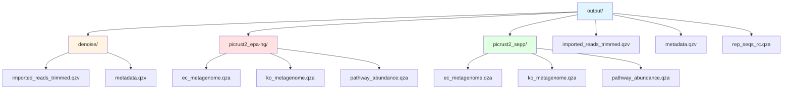
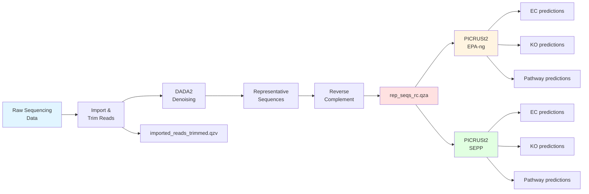

# Output Directory

This directory contains analysis outputs from QIIME2 processing workflows for the coral embryo microbiome project. Outputs include imported/trimmed sequence data, reverse-complemented representative sequences, and functional predictions from PICRUSt2 using different phylogenetic placement methods.

## Directory Structure

## File Types

### QIIME2 Artifacts (.qza)
QIIME2 artifacts are compressed archives containing data and metadata. These files can be used as inputs for downstream QIIME2 analyses.

### QIIME2 Visualizations (.qzv)
QIIME2 visualizations are interactive HTML files that can be viewed at [view.qiime2.org](https://view.qiime2.org). They provide graphical representations of data and analysis results.

## Root Directory Files

### imported_reads_trimmed.qzv
QIIME2 visualization of imported and quality-trimmed sequencing reads. Shows read quality profiles and sequence characteristics after trimming.

### metadata.qzv
Interactive visualization of sample metadata including experimental factors, sample identifiers, and associated variables.

### rep_seqs_rc.qza
Representative sequences that have been reverse-complemented. These sequences represent unique ASVs (Amplicon Sequence Variants) detected in the samples, oriented in the correct direction for downstream analyses.

## Subdirectories

### denoise/
Contains QIIME2 visualizations from the denoising workflow step.

**Contents:**
- `imported_reads_trimmed.qzv` - Visualization of imported and trimmed sequencing reads
- `metadata.qzv` - Sample metadata visualization

### picrust2_epa-ng/
PICRUSt2 functional predictions using the **EPA-ng** phylogenetic placement tool. EPA-ng (Evolutionary Placement Algorithm - next generation) is a faster placement method suitable for large datasets.

**Contents:**
- `ec_metagenome.qza` - EC (Enzyme Commission) number predictions - represents predicted enzyme functions with rows as EC numbers and columns as samples
- `ko_metagenome.qza` - KO (KEGG Orthology) predictions - represents predicted gene families with rows as KO identifiers and columns as samples  
- `pathway_abundance.qza` - MetaCyc pathway abundance predictions - represents predicted metabolic pathway abundances with rows as pathway identifiers and columns as samples

### picrust2_sepp/
PICRUSt2 functional predictions using the **SEPP** phylogenetic placement tool. SEPP (SATé-enabled phylogenetic placement) is more accurate for fragmentary sequences but computationally intensive.

**Contents:**
- `ec_metagenome.qza` - EC (Enzyme Commission) number predictions
- `ko_metagenome.qza` - KO (KEGG Orthology) predictions
- `pathway_abundance.qza` - MetaCyc pathway abundance predictions

## Analysis Workflow

## PICRUSt2 Comparison

Both `picrust2_epa-ng/` and `picrust2_sepp/` contain the same types of functional predictions but differ in the phylogenetic placement algorithm used:

| Feature | EPA-ng | SEPP |
|---------|--------|------|
| Speed | Faster | Slower |
| Accuracy | Good for complete sequences | Better for fragmentary sequences |
| Use Case | Large datasets, general analysis | Smaller datasets, higher accuracy needed |
| Computational Cost | Lower | Higher |

## Related Directories

- `../code/` - Contains analysis scripts that generate these outputs (`02_import_trim_denoise.qmd`, `picrust.qmd`)
- `../salipante/` - Contains additional analysis results from Salipante Lab including Maaslin2 differential abundance analyses
- `../metadata/` - Contains sample metadata files used in analyses
- `../input/` - Contains input files and read manifests

## Key Analysis Parameters

Based on the code analysis, the following parameters were used:

**DADA2 Denoising:**
- Forward trim length: 270 bp
- Reverse trim length: 200 bp

**PICRUSt2 Parameters:**
- Max NSTI cutoff: 2.0
- Min alignment proportion: 0.1
- Placement tools: EPA-ng and SEPP (both tested)
- HSP method: PIC (phylogenetic independent contrasts)
- Threads: 4

## Notes

- Input sequences were reverse-complemented when necessary for proper alignment to PICRUSt2 reference sequences
- 661 input sequences aligned poorly to reference sequences and were excluded from downstream steps
- 323 of 6521 ASVs were above the max NSTI cut-off of 2.0 and were removed from analyses
- The functional prediction outputs are compatible with downstream differential abundance testing tools like Maaslin2
