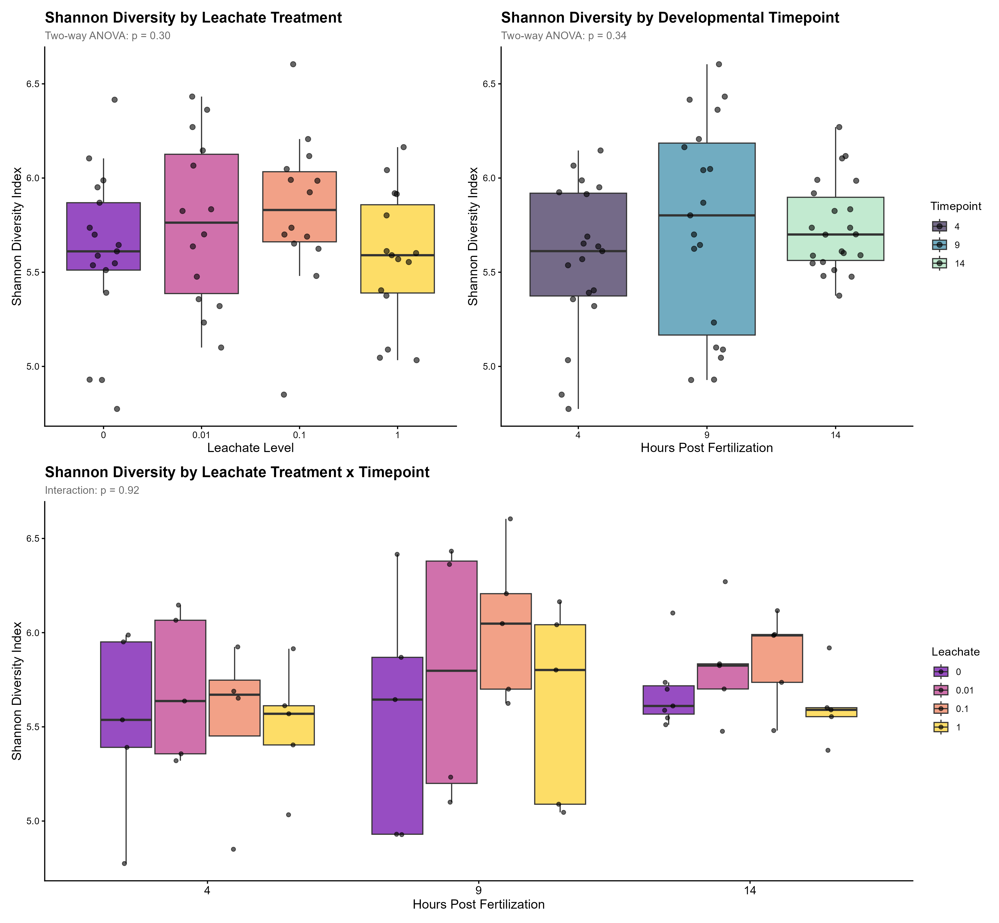
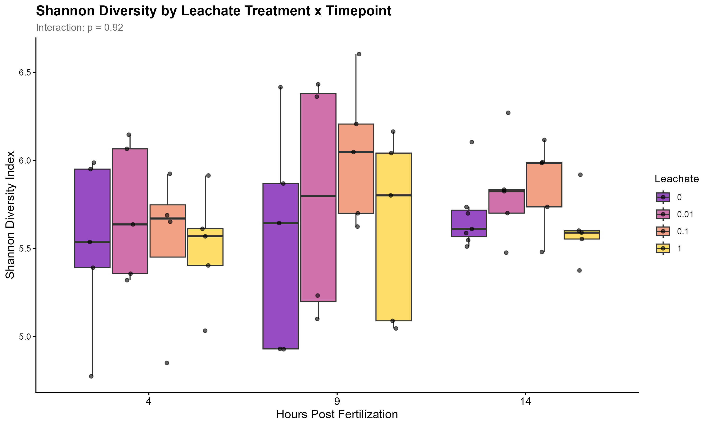
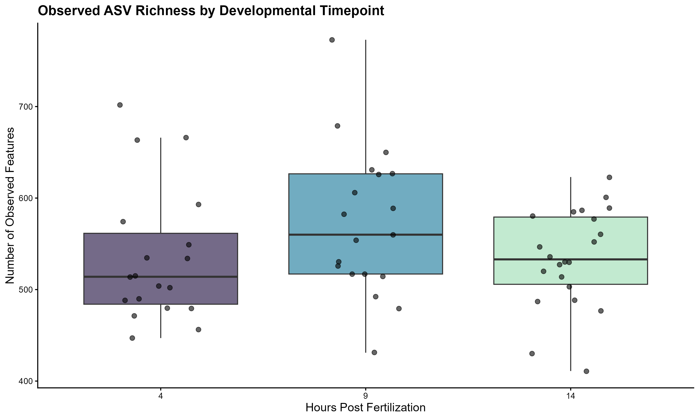

# Figures Gallery

This directory contains visualization outputs from the coral embryo microbiome analysis. All figures are organized by analysis type below.

## Alpha Diversity Metrics

Alpha diversity measures the diversity within individual samples.

### Faith's Phylogenetic Diversity

Faith's PD measures the total phylogenetic branch length in a sample.

#### By Leachate Concentration

#### By Timepoint

#### Combined Analysis

#### Leachate × Timepoint Interaction

### Shannon Diversity Index

Shannon diversity measures both richness and evenness.

#### By Leachate Concentration

#### By Timepoint

#### Combined Analysis

#### Leachate × Timepoint Interaction

### Pielou's Evenness Index

Pielou's evenness measures how evenly species are distributed.

#### By Leachate Concentration

#### By Timepoint

#### Combined Analysis

#### Leachate × Timepoint Interaction

### Observed Features (ASV Richness)

Number of unique amplicon sequence variants (ASVs) detected.

#### By Leachate Concentration

#### By Timepoint

#### Combined Analysis

#### Leachate × Timepoint Interaction

### Alpha Diversity Panel Plots

Multi-metric overview panels combining multiple alpha diversity measures.

#### By Leachate Concentration

#### By Timepoint

## Beta Diversity Metrics

Beta diversity measures differences in microbial community composition between samples.

### Bray-Curtis Dissimilarity

Bray-Curtis measures compositional dissimilarity based on abundance data.

#### By Leachate Concentration

#### By Timepoint

### Weighted UniFrac Distance

Weighted UniFrac incorporates phylogenetic relationships and abundance information.

#### By Leachate Concentration

#### By Timepoint

## Taxonomic Composition

Taxonomic barplots showing the relative abundance of different taxa.

### All Samples

### By Treatment

### Phylum Level

---

**Note:** All figures were generated as part of the *Montipora capitata* coral embryo microbiome analysis examining the effects of PVC leachate exposure during embryonic development.
