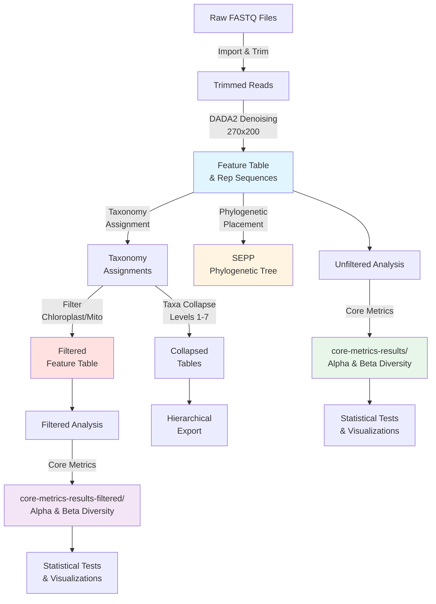

# 241121_StonyCoral Directory

This directory contains QIIME2 pipeline outputs and diversity analyses for the StonyCoral sequencing run from November 21, 2024.

## Overview

This directory includes complete microbiome analysis results for the coral embryo project, including raw data manifests, denoised feature tables, taxonomy assignments, phylogenetic trees, and diversity metrics.

## Files in Root Directory

### Metadata Files
- **250414_StonyCoral_read_manifest.tsv** - Manifest file linking sample IDs to raw sequencing files (FASTQ)
- **250416_StonyCoral_metadata.tsv** - Sample metadata including categorical and continuous variables
- **250416_StonyCoral_metadata_categoric.tsv** - Metadata with categorical variables only (formatted for specific analyses)

## Subdirectories

### 270x200/
DADA2 denoising results with 270bp forward and 200bp reverse trim lengths.

**Key Files:**
- `250414_StonyCoral_270x200_featureTable.qza` - Unfiltered ASV feature table
- `250414_StonyCoral_270x200_featureTable_filtered.qza` - Filtered feature table (chloroplast/mitochondria removed)
- `250414_StonyCoral_270x200_representative-sequences.qza` - Representative sequences for each ASV
- `250414_270x200_representative-sequences_taxonomy.qza` - Taxonomy assignments
- `250414_StonyCoral_270x200_denoising-stats.qza` - DADA2 denoising statistics
- `250414_StonyCoral_270x200_taxa-bar-plots.qzv` - Taxa bar plot visualization (unfiltered)
- `250414_StonyCoral_270x200_filtered_taxa-bar-plots.qzv` - Taxa bar plot visualization (filtered)
- `250416_StonyCoral_270x200_alpha_rarefaction_curves.qzv` - Alpha rarefaction curves
- `250416_StonyCoral_270x200_alpha_rarefaction_curves_200k.qzv` - Alpha rarefaction curves (200K depth)
- `250416_StonyCoral_270x200_alpha_rarefaction_curves_400k.qzv` - Alpha rarefaction curves (400K depth)

**Taxonomy Collapsed Tables:**
- `collapsed-l1.qza` through `collapsed-l7.qza` - Feature tables collapsed at taxonomic levels 1-7 (kingdom to species)
- `hierarchical-table.qza` - Hierarchical taxonomy table
- `filtered_hierarchical.tsv` - Exported hierarchical taxonomy data
- `taxa_collapse_filtered.sh` - Shell script for generating collapsed tables

**Subdirectories:**
- `1st_collapse/` - Initial taxonomy collapse outputs
- `hierarchical-export/` - Exported hierarchical taxonomy data

### SEPP/
Phylogenetic placement results using SEPP (SATé-enabled phylogenetic placement) algorithm.

**Files:**
- `insertion-placements.qza` - Phylogenetic placement positions on reference tree
- `insertion-tree.qza` - Phylogenetic tree with inserted sequences

### core-metrics-results/
Core diversity metrics calculated on unfiltered data.

**Alpha Diversity:**
- `shannon_vector.qza` - Shannon diversity index
- `evenness_vector.qza` - Pielou's evenness
- `faith_pd_vector.qza` - Faith's phylogenetic diversity
- `observed_features_vector.qza` - Observed features (richness)
- `rarefied_table.qza` - Rarefied feature table

**Beta Diversity:**
- `bray_curtis_distance_matrix.qza` - Bray-Curtis dissimilarity
- `jaccard_distance_matrix.qza` - Jaccard distance
- `unweighted_unifrac_distance_matrix.qza` - Unweighted UniFrac distance
- `weighted_unifrac_distance_matrix.qza` - Weighted UniFrac distance

**PCoA and Visualizations:**
- `bray_curtis_pcoa_results.qza` / `bray_curtis_emperor.qzv`
- `jaccard_pcoa_results.qza` / `jaccard_emperor.qzv`
- `unweighted_unifrac_pcoa_results.qza` / `unweighted_unifrac_emperor.qzv`
- `weighted_unifrac_pcoa_results.qza` / `weighted_unifrac_emperor.qzv`

**Statistical Tests:**
- `*-cross-significance.qzv` - Significance tests for cross variable
- `*-development-stage-significance.qzv` - Tests for development stage
- `*-leachate-significance.qzv` - Tests for leachate treatment
- `*-timepoint-significance.qzv` - Tests for timepoint

### core-metrics-results-filtered/
Core diversity metrics calculated on filtered data (chloroplast and mitochondrial sequences removed).

Contains the same file structure as `core-metrics-results/` but computed on the filtered dataset:
- Alpha diversity vectors (Shannon, evenness, Faith's PD, observed features)
- Beta diversity distance matrices (Bray-Curtis, Jaccard, UniFrac weighted/unweighted)
- PCoA results and Emperor visualizations
- Rarefied feature table

## QIIME2 Pipeline Workflow

## Analysis Parameters

- **Trim Lengths:** 270bp forward, 200bp reverse
- **Rarefaction Depth:** 200,000 - 400,000 sequences
- **Taxonomy Levels:** Collapsed at levels 1 (kingdom) through 7 (species)
- **Filtering:** Chloroplast and mitochondrial sequences removed for filtered analyses

## File Types

### QIIME2 Artifacts (.qza)
Compressed archives containing data and metadata. Can be used as inputs for downstream QIIME2 analyses or exported for use with other tools.

### QIIME2 Visualizations (.qzv)
Interactive HTML visualizations that can be viewed at [view.qiime2.org](https://view.qiime2.org). Provide graphical representations of analysis results.

### TSV Files (.tsv)
Tab-separated value files containing metadata, manifests, or exported data tables.

### Shell Scripts (.sh)
Executable scripts for running specific analysis steps (e.g., taxonomy collapsing).

## Notes

- This analysis uses DADA2 for denoising rather than other methods like Deblur
- The 270x200 trim parameters were selected based on quality score profiles
- Both filtered and unfiltered analyses are provided for comparison
- Statistical tests assess significance across multiple metadata categories (cross, development stage, leachate treatment, timepoint)
